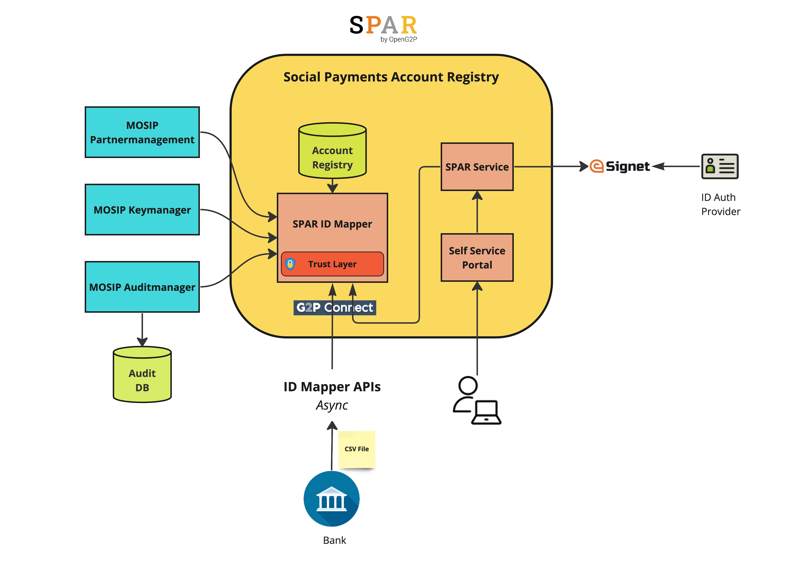

# SPAR

The Social Payments Account Registry (SPAR) is an extension of the ID Account Mapper that maintains a mapping of a user ID and [Financial Address](https://docs.cdpi.dev/technical-notes/digital-payment-networks/financial-address) (FA) like bank code, account details, mobile wallet number, etc., primarily aimed at cash transfers in a social benefit delivery system. SPAR implements the functionality of an ID Account Mapper with additional feature of offering a self service portal for a beneficiary to add/update his/her FA. While in countries like India, the ID Account Mapper is updated by a bank (after authenticating a beneficiary), this may not be  immediately feasible in many countries as all FSPs need to integrate with ID Account Mapper. In such situations, social welfare department can install SPAR and offer self service update, or via an agent. Of course, one important assumption is that online ID authentication mechanism is available in the country via APIs. For example, in MOSIP adopting countries both biometric and OTP based authentication is available.&#x20;

SPAR is powerful **inclusion** tool as it gives end users ability to choose how they would like to receive the benefits. &#x20;

SPAR may be housed centrally in a country as a building block of the Digital Public Infrastructure (DPI). Alternatively, a social welfare department can house it and enable other departments to use the same for cash disbursements.

The SPAR subsystem consists of 2 functional components

* ID-Account Mapper
* Self-Service-Portal

The ID-Account Mapper contains the actual mapping between beneficiary IDs and their respective accounts.

The Self-Service-Portal provides a Self Service to the beneficiaries who can log in into SPAR and update their own account information into the registry. The Self Service portal facilitates an easy to use interface like searching for a beneficiary's bank, his branch, her mobile service provider so that the beneficiary is able to provide the full financial address, where he/she wishes to receive the cash credits for the benefit programs.

## Functional Overview

The following picture represents how SPAR fits into the overall OpenG2P Project Landscape

<figure><figcaption>
SPAR in the OpenG2P lanscape
</figcaption></figure>

The Government Department administers its benefit program in the OpenG2P PBMS platform. The PBMS platform manages benefit programs, beneficiaries under the programs, disbursement cycles and entitlements (rules & definitions).

At the end of every disbursement cycle of a given benefit program, the PBMS platform produces a list that contains all the beneficiaries and their individual disbursements. The beneficiaries in that list are identified by a Beneficiary ID. This ID might be a National ID, that uniquely identifies a beneficiary in the country or depending on the National ID implementation in the country can also be a proxy or a token that has been issued by the National ID Registry.

This List has to be presented to the Sponsor Bank, where the Government Department has its Money Account (Financial Account) that contains the funds required to fund these disbursements.

The Sponsor Bank in turn has to present this List to the National Clearing System. The National Clearing List will in turn split this list into multiple lists that will be presented to multiple destination banks in the country.

Somewhere in this G2P Disbursement Chain, the Beneficiary ID needs to be translated to the Beneficiary's Financial Address

1. 1.Beneficiary Account Number + Bank/Branch Address - in case of Bank Accounts
2. 2.Beneficiary Mobile Number + Mobile Service Provider - in case of Wallets

This mapping between the Beneficiary ID and his Financial Address is maintained by SPAR. SPAR provides a lookup referral service by which any participant in the G2P chain can perform a lookup into SPAR and obtain the financial address for a given beneficiary ID. The three blue dotted arrows (1, 2 & 3) in the above picture represents this lookup.

Depending on the implementation, we can decide which layer in the G2P chain performs this lookup and enriches the disbursement list that was originally produced by the PBMS  system.

The following figure provides a Functional Architecture of the SPAR Subsystem.

<figure><figcaption>
SPAR Functional Architecture
</figcaption></figure>

## Technical Overview

The following picture provides a technical architecture of SPAR

<figure><figcaption>
SPAR Technical Architecture
</figcaption></figure>

The SPAR subsystem consists of the following technology components

* **openg2p-spar-mapper-api** -- This is a FastAPI based python **microservice** that serves as the id-mapper registry service. This microservice provides G2P-Connect compliant APIs to update and retrieve financial address information.
* **openg2p-spar-self-service-ui** -- This is a ReactJS based **web-ui layer** that enables a beneficiary to login into the Self Service System of SPAR and view and update his financial address.
* **openg2p-spar-self-service**
  * **openg2p-spar-self-service-api** -- This is a FastAPI based python **microservice** that provides REST APIs to the UI layer. This microservice facilitates maintenance of financial address to a beneficiary by providing search APIs for banks, branches and wallet providers, so that a beneficiary can provide his/her complete financial address in the registry. This microservices uses a Postgresql persistence layer.
  * **openg2p-spar-mapper-interface-lib** -- This is python **library** that specifies interface APIs to connect to an account-mapper service.
  * **openg2p-spar-mapper-connector-lib** -- This is a **library** that provides an OpenG2P implementation of the mapper-interface. This connector library enables the self-service microservice to connect to the openg2p-spar-mapper-fastapi microservice using REST APIs.&#x20;
  * In an implementation, if there is a requirement to use some other account-mapper, we will need to provide another connector library. That new connector library also needs to implement the openg2p-spar-mapper-interface-lib, so that there is no change to be made in the openg2p-spar-self-service-api. The new connector library should be wired into the openg2p-spar-self-service-api in the application initializer.
