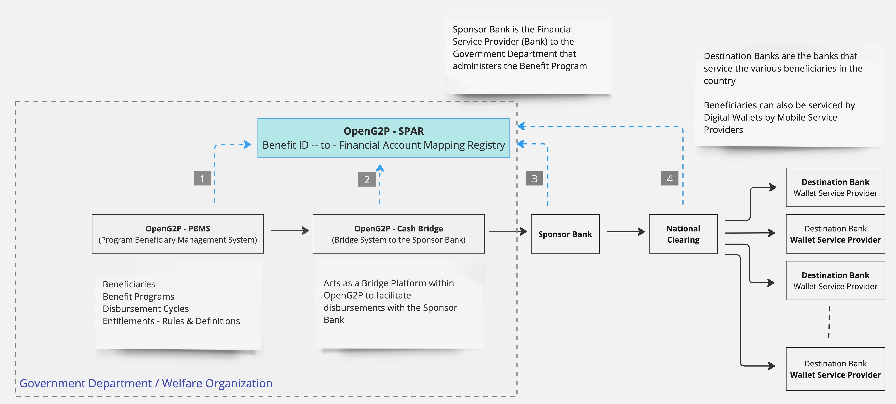
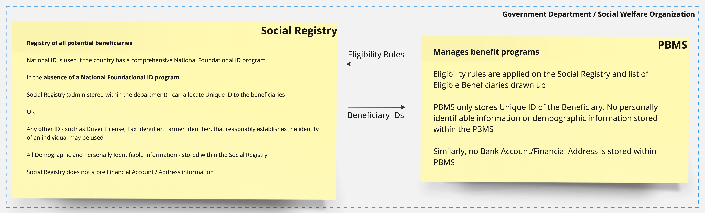

---
layout:
  title:
    visible: true
  description:
    visible: false
  tableOfContents:
    visible: true
  outline:
    visible: true
  pagination:
    visible: true
---

# spar-mapper

## Features

* Maintains a mapping between Beneficiary ID and the Beneficiary's Financial Address
* The Beneficiary ID can be anyone of the following
  * Beneficiary ID issued by a Country, that uniquely identifies the beneficiary
  * In the absence of a comprehensive National ID Program, the Beneficiary ID issued by the Department that administers a particular Social Program can be used
  * Any other ID, that is prevalent in the Country, that works reasonably to establish the identity of a beneficiary - e.g. Social Security Number, Income-Tax-ID, Passport ID etc. are examples that may be used
  * A token issued by a Token Issuing Platform (Authentication Provider), that issues a Token against a Beneficiary ID (Login ID). This is explained in more detail in the Self-Service feature of SPAR
* The Financial Address can be one of
  * Bank Account&#x20;
  * Mobile Wallet
* An ID is linked to one Account (financial address). There can be only one mapping for an ID.
* [G2P Connect Compliant APIs](https://g2pconnect.cdpi.dev/protocol/interfaces/beneficiary-management/mapper-specs) - to
  * link - link a Beneficiary ID and Financial Address
  * unlink - unlink the existing mapping (delete the existing mapping)
  * modify - update the Financial Address&#x20;
  * resolve - given a beneficiary Id, query to retrieve the Financial Address
* Signature verification for clients (partners)  via integrations with MOSIP's Partnermanager & Keymanager - **TBD**

#### The Mapper can be visualized in a tabular depiction as follows - (More Clarity on Structure of ID required)

<table><thead><tr><th width="352.5">ID</th><th>Account Number</th></tr></thead><tbody><tr><td>234AFBC@mosip.openg2p</td><td>45678756456@branchOne@bankOne</td></tr><tr><td>DBCF34A@mosip.socialaccountregistry</td><td>9957585955@mpesa.ke</td></tr></tbody></table>

## Usage in the G2P transfer chain&#x20;

### Consumers of SPAR Mapper

Refer to this picture - SPAR in the G2P landscape

<figure><figcaption>
SPAR Subsystem in the OpenG2P landscape
</figcaption></figure>

The PBMS (Program and Beneficiary Management System) is the place where a government department (or a social welfare organization) manages the benefit programs. These programs will identify and target beneficiaries based on eligibility rules. Based on the beneficiary profiles and other attributes, the PBMS will calculate entitlements.

Each program, depending on the nature of the program will have disbursement cycles such as weekly, fortnightly, monthly and so on.

At the end of each disbursement cycle for a benefit program, the PBMS will draw up a list of beneficiaries and their entitlements.&#x20;

Whenever any beneficiary is coopted or enrolled into a benefit program, we recommend that the PBMS platform (aka MIS platform) only works with the Beneficiary ID.

This Beneficiary ID can be anyone of the following

1. In case of a nation having a comprehensive foundational identity program, this national ID should be used
2. In the absence of a comprehensive foundational identity program, the department can choose to allocate a unique ID to every beneficiary and use that unique ID to identify the beneficiary OR the department can use any other locally prevalent ID such as Tax Identifier, Farmer Identifier that reasonably establishes the identity of an individual. Of course, in such cases, there should be a reasonably robust De-Duplication process to identify potential duplicates

Even in such a scenario, we recommend that the Beneficiary ID be allocated by a Social Registry System, that is decoupled from the PBMS System. In this scenario, an individual is registered into the Social Registry System and is allocated a unique ID (let's call it Social Registry ID). Now if the individual is coopted into a benefit program, the PBMS system only keeps the individual's Social Registry ID.

This is explained in the figure below

<figure><figcaption>
ID in OpenG2P Landscape
</figcaption></figure>

Thus, the PBMS produces only a list of Beneficiary IDs and their disbursement amounts. Now this beneficiary ID has to be translated into a Financial Address (either a Bank Account or a Mobile Wallet) so that the beneficiary's account/wallet can be credited appropriately.

For this, one of the following systems has to do a lookup into the SPAR Mapper using the beneficiary ID.&#x20;

Depending on the implementation, anyone of the following participant systems can perform this lookup. These have been identified as 1, 2, 3 and 4 in the figure - SPAR in the G2P Landscape.

1. The PBMS itself can perform a lookup and create the disbursement list with ID and Financial Address (FA) of the beneficiary
2. The G2P-Cash-Bridge can do this lookup and enrich the disbursement list with the FA information
3. The Sponsor Bank (the bank that services the Government Department) can do this lookup and enrich the disbursement list with FA information before sending the list to the Clearing network
4. The Clearing Network (Switch) can do this lookup and then distribute the disbursement list amongst the various Destination Banks

The SPAR Mapper implements all APIs as specified by [G2P Connect](https://g2p-connect.github.io/specs/release/html/mapper\_core\_api\_v1.0.0.html) to facilitate interoperability and participation by these participants.&#x20;

### Maintainers of SPAR Mapper

Who and how do we update information in the SPAR Mapper?

#### Option - 1 - Banks and Mobile Service Providers

In this option, beneficiaries have to instruct their banks (or mobile wallet service providers for walllets) that they wish to receive the G2P benefit transfers in a specific account (or wallet). The Banks (or mobile wallet service providers) in turn update the SPAR Mapper, based on these instructions received from the beneficiaries. The banks update the SPAR Mapper using the standard [G2PConnect APIs](https://g2p-connect.github.io/specs/release/html/mapper\_core\_api\_v1.0.0.html) published by the Mapper.&#x20;

In this, all the participant banks (and mobile wallet service providers) have to develop this technology infrastructure to update the Mapper and implement this process in their branches.

#### Option - 2 - Beneficiaries directly access the SPAR Self Service Portal

In this option, Beneficiaries access the Self Service Portal of SPAR Mapper and update their Account Number (or Wallet ID) against their ID. The Self Service Portal provides flexibility to the beneficiaries to modify this anytime.
