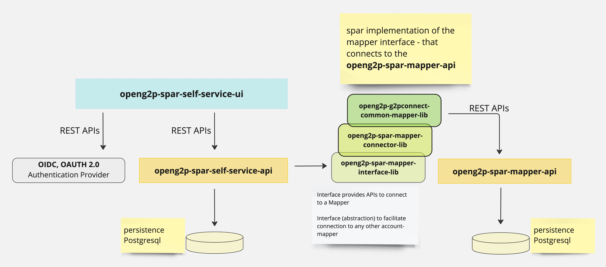

# Technical Overview

The following picture provides a technical architecture of SPAR

<figure><figcaption>
SPAR Technical Architecture
</figcaption></figure>

The SPAR subsystem consists of the following technology components

* **openg2p-spar-self-service-ui** -- This is a ReactJS based **web-ui layer** that enables a beneficiary to login into the Self Service System of SPAR and view and update his financial address.
* **openg2p-spar-self-service-fastapi** -- This is a FastAPI based python **microservice** that provides REST APIs to the UI layer. This microservice facilitates maintenance of financial address to a beneficiary by providing search APIs for banks, branches and wallet providers, so that a beneficiary can provide his/her complete financial address in the registry. This microservices uses a Postgresql persistence layer.
* **openg2p-spar-mapper-fastapi** -- This is a FastAPI based python **microservice** that serves as the id-mapper registry service. This microservice provides G2P-Connect compliant APIs to update and retrieve financial address information
* **openg2p-spar-mapper-interface-lib** -- This is python **library** that specifies interface APIs to connect to an account-mapper service.
* **openg2p-spar-mapper-connector-lib** -- This is a **library** that provides an OpenG2P implementation of the mapper-interface. This connector enables the self-service microservice to connect to the openg2p-spar-mapper-fastapi microservice using REST APIs. In an implementation, if there is a requirement to use some other account-mapper, we will need to provide another connector library. That connector library also needs to implement the openg2p-spar-mapper-interface-lib.
