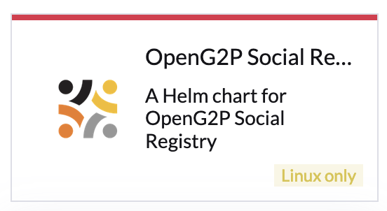

# Deployment

The instructions here pertain to the deployment of all Social Registry and associated components on the Kubernetes cluster using[ Helm charts](../deployment/helm-charts.md).   All the components are installed in the same namespace. The deployment may be achieved by the following methods:

* Using Rancher UI&#x20;
* Using command line

## Prerequisites

Before you deploy, make sure the following are available:

* [Base infrastructure](../deployment/base-infrastructure/)
* Cluster Owner permission on your cluster
* Namespace in which you would be installing the module

## Installation using Rancher UI

1. Log in to Rancher admin console.
2. Select your cluster.
3. Under _Apps -> Repositories_ click on _Create_ to add a repository.
4. Provide _Name_ as "openg2p" and target HTTPS _Index URL_ as [https://openg2p.github.io/openg2p-helm/rancher](https://openg2p.github.io/openg2p-helm/rancher) and click _Create_.
5. To display prerelease versions of OpenG2P, click on your user avatar in the upper right corner of the Rancher dashboard. Then click on "Include Prerelease Versions" under _Preferences_ under _Helm Charts_.
6. &#x20;Navigate to _Apps->Charts_ page on Rancher. You should see OpenG2P Social Registry Helm chart listed.

<figure><figcaption></figcaption></figure>

7. Click on the Helm chart, select the version to be installed and click _Install_.
8. Select the namespace in which you would like the chart to be installed (you will need to create a namespace upfront if it does not already exist) and select the checkbox _Customise Helm options before install._
9. Provide _Global Hostname_ of the installation. Refer to [DNS requirements](../deployment/hardware-requirements.md#dns-requirements) for mapping the hostname.
10. Select the components to be installed. (default options will install all required components)&#x20;
11. Click _Next_ and then _Install_.  &#x20;

## Installation using the command line

* Install the following utilities on your machine:
  * `kubectl`, `istioctl`, `helm`, `jq`, `curl`, `wget`, `git`, `bash`, `envsubst`.
* TBD

## Access links

TBD

## Database

Postgresql is installed as part of the above procedure in the same namespace. The default database created is socialregistrydb`.`

## Sanity testing

TBD
