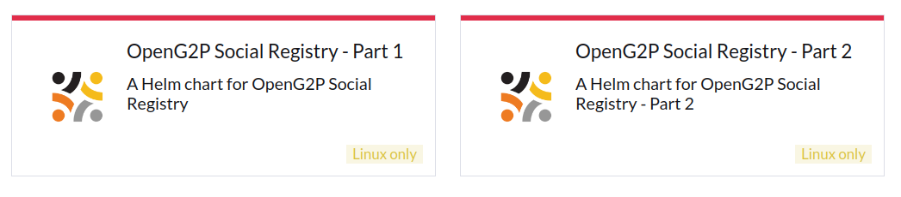

# Deployment

The instructions here pertain to the deployment of all Social Registry and associated components on the Kubernetes cluster using [Helm charts](helm-charts.md).   All the components are installed in the same namespace. The deployment may be achieved by the following methods:

* [Using Rancher UI](./#installation-using-rancher-ui)&#x20;
* [Using command line](./#installation-using-the-command-line)

## Prerequisites

Before you deploy, make sure the following are available:

* [Base infrastructure](../../deployment/base-infrastructure/)&#x20;
* [Domain name requirements](../../deployment/hardware-requirements.md#dns)
  * Domain points to the Nginx network interface (IP)
* SS certificate for the domain
* Nginx&#x20;
  * A vhost (server) conf file is created under `sites-enabled` on Nginx on the above network interface that includes SSL certificates of the domain. &#x20;
  * [Sample conf file](https://github.com/OpenG2P/openg2p-deployment/blob/main/kubernetes/nginx/server.sample.conf)
* Cluster Owner permission on your cluster
* Namespace is created
* Gateways are setup for the domain as given here [Istio namespace setup](../../deployment/base-infrastructure/openg2p-cluster/cluster-setup/istio.md#namespace-setup).

## Installation using Rancher UI

1. Log in to Rancher admin console.
2. Select your cluster.
3. Under _Apps -> Repositories_ click on _Create_ to add a repository.
4. Provide _Name_ as "openg2p" and target HTTPS _Index URL_ as [https://openg2p.github.io/openg2p-helm/rancher](https://openg2p.github.io/openg2p-helm/rancher) and click _Create_.
5. Select the namespace in which you would like to install Social Registry, from the namespace filter on the top-right.
6. To display prerelease versions of OpenG2P apps, click on your user avatar in the upper right corner of the Rancher dashboard. Then click on "Include Prerelease Versions" under _Preferences_ under _Helm Charts_.
7. Navigate to _Apps->Charts_ page on Rancher. You should see "OpenG2P Social Registry" Helm charts listed.

<figure><figcaption></figcaption></figure>

7. Click on "Part 1" Helm chart, select the version to be installed, and click _Install_.
8. On the next screen, choose a name for installation, like `social-registry`. Select the checkbox _Customise Helm options before install_, and click _Next_.
9. Go through each app's configuration page, and configure the following:
   1. Configure a hostname for each app in the following way. `<appname>.<base-hostname>` , where base hostname is the wildcard hostname chosen during [Istio namespace setup](../../deployment/base-infrastructure/openg2p-cluster/cluster-setup/istio.md#namespace-setup).  Example: `socialregistry.dev.openg2p.org` and `odk-sr.dev.openg2p.org` , etc. `<appname>` is arbitrary - default names have been provided.
   2. _Keycloak Base Url_ is your organization-wide Keycloak URL.  (Refer to [Keycloak installation](../../deployment/base-infrastructure/rancher.md#keycloak-installation)).
   3. Create a Keycloak client,&#x20;
   4. &#x20;OIDC Client details are asked. Refer to [Keycloak Client Creation](../../deployment/deployment-guide/keycloak-client-creation.md) guide.
10. Click _Next_ to reach _Helm Options_ page. Disable `wait` flag. Click on _Install_.
11. Navigate back to _Apps->Charts_ page on Rancher. Choose "Part 2" Helm chart. Select the same version as for "Part 1", and click _Install_.
12. On the next screen, give the same installation name as for "Part 1" but with suffix `-p2` , like `social-registry-p2`. Select the same namespace as "Part 1". Select the checkbox _Customise Helm options before install_, and click _Next_.
13. Repeat steps 9 & 10.&#x20;
14. Wait for all pods to get into _Running_ state. This may take several minutes.

<figure><figcaption></figcaption></figure>

## Installation using the command line

* Install the following utilities on your machine:
  * `kubectl`, `istioctl`, `helm`, `jq`, `curl`, `wget`, `git`, `bash`, `envsubst`.
* TBD

## Post Installation

### Keycloak

#### Assigning roles to users

Create[ Keycloak client roles](https://www.keycloak.org/docs/latest/server\_admin/#con-client-roles\_server\_administration\_guide) for the following components and assign them to users:

<table><thead><tr><th width="336">Component</th><th>Role name</th></tr></thead><tbody><tr><td>OpenSearch Dashboards for logging</td><td><code>admin</code></td></tr><tr><td>OpenSearch Dashboards for Reporting </td><td> <code>admin</code></td></tr><tr><td>Apache Superset</td><td><code>Admin</code></td></tr><tr><td>Minio Console</td><td> <code>consoleAdmin</code></td></tr><tr><td>Kafka UI for Reporting</td><td><code>Admin</code></td></tr></tbody></table>

#### Assigning roles to clients

* For Social Registry to be able to access Keymanager APIs, create a realm role in Keycloak with the name "KEYMANAGER\_ADMIN" and assign this as a service account role to the Social Registry Keycloak client.

### Odoo

* Follow with [Odoo post-install guide](../../deployment/deployment-guide/odoo-post-install-configuration.md) to activate Odoo modules.
