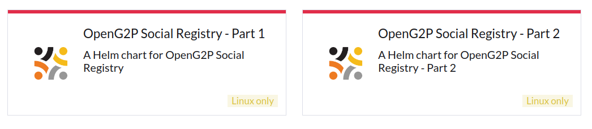

# Deployment

The instructions here pertain to the deployment of all Social Registry and associated components on the Kubernetes cluster using [Helm charts](broken-reference).   All the components are installed in the same namespace. The deployment may be achieved by the following methods:

* [Using Rancher UI](./#installation-using-rancher-ui)&#x20;
* [Using command line](./#installation-using-the-command-line)

## Prerequisites

Before you deploy, make sure the following are available:

* [Base infrastructure](../../deployment/base-infrastructure/) along with domain name and certificates for Rancher and Keycloak
* [Domain names and certificates](domain-names-and-certificates.md) specific to Social Registry.
* Nginx server configuration
  * A conf file is created under `sites-enabled` on Nginx containing the above SSL certs. See [sample conf file](https://github.com/OpenG2P/openg2p-deployment/blob/main/kubernetes/nginx/server.sample.conf).
* Namespace is created (On Rancher a namespace is created under a Project).
* [Project Owner](https://ranchermanager.docs.rancher.com/how-to-guides/new-user-guides/authentication-permissions-and-global-configuration/manage-role-based-access-control-rbac/cluster-and-project-roles#project-roles) permission on the namespace of OpenG2P cluster.&#x20;
* Gateways are setup for the domain as given here [Istio namespace setup](../../deployment/base-infrastructure/openg2p-cluster/cluster-setup/istio.md#namespace-setup).

## Installation using Rancher UI

1. Log in to Rancher admin console.
2. Select your cluster.
3. Under _**Apps -> Repositories**_ click on _Create_ to add a repository.
4. Provide _Name_ as "**openg2p**" and target HTTPS _Index URL_ as [https://openg2p.github.io/openg2p-helm/rancher](https://openg2p.github.io/openg2p-helm/rancher) and click _Create_.
5. Select the namespace in which you would like to install Social Registry, from the namespace filter on the top-right.
6. To display **prerelease versions** of OpenG2P apps, click on your user avatar in the upper right corner of the Rancher dashboard. Then click on "**Include Prerelease Versions**" under _Preferences_ under _Helm Charts_.
7. Navigate to _**Apps->Charts**_ page on Rancher. You should see "**OpenG2P Social Registry**" Helm charts listed.

<div align="left"><figure><figcaption></figcaption></figure></div>

7. You can ignore "**Part 1**" as it refers to an older version of the Helm chart, and proceed directly to "**Part** **2**" for the updated Helm chart instructions.
8. Click on "**Part 2**" Helm chart, select the latest version to be installed, and click _Install_.
9. On the next screen, choose a name for installation, like `social-registry`. Select the checkbox _**Customise Helm options** before install_, and click _Next_.
10. Go through each app's configuration page, and configure the following:
    1. Configure a hostname for each app in the following way. `<appname>.<base-hostname>` , where base hostname is the wildcard hostname chosen during [Istio namespace setup](../../deployment/base-infrastructure/openg2p-cluster/cluster-setup/istio.md#namespace-setup).  Example: `socialregistry.dev.openg2p.org` and `odk-sr.dev.openg2p.org` , etc. `<appname>` is arbitrary - default names have been provided.
    2. _**Keycloak Base Url**_ is your organization-wide Keycloak URL.  (Refer to [Keycloak installation](../../deployment/base-infrastructure/rancher.md#keycloak-installation)).
    3. OIDC Client details are asked. **Create Keycloak client**, refer to [Keycloak Client Creation](../../deployment/deployment-guide/keycloak-client-creation.md) guide.
    4.  To change the docker image from the default image, click on _Edit YAML_ table and update the following section in Helm. This step is required only if you have separate docker image to be deployed or else you can go with default one _skip this step_.

        ```
        image:
            pullPolicy: Always
            repository: openg2p/openg2p-social-registry-odoo-package
            tag: 17.0-develop-social-registry
        ```
11. To pull docker from a private repository on Docker Hub, follow guide [here](../../deployment/deployment-guide/pulling-docker-from-private-repository-on-docker-hub.md). This step is required only if you have separate private docker image to be deployed or else you can go with default one _skip this step_.
12. Click _Next_ to reach _Helm Options_ page. Disable `wait` flag. Click on _Install_.
13. Wait for all pods to get into _**Running**_**&#x20;state**. This may take several minutes.

<div align="center"><figure><figcaption></figcaption></figure></div>

## Installation using the command line

* Install the following utilities on your machine:
  * `kubectl`, `istioctl`, `helm`, `jq`, `curl`, `wget`, `git`, `bash`, `envsubst`.
* TBD

## Post Installation

### Keycloak

#### Assigning roles to users

Create[ Keycloak client roles](https://www.keycloak.org/docs/latest/server_admin/#con-client-roles_server_administration_guide) for the following components and assign them to users:

<table><thead><tr><th width="336">Component</th><th>Role name</th></tr></thead><tbody><tr><td>OpenSearch Dashboards for logging</td><td><code>admin</code></td></tr><tr><td>OpenSearch Dashboards for <a href="../../monitoring-and-reporting/reporting-framework/">Reporting</a> </td><td> <code>admin</code></td></tr><tr><td>Kafka UI for <a href="../../monitoring-and-reporting/reporting-framework/">Reporting</a></td><td><code>Admin</code></td></tr><tr><td>Apache Superset</td><td><code>Admin</code></td></tr><tr><td>Minio Console</td><td> <code>consoleAdmin</code></td></tr></tbody></table>

#### Assigning roles to clients

* For Social Registry to be able to access Keymanager APIs, create a realm role in Keycloak with the name "KEYMANAGER\_ADMIN" and assign this as a service account role to the Social Registry Keycloak client.

### Odoo

* Follow with [Odoo post-install guide](../../deployment/deployment-guide/odoo-post-install-configuration.md) to activate Odoo modules.
