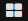

# Installation of Odoo Modules

Once the SR module is deployed, individual Odoo modules can be installed directly from the Odoo dashboard as required.

## Procedure

1. Open the landing page for your environment (e.g., [https://explore.openg2p.org/](https://explore.openg2p.org/)), and log in to the Social Registry module using valid credentials available in the Secrets section of the Rancher UI.
2.  Once you logged in enable `Activate the developer mode` under **settings -> General Settings -> Developer Tools.**

    <figure><figcaption></figcaption></figure>
3. Click the main menu icon  and select **Apps**.
4.  Search G2P modules inside the **Search field** available on the dashboard.

    <figure><figcaption></figcaption></figure>
5. You can search for a module by name to I**nstall** it according to your project requirements. And to upgrade an existing module, click the **Upgrade** button to apply the latest version.
6. Click the **Learn More** button to learn about OpenG2P.
7.  Click the  icon to get Module Information.

    <table><thead><tr><th width="206">Feature</th><th>Description</th></tr></thead><tbody><tr><td>Module Info</td><td>It contains the information of the module.</td></tr><tr><td>Learn More</td><td>It navigates to the OpenG2P website page.</td></tr></tbody></table>

Similarly, you can activate the other modules for Social Registry based on your project requirements.
