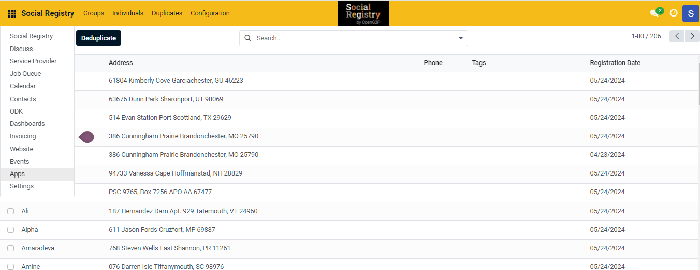

---
layout:
  title:
    visible: true
  description:
    visible: false
  tableOfContents:
    visible: true
  outline:
    visible: true
  pagination:
    visible: true
---

# Install Odoo Modules

After deployment of SR module, you still need to install the individual Odoo modules from inside the App.&#x20;

## Procedure

1. Use the link [https://socialregistry.explore.openg2p.org/](https://socialregistry.explore.openg2p.org/) and login with valid credentials to access the Social Registry module.
2. Click the main menu icon  and select _**Apps**_.

<figure><figcaption></figcaption></figure>

Apps screen is displayed.

3. Click the _**G2P**_ from the _**CATEGORIES**_ menu in the left pane.

<figure><figcaption></figcaption></figure>

You can find all the modules applicable to Social Registry in the right pane.

4. Choose the module, click the _**Activate/Install**_ button to install the module based on your project requirements.&#x20;


In Odoo 15.0, click the _**Install**_ button, and in Odoo 17.0, click the _**Activate**_ button to install the module based on your project requirements.&#x20;


Or

You can enter the module name in the _**Search**_ field to choose the module to install based on your project requirements.

5. Click the _**Upgrade**_ button to upgrade to the latest version of the module.
6. Click the _**Learn More**_ button to learn about OpenG2P.
7. Click the  icon

<table><thead><tr><th width="206">Feature</th><th>Description</th></tr></thead><tbody><tr><td>Module Info</td><td>It contains the information of the module.</td></tr><tr><td>Learn More</td><td>It navigates to the OpenG2P website page.</td></tr></tbody></table>


* In Odoo 15.0, after the successful installation, the status of the module is changed from Install to Installed.&#x20;
* In Odoo 17.0,  the _**Activate**_ button will not be available after the successful installation of the module.


Similarly, you can activate the other modules for Social Registry based on your project requirements.
