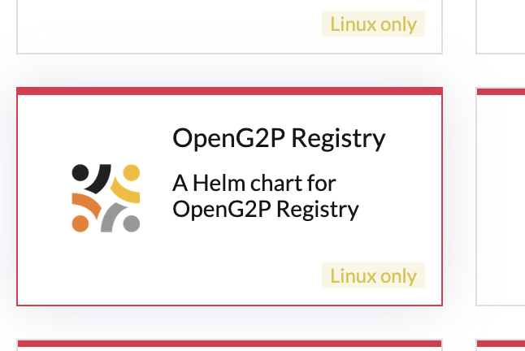

# Registry Installation Instructions

The instructions here pertain to the deployment of all  Registry and associated components on the Kubernetes cluster using Helm charts. All the components are installed in the same namespace. The deployment may be achieved by the following methods:

## Prerequisites

Before you deploy, make sure the following are in place:

* ✅ [Infrastruction setup](../../deployment/deployment-instructions/infrastructure-setup.md) is completed&#x20;
* ✅ [Environment](../../deployment/deployment-instructions/environment-installation.md) has been setup with common resources installed.
* ✅ Domain name `registry.<your environment>.<your domain name>` (e.g. `registry.qa.openg2p.org`) is available along with SSL certificate for the domain (_the wild certificate should have already been loaded during Infrastructure setup_)
* ✅ **Project Owner access** on the OpenG2P namespace

## Installation using Rancher UI

1. Log in to Rancher admin console.
2. Select your cluster.
3. Under **Apps -> Repositories** click on Create to add a repository.
4.  Provide Name as `openg2p` and target HTTPS Index URL as [https://openg2p.github.io/openg2p-helm/rancher](https://openg2p.github.io/openg2p-helm/rancher) and click Create.\


    <figure><figcaption></figcaption></figure>
5.  To display prerelease versions of OpenG2P apps, click on your user avatar in the upper right corner of the Rancher dashboard. Then click on `Include Prerelease Versions` under Preferences under Helm Charts.\


    <figure><figcaption></figcaption></figure>
6. Select the namespace in which you would like to install Registry, from the namespace filter on the top-right.
7. Navigate to **Apps->Charts** page on Rancher. You should see `OpenG2P  Registry` Helm charts listed.

<figure><figcaption></figcaption></figure>

8. Proceed to Install `OpenG2P  Registry` chart select the latest version to be installed, and click Install.
9. On the next screen, choose a name for installation, like `registry`. Select the checkbox `Customise Helm options` before install, and click Next.
10. Go through each app's configuration page, and configure the following:
    1. Configure a hostname for each app in the following way. `<appname>.<base-hostname>` , where base hostname is the wildcard hostname chosen during [Istio namespace setup](../../deployment/scaling/base-infrastructure/openg2p-cluster/cluster-setup/istio.md#namespace-setup).  Example: `socialregistry.dev.openg2p.org` and `odk-sr.dev.openg2p.org` , etc. `<appname>` is arbitrary - default names have been provided.
    2. **Keycloak Base Url** is your organization-wide Keycloak URL. (Ex: keycloak.\<your domain>.org)
    3. OIDC Client details are asked. **Create Keycloak Client**, refer to [Keycloak Client Creation](../../deployment/deployment-guide/keycloak-client-creation.md) guide.
    4.  To change the docker image from the default image, click on `Edit YAML` table and update the following section in Helm. \
        **Note:** This step is required only if you have separate docker image to be deployed or else you can go with default one skip this step.

        ```bash
        image:
            pullPolicy: Always
            repository: openg2p/openg2p-social-registry-odoo-package
            tag: 17.0-develop-social-registry
        ```
11. To pull docker from a private repository on Docker Hub, follow guide [here](../../deployment/deployment-guide/pulling-docker-from-private-repository-on-docker-hub.md). \
    **Note:** This step is required only if you have separate private docker image to be deployed or else you can go with default one skip this step.
12. Click Next to reach Helm Options page. Disable `wait` flag. Click on Install.
13. Wait for all the pods to get into **Running state**. This may take several minutes.

    <div align="left"><figure><figcaption></figcaption></figure></div>

## Post Installation

### Keycloak

#### Assigning roles to users

Create[ Keycloak client roles](https://www.keycloak.org/docs/latest/server_admin/#con-client-roles_server_administration_guide) for the following components and assign them to users:

<table><thead><tr><th width="336">Component</th><th>Role name</th></tr></thead><tbody><tr><td>OpenSearch Dashboards for logging</td><td><code>admin</code></td></tr><tr><td>OpenSearch Dashboards for <a href="../../monitoring-and-reporting/reporting-framework/">Reporting</a> </td><td><code>admin</code></td></tr><tr><td>Kafka UI for <a href="../../monitoring-and-reporting/reporting-framework/">Reporting</a></td><td><code>Admin</code></td></tr><tr><td>Apache Superset</td><td><code>Admin</code></td></tr><tr><td>Minio Console</td><td><code>consoleAdmin</code></td></tr></tbody></table>

#### Assigning roles to clients

* For Social Registry to be able to access Keymanager APIs, create a realm role in Keycloak with the name "KEYMANAGER\_ADMIN" and assign this as a service account role to the Social Registry Keycloak client.

### Odoo

* Activate the Registry Odoo module after logging into Odoo (TBD).

## Tear down

To completely cleanup Registry installation, note the following:  Helm uninstall will **not** delete the database and secrets created. Secret for user does not get deleted (and rightly so). If you re-run the Helm while database still exists, it just brings up Odoo without any issues - it does not re-initalize the database.

To tear down completely:

1. Helm uninstall via command line or Rancher (Apps -> Installed Apps --> Delete)
2. Delete `registry` secret in the namespace
3. Drop `registry_db` and user from Postgres&#x20;
   1. Login into Postgres as admin (via port fowarding or directly from Rancher). Use the `postgres-password` key in `openg2p-commons-postgresql` secret to get the password
   2. `drop database registry_db;`&#x20;
   3. `drop role registry_db_user;`&#x20;
4. Drop `mosip-kernel` database:
   1. `drop database mosip-kernel`&#x20;

_<mark style="color:orange;">TBD: Step 4 will be moved to openg2p-commons, so this won't be required here.</mark>_
