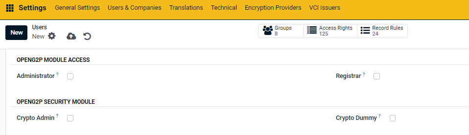

# Administration / User Management

In the Social Registry, user management is typically handled through an administrative interface that allows administrators to create, modify, and deactivate user accounts. The specific process may vary depending on the system's design and configuration, but generally, the following process are involved:

1. **User Creation:** Administrators can create new user accounts by entering basic information such as username, password, and email address. They may also assign roles and permissions to the new user.
2. **Role Assignment:** Users are assigned roles based on their responsibilities within the system. Roles determine the permissions and access rights that users have within the system.
3. **User Activation and Deactivation:** Administrators can activate or deactivate user accounts as needed. Deactivating an account prevents the user from accessing the system, while activating an account restores access.
4. **Audit Logs:** The system may keep audit logs of user activity, recording actions such as login attempts, changes to user accounts, and access to sensitive data. Audit logs help administrators monitor user activity and identify potential security issues

## Roles

Each role in the Social Registry system plays a critical part in ensuring the accurate collection, management, and security of data, ultimately contributing to the effective operation of the system

<table><thead><tr><th width="193" align="center">Role </th><th>Responsibilities</th></tr></thead><tbody><tr><td align="center">Administrator</td><td><ul><li>The Administrator role in the Social Registry system is responsible for overall system management and configuration.</li><li>Administrators have permissions to manage user accounts, configure system settings, and oversee the general operation of the system.</li><li>Administrators can create new user accounts by entering basic information such as username, password, and email address. They may also assign roles and permissions to the new user.</li></ul></td></tr><tr><td align="center">Crypto Administrator</td><td><ul><li>The Crypto Administrator plays a crucial role within the security module of the system.</li><li>This role is responsible for managing and securing cryptographic keys, overseeing encryption practices, and ensuring data integrity and protection against unauthorized access.</li><li>The Crypto Administrator is vital in maintaining the confidentiality, availability, and integrity of sensitive information.</li></ul></td></tr><tr><td align="center">Registrar</td><td><ul><li>A Registrar is a role within the Social Registry system responsible for maintaining Registry records.</li><li>Registrars have specific permissions related to adding, editing, and managing registrant information within the system, while also having restrictions to ensure data integrity and security.</li></ul></td></tr><tr><td align="center">Enumerator</td><td><ul><li>Enumerators are individuals responsible for collecting demographic data from individuals and households to populate data in the registry.</li><li>Enumerators are typically field workers who visit households, communities, or places to gather the necessary information.</li></ul></td></tr><tr><td align="center">Service Provider / Operator</td><td><ul><li>Service providers refer to institutions or organizations responsible for collecting data on individuals and households</li></ul></td></tr></tbody></table>

The figure below shows below some of the roles or access levels that can be assigned to users

<figure><figcaption></figcaption></figure>
