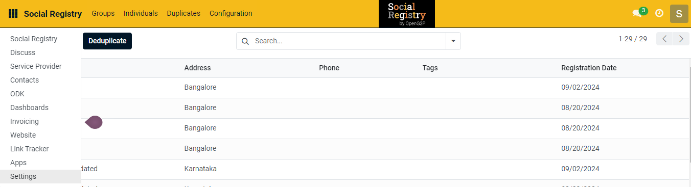
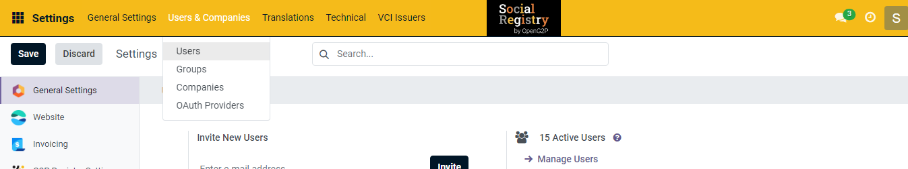
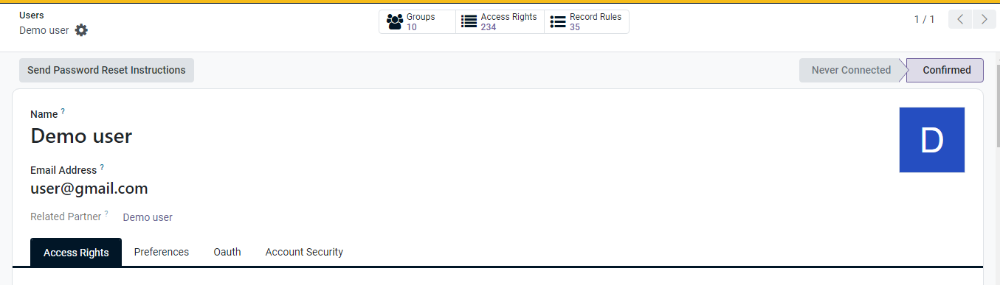

# 📔 Assign a Role to a User

This document provides instructions to assign a role to a user in Social Registry module.

## Prerequisites

* The user must have access to the Social Registry module.
* The user must have Administrator role.

Note:

Enable a debug mode, when you assign a role to a user.

## Procedure

1. Click the main menu icon  and select _**Settings**_.

<figure><figcaption></figcaption></figure>

2. Click the tab _**Users & Companies**_ and select _**Users**_.

<figure><figcaption></figcaption></figure>

The _**Users**_ screen is displayed.

3. Click the _**User**_ to assign a role in the Users list.

For example, here Demo user is selected to assign a role.

<figure><figcaption></figcaption></figure>

The Demo user screen is displayed

4. Click the _**Access Rights**_ tab.

<figure><figcaption></figcaption></figure>

The following list of fields includes descriptions of each that must be filled out to assign a role and provide relevant access to the user.

<table><thead><tr><th width="218"></th><th></th></tr></thead><tbody><tr><td>USER TYPE</td><td></td></tr><tr><td>User types</td><td>
Select the appropriate user types. The valid values are:
<ul><li>Internal User</li><li>Portal</li><li>Public</li></ul></td></tr><tr><td>ACCOUNTING</td><td></td></tr><tr><td><ul><li>Invoicing </li><li>Bank</li></ul></td><td>Retain the default values.</td></tr><tr><td>WEBSITE</td><td></td></tr><tr><td>Website</td><td>Retain the default values.</td></tr><tr><td>ADMINISTRATION</td><td></td></tr><tr><td>Administration</td><td>
Select the appropriate values. The valid values  are:
<ul><li>Access Rights</li><li>Settings</li></ul>
Note:

The Settings option must be chosen from the drop-down only for the <em><strong>Administrator</strong></em> role.
</td></tr><tr><td>OTHER</td><td></td></tr><tr><td><ul><li>Job Queue </li><li>Dashboard</li></ul></td><td>Retain the default values.</td></tr><tr><td>OPENG2P MODULE ACCESS</td><td></td></tr><tr><td>Administrator</td><td>Check the box, if the user needs to be assigned as a <em><strong>Administrator</strong></em> role.</td></tr><tr><td>Registrar</td><td>Check the box, if the user needs to be assigned as a <em><strong>Registrar</strong></em> role.</td></tr><tr><td>OPENG2P SECURITY MODULE</td><td></td></tr><tr><td>Crypto Admin</td><td>When the user installs the <em><strong>Security</strong></em> module, the <em><strong>Crypto Admin</strong></em> option is checked as needed.</td></tr><tr><td>Crypto Dummy</td><td>When the user installs the <em><strong>Security</strong></em> module, the <em><strong>Crypto Dummy</strong></em> option is checked as needed.</td></tr><tr><td>OPENG2P DOCUMENTS MODULE</td><td></td></tr><tr><td>Document Admin</td><td>When the user installs the <em><strong>Documents</strong></em> module, the <em><strong>Document Admin</strong></em> option is checked as needed.</td></tr><tr><td>Document Write</td><td>When the user installs the <em><strong>Documents</strong></em> module, the <em><strong>Document Write</strong></em> option is checked as needed.</td></tr><tr><td>Document Read</td><td>When the user installs the <em><strong>Document</strong></em> module, the <em><strong>Document Read</strong></em> option is checked as needed.</td></tr><tr><td>OPENG2P REST API</td><td></td></tr><tr><td>Rest API GET</td><td>The <strong>Rest API GET</strong> option is checked, if the authenticated/authorised user accesses the OpenG2P Rest API as needed.</td></tr><tr><td>Rest API POST</td><td>The <em><strong>Rest API POST</strong></em> option is checked, if the authenticated/authorised user accesses the OpenG2P Rest API as needed.</td></tr><tr><td>TECHNICAL</td><td>
The options listed below this section are out-of-the-box Odoo options.

Select the appropriate options from the list as needed.

Note:

Mostly the options <em><strong>Access to export feature</strong></em> and <em><strong>Mail Template Editor</strong></em> are checked.
</td></tr><tr><td>FASTAPI</td><td>The options listed below this section are checked only for the authenticated/authorised user who has access to the <em><strong>FAST API</strong></em> as needed.</td></tr><tr><td>EXTRA RIGHTS</td><td>
The options listed below this section are checked for the user who needs access to extra options.

Note:

Mostly the option <em><strong>Contact Creation</strong></em> is checked.
</td></tr><tr><td>OTHER</td><td>
The options listed below this section are checked for the user who needs access to other options.

Note:

Mostly the option <strong>Bypass HTML Field Sanitize</strong> is checked.
</td></tr></tbody></table>

| Icon                                                                                         | Click to                                                                                                                                                                                                                                     |
| -------------------------------------------------------------------------------------------- | -------------------------------------------------------------------------------------------------------------------------------------------------------------------------------------------------------------------------------------------- |
|               | 
Select the appropriate value. The available values are: 
<ul><li>Archive</li><li>Duplicate</li><li>Change Password</li><li>Disable two-factor authentication</li><li>Send Password Reset Instructions</li><li>Privacy Lookup</li></ul> |
|    | Save the data and exit from the screen.                                                                                                                                                                                                      |
|  | Discard changes and exit from the screen.                                                                                                                                                                                                    |

Now that the Administrator has granted access permissions in Settings, the user can utilise the module as intended.
