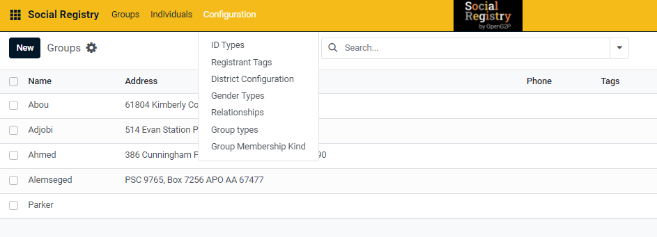
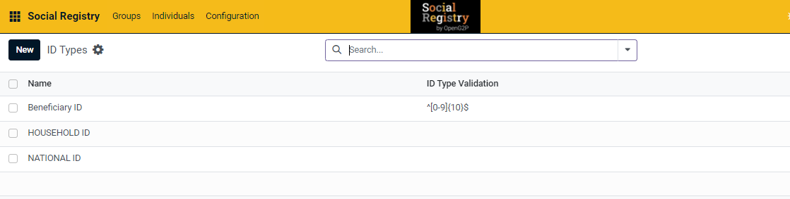
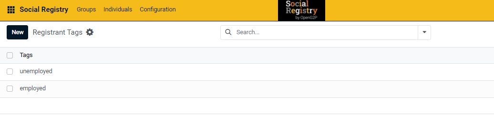
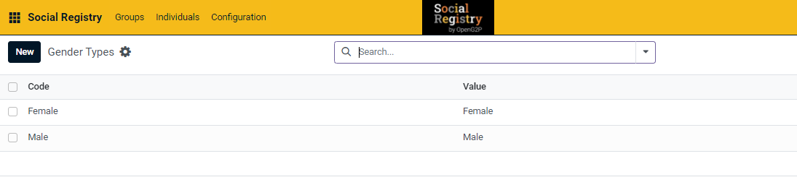
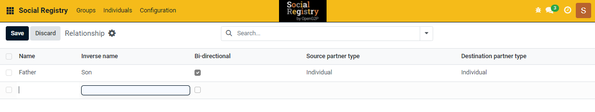
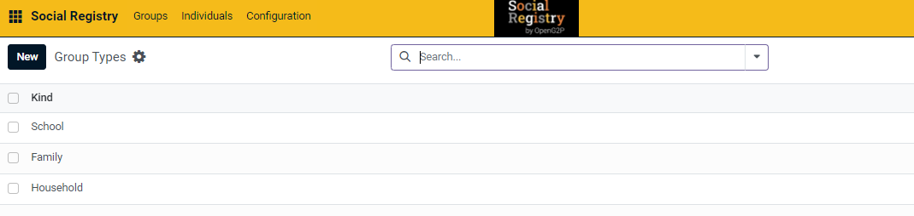
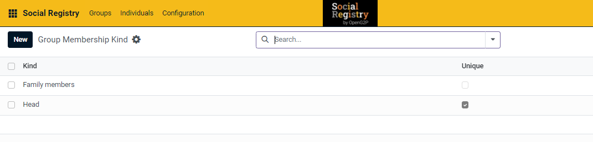

---
layout:
  title:
    visible: true
  description:
    visible: false
  tableOfContents:
    visible: true
  outline:
    visible: true
  pagination:
    visible: true
---

# Configurations

The Social Registry platform provides configurations to define values (enumerations) for a field. These fields are related to the registrant's identity and association with other registrants. Once defined, these values are available for selection in a drop-down list for that field. This is the list of currently available configurations:

The figure below illustrates the current configurations in the social registry.

<figure><figcaption></figcaption></figure>

### ID Types

ID Type is a reference name given by the platform to refer to a registrant identity such as driver's license, MOSIP ID, Aadhar, etc. Users can define multiple ID Types. Once defined, users can select the ID Type from a dropdown list. Each registrant's ID Type has an ID Number (identifier) associated with it.&#x20;

The figure below illustrates the 'ID Types' page with some created IDs displayed below.

<figure><figcaption></figcaption></figure>

### Registrant Tags

Registrant tags are used to define the categories for Individuals and Groups such as indigenous, solo parents, minors, unemployed, disabled, mentally challenged, etc. These tags can be used to differentiate and identify the registrants accordingly.

The figure below illustrates the 'Registrant Tags' page with some created tags displayed below.

<figure><figcaption></figcaption></figure>

### Gender Types

Gender types are used to define the gender of individuals and members in groups. Users can create gender types from the configurations, which will appear as a drop-down menu for selecting the gender type. This allows for easy categorization and identification of individuals and group members based on their gender.

The figure below illustrates the 'Gender Types' page with some created types displayed below.

<figure><figcaption></figcaption></figure>

### Relationships

Relationship is used to record the relation between registrants such as father and son, mother and daughter, and village head and villagers. Relationships can be established between individuals and groups. Some common examples are:

* Individual<>Individual: Father<>Son, Mother<>Daughter, etc.
* Individual<>Group: Village head<>Villagers, Social worker<>Group of beneficiaries, etc.
* Group<>Individual: School<>Principal, Children<>Mother, etc.
* Group<>Group: Class<>School, Schools<>Districts, etc.

Social Registry platform provides options for directionality in relationships, i.e. bi-directional meaning both parties are connected or uni-directional, where the connection is one-way based on context. Some examples are:

Examples of bi-directional relationships:

* A husband and wife are both connected to each other in the system.
* Two siblings are linked to each other as family members.

Examples of uni-directional relationships:

* The father can authenticate the minor child, but the minor child cannot authenticate the father.
* A representative from a group of beneficiaries can receive benefits on behalf of a beneficiary, but the beneficiary cannot receive benefits on behalf of the representative.

The figure below illustrates the 'Relationship' page with some created values and displayed below.

<figure><figcaption></figcaption></figure>

The exact interpretation of relationships can vary based on the program and the situation. Social Registry provides all the necessary configurations to the administrator to define complex relationships.

### Group Types

Group Types define the association among a group of registrants. Some common examples of Group Types are family, household, village, and company.

The figure below illustrates the 'Group Types' page with some created entries and displayed below.

<figure><figcaption></figcaption></figure>

### Group Membership Kind

The Group Membership Kind establishes the role of an individual in a group. For example, the individual could be a member or head of the group. This field is especially useful for programs that disburse the benefits to only the head of the group but also record the list of other members in the group.&#x20;

The figure below illustrates the 'Group Membership Kind' page with some created entries and displayed below.

<figure><figcaption></figcaption></figure>

## Related user guides

:notebook\_with\_decorative\_cover:[Configurations](user-guide/)
