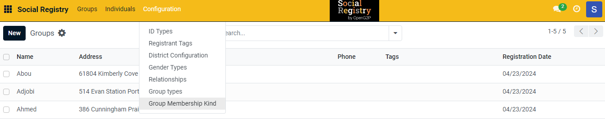
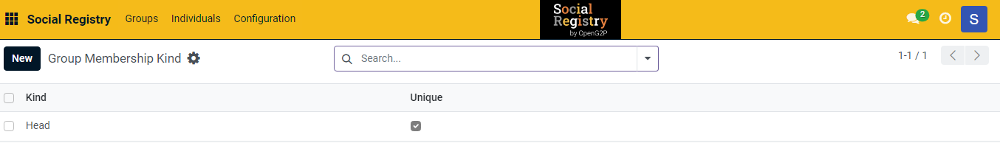
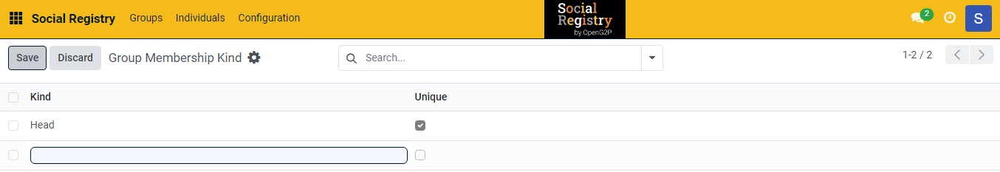
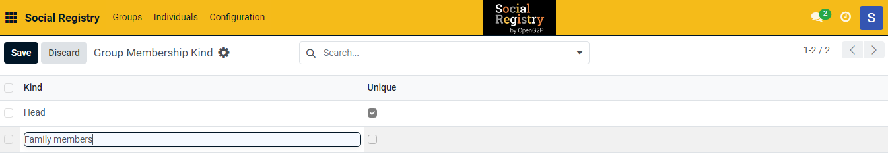
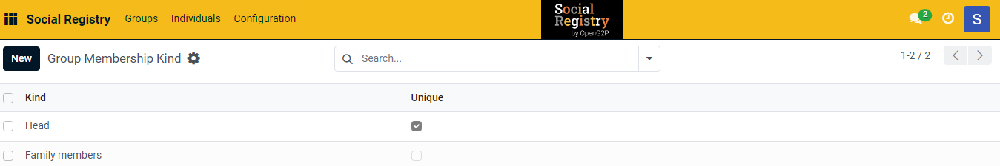

---
layout:
  title:
    visible: true
  description:
    visible: false
  tableOfContents:
    visible: true
  outline:
    visible: true
  pagination:
    visible: true
---

# 📔 Configure Group Membership Kind

This document provides instructions to configure group membership kind in the _**Social Registry**_ module.

## Prerequisites

* The user must have Registrar and Administrator role.
* The user must have access to the Social Registry module.

## Procedure

1. Use the link _**socialregistry.explore.openg2p.org**_ to access Social Registry.
2. Click the main menu icon  and select _**Social Registry**_.

_**Social Registry**_ screen is displayed.

<figure><figcaption></figcaption></figure>

3. Click the _**Configuration**_ in the menu bar and then select _**Group membership kind.**_

<figure><figcaption></figcaption></figure>

_**Group membership kind**_ screen is displayed.

<figure><figcaption></figcaption></figure>

4. Click the _**New**_ button. It enables an empty field.

<figure><figcaption></figcaption></figure>

5. Enter the relevant [Group Membership Kind](../#group-membership-kind) in the _**Kind**_ field.
6. Check the _**Unique**_ check box for the value that is considered as Head of the group.

For example, here, enter the value as Family members and by default the Head value is checked.

<figure><figcaption></figcaption></figure>

7. Click the _**Save**_ button to save the group membership kind.
8. Click the _**Discard**_ button to exit from the screen.

The newly created group membership kind is added to the group membership kind list.

<figure><figcaption></figcaption></figure>

9. Repeat the steps 4, 5, 6, and 7 to add the relevant group membership kind.

This completes the configuration of group membership kind in Social Registry module.

## Delete Group Membership Kind

Refer to the user guide's [Configure Registrant Tags](configure-registrant-tags.md#delete-registrant-tags) section to delete group membership kind.
