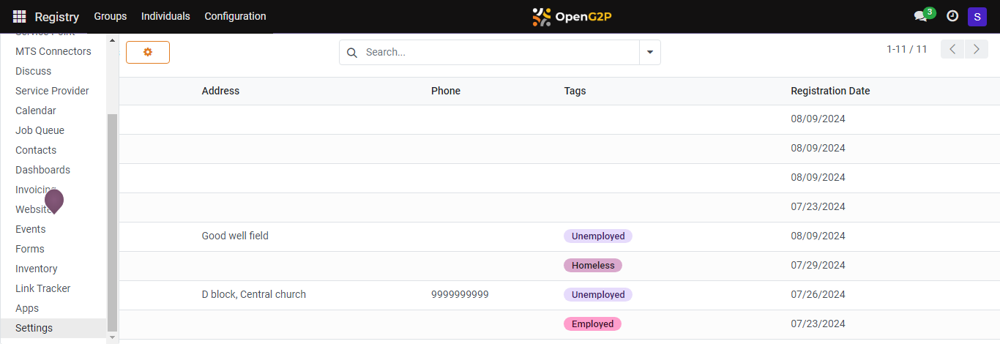
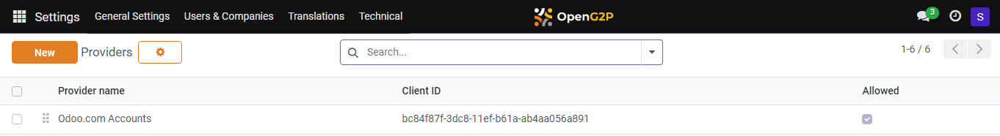
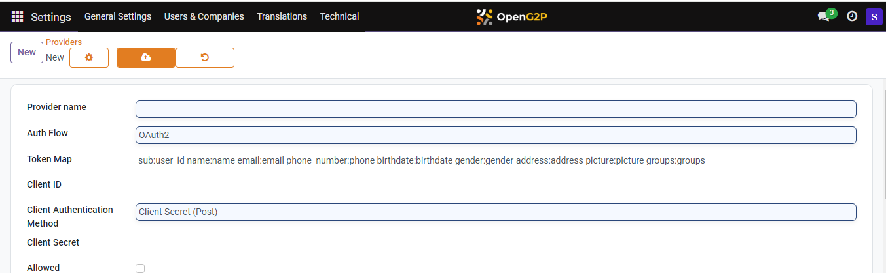

---
layout:
  title:
    visible: true
  description:
    visible: false
  tableOfContents:
    visible: true
  outline:
    visible: true
  pagination:
    visible: true
---

# 📔 Configure eSignet Auth Provider for ID Authentication

This document provides instructions on how to configure eSignet Authentication Provider in PBMS to help the end-users to utilise the eSignet option to log into PBMS.

## Prerequisites

* Create an eSignet client for PBMS/Social Registry as given in eSignet Client Creation guide.
  * Create a public key and a private key JWKS pair. Use the public key JWK during eSignet creation and keep the private key JWK.
  *   Allowed redirect URIs of the client must contain

      `https://socialregistry.your.org/auth_oauth/g2p_registry_id/authenticate`
* Create two ID types on the Registry such as `NATIONAL ID` and `NATIONAL ID TOKEN`. To configure ID types refer the [Configure ID Types](../../../../pbms/functionality/beneficiary-management/beneficiary-registry-configurations/user-guides/configure-id-types.md) documentation.
* Install the [OpenID Connect Authentication](../../../../pbms/development/odoo-modules/openid-connect-authentication.md) and [G2P Auth: OIDC - Reg ID](../../../../pbms/development/odoo-modules/authentication-oidc-reg-id.md) module.

## Procedure

1. Click the main menu icon  and select _**Settings**_.

<figure><figcaption></figcaption></figure>

The _**Settings**_ screen is displayed.

2. Select the tab _**Users & Companies**_, and click the option _**OAUTH Providers**_.

<figure><figcaption></figcaption></figure>

_**Providers**_ screen is displayed.

<figure><figcaption></figcaption></figure>

3. Click the _**New**_ button.

_**Providers New**_ screen is displayed.

<figure><figcaption></figcaption></figure>

4. Enter the values in the respective fields.

For example, the fields, their descriptions, and sample values are given below.

<table><thead><tr><th width="327">Feature</th><th width="281">Description</th><th>Value</th></tr></thead><tbody><tr><td>Provider name</td><td>Enter the provider name.</td><td>For example: eSignet for beneficiary portal</td></tr><tr><td>Auth Flow</td><td>Select the option <em><strong>OpenID Connect Authorization Code Flow</strong></em> from the drop-down.</td><td></td></tr><tr><td>Token Map</td><td>You can find a default value. In the default value replace <code>sub: user_id</code> with <code>individual_id: user_id</code>.</td><td></td></tr><tr><td>Client ID</td><td>
The ID of the eSignet client.

To learn more refer to eSignet Client Creation.
</td><td></td></tr><tr><td>Client Authentication Method</td><td>Select the option <em><strong>Private Key JWT</strong></em> from the drop-down.</td><td></td></tr><tr><td>Client Private Key</td><td>The <em><strong>Client Private Key</strong></em> of the eSignet client. To learn more, refer to eSignet Client Creation.</td><td></td></tr><tr><td>Allowed</td><td>Uncheck the box.  </td><td></td></tr><tr><td>Allowed in Self Service Portal</td><td>Uncheck the box.</td><td></td></tr><tr><td>Allowed in Service Provider Portal</td><td>Uncheck the box.</td><td></td></tr><tr><td>Login button label</td><td>Enter the label name for the eSignet Login button.</td><td>
For example:  <code>Login with eSignet.</code>

Note: This text with the button name will appear on login page. 
</td></tr><tr><td>Authorization URL, Userinfo URL, Token Endpoint, JWKS URL</td><td>These are to be configured as available in the well-known config of eSignet. </td><td></td></tr><tr><td>Verify Access Token Hash</td><td>Check the box to enable the option <em><strong>Verify Access Token</strong></em>.</td><td></td></tr><tr><td>Allow Signup</td><td>Select the option <em><strong>Denies</strong></em><strong> user signup (invitation only)</strong> from the drop-down. </td><td></td></tr><tr><td>Sync User Groups</td><td>Select the option <em><strong>Never</strong></em> from the drop-down. </td><td></td></tr><tr><td>G2P REG ID SETTINGS</td><td></td><td></td></tr><tr><td>G2P Registrant ID Type </td><td>Enter the configured ID type</td><td>For example: <code>NATIONAL ID.</code></td></tr></tbody></table>

Note:

The rest of the fields have the default values.

5. Click the icon  to save the changes.

This completes the process of configuring the _**eSignet Authentication Provider**_ in SR.

To know the process on authenticate an individual, refer [ID Authentication Process](id-authentication-process.md) documentation.
