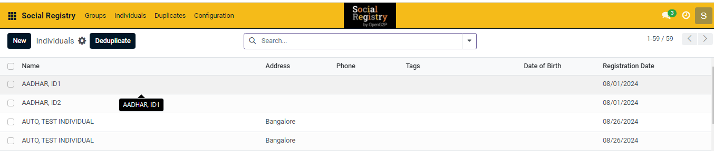
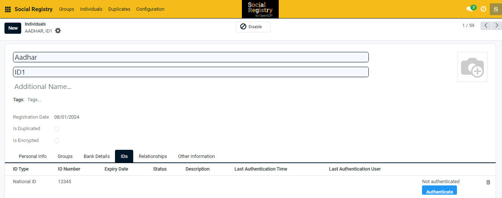

# 📔 ID Authentication Process

This document provides instructions to perform ID authentication of an individual using Social Registry (SR) module's individual registry.

## Prerequisites

* The user must have access to Social Registry module.
* The user must have an Registrar and Administrator access.

## Procedure

1. Click the main menu icon  and select _**Social**_ _**Registry**_.

_**Social Registry**_ screen is displayed

2. Click the Individual tab in the menu bar.
3. Select the individual to perform ID authentication.

<figure><figcaption></figcaption></figure>

Individual screen is displayed.

<figure><figcaption></figcaption></figure>

4. Select the IDs tab.
5. Click the _**Authenticate**_ button.

A popup is displayed and redirects to eSignet to capture biometrics and perform authentication.

6. Verify whether the ID matched with the current registry.

If authentication is successful, displays the response from the ID provider.
