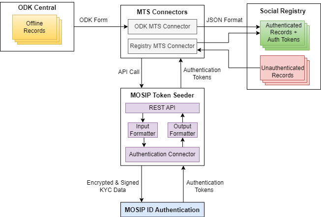

---
layout:
  title:
    visible: true
  description:
    visible: false
  tableOfContents:
    visible: true
  outline:
    visible: true
  pagination:
    visible: true
---

# ID Verification

Social Registry with MOSIP Token Seeder (MTS) uses MTS Connector to authenticate registrants, who are registered using the ODK Collect App. The Unique ID Number (UIN) and demographic details provided by registrants are verified by calling APIs of the [MOSIP ID Authentication](https://docs.mosip.io/1.2.0/id-authentication) (IDA) system. The MOSIP IDA responds with an Authentication Token upon successful verification. MTS is a standalone service offered by MOSIP.&#x20;

MTS Connectors can take inputs from both ODK Central and Social Registry. Since one MTS Connector takes only one type of input, separate MTS connectors are required for ODK Central and Social Registry.

A high-level representation of the interactions between different components during authentication is shown below:

<figure><figcaption></figcaption></figure>

## Functionality

* Verify ID information at the backend by connecting to APIs of the ID system (using [MTS connector](https://docs.mosip.io/1.2.0/integrations/mosip-token-seeder/mts-odk-importer)).
* Bulk ID verification.
* Tokenize the ID and populate it in Social Registry.


**Is ID number by itself considered Personally Identifiable Information (PII**) ?

If ID is random, revokable and tokenized (not used for seeding), it is not PII. But if it is codified, used for seeding everywhere and not changeable, then it can be used to identify the person or know something about them


