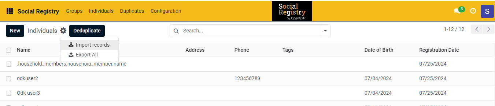
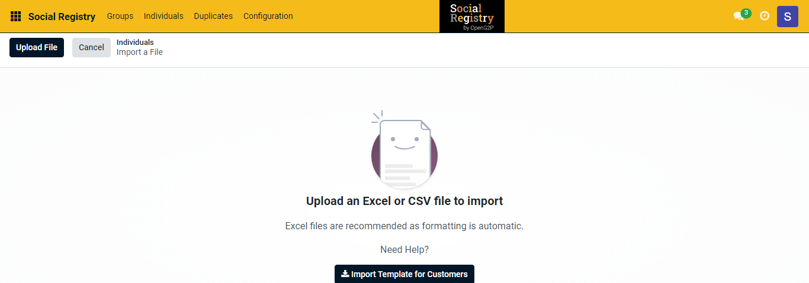

---
layout:
  title:
    visible: true
  description:
    visible: false
  tableOfContents:
    visible: true
  outline:
    visible: true
  pagination:
    visible: true
---

# 📔 Import CSV file to Social Registry

This document provides instructions to import .csv file to Social Registry (SR) Module.

## Prerequisites

* The user must have access to the Social Registry module in OpenG2P systems.

## Procedure

1. Use the link _**socialregistry.explore.openg2p.org**_ to access the Social Registry.
2. Click the main menu icon  and select _**Social Registry**_

You can view the _**Groups**_ screen by default.

<figure><figcaption></figcaption></figure>

3. In the menu bar, click the _**Individual**_ tab.

_**Individual**_ screen is displayed.

4. Click the _**Action**_ icon and then select _**Import records**_.

<figure><figcaption></figcaption></figure>

_**Individuals Import a File**_ screen is displayed.

<figure><figcaption></figcaption></figure>

5. Click the _**Upload File**_ button.
6. Browse for the file location and upload the file.

Below the File Column, the name of the fields are populated from the .csv file. You need to map the field names from CSV file with the associated Odoo Field name.

For example, the mapping of the few fields are given below. &#x20;

| Field name in .csv file | Mapped to Odoo Field Name |
| ----------------------- | ------------------------- |
| language                | Language                  |
| id\_type                | Registrant IDs / ID Type  |
| id\_number              | Registrant IDs / Value    |
| given\_name             | Given Name                |

Similarly, you must map the rest of the fields.

7. Click the _**Test**_ button to validate the mapping.&#x20;

A pop up message _**Everything seems valid**_ implies that the mapping of the field is successfully validated.&#x20;

8. Click the _**Load File**_ button to upload another csv file for validation
9. Click the _**Cancel**_ button to exit from the screen.
10. Click the _**Import**_ button to import the csv file after successful validation.

The files are imported to the individual registry dashboard.

This completes the process of importing .csv file into the individual registry.
