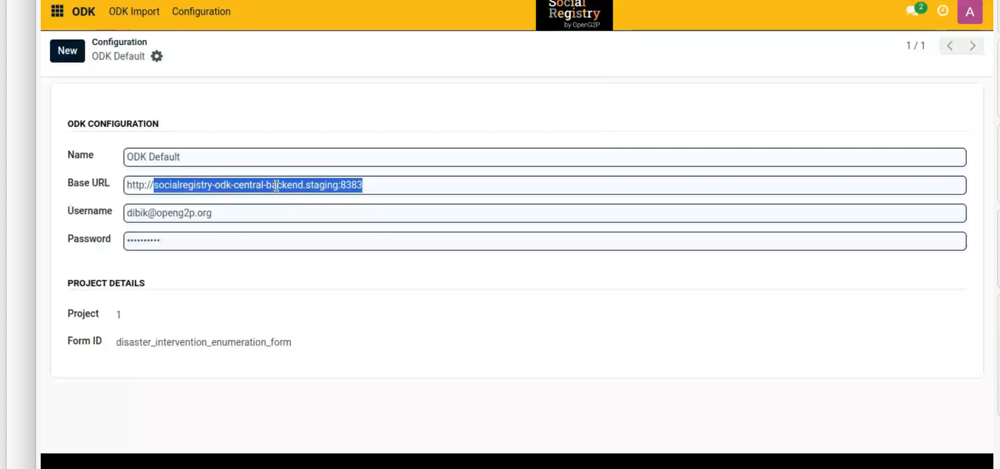

# ODK Importer

The Social Registry (SR) gathers registrants'/applicants' data through various mechanisms, one of which includes ODK forms to import data housed within ODK Central.&#x20;

OpenG2P has built an ODK Importer module. It is specifically designed to tailor, configure the required field based on the ODK (Open Data Kit) form, and import the beneficiaries' relevant ODK form into SR module. ODK forms are customised in compliance with project requirements using the JSON Formatter. The benefits of using ODK Importer are:

* Streamlines data transfer from ODK forms directly into SR modules.
* Eliminates manual data entry, improves data accuracy, and efficiency in data management.
* Provides data import for automatic updates using the automated scheduler.

## Feature and functionality

<table><thead><tr><th width="213">Feature </th><th>Functionality</th></tr></thead><tbody><tr><td><strong>Data Import</strong></td><td><ul><li>Simplifies the process of entering data from the ODK forms' field into individual/group registries of the SR module, ensuring accuracy and effectiveness in data management.</li></ul></td></tr><tr><td><strong>Test Connection</strong></td><td><ul><li>Verifies the established connection between the ODK Importer and ODK Central.</li><li>Ensures that the ODK Importer can effectively communicate with ODK Central, the server hosting the ODK forms. </li><li>Enables seamless data transfer between the two systems.</li></ul></td></tr><tr><td><strong>Import Records</strong></td><td><ul><li>Tracks the progress of data import and identifies any errors that may occur during the process  </li><li>Provides users with real-time updates on the status of their data import, allowing them to quickly address any issues and ensure a smooth import process</li></ul>
Note:

This feature is used when you want to retrieve data in bulk.
</td></tr><tr><td><strong>Fetch Records</strong></td><td><ul><li>This feature enables users to retrieve a specific record from the ODK system using the unique ODK Instance ID. It works similarly to the standard import record process but offers more precision by allowing users to target a single record based on its unique identifier. </li><li>This is particularly useful when you need to retrieve specific record without importing the complete dataset.</li></ul>
Note: 

Make sure you have completed the Configuration procedure to use this feature. To learn more on this feature, refer Import Specific ODK Form.
</td></tr><tr><td><strong>Automated Data Processing</strong></td><td><ul><li>Removes the risk of manual error, ensuring higher accuracy in data records.</li><li>Streamlines task, saves time and resources while enhancing overall operational efficiency.</li><li>Increases total operational efficiency, streamlines tasks, saves time and resources.</li></ul></td></tr><tr><td><strong>Automated Scheduler</strong></td><td><ul><li>Allows smooth updates that do not require operator intervention. This capability enables rapid and regular changes to data sets, improving data currency and relevancy</li><li>Automates the import process, improves workflow efficiency, and avoids delay in processing</li></ul></td></tr></tbody></table>

## Process workflow



## **Process & Data Flow**

1. **User initiates import:** User selects the desired ODK form and configures import options.
2. **Data Mapping:** User establishes a mapping between corresponding fields in the ODK form using JSON-formatter (PYJQ) and the OpenG2P system.
3. **Connection & Data Retrieval:** Module connects to ODK Central and retrieves data based on the selected form and import options.
4. **Data Import:** Extracted data is imported into the designated fields within the OpenG2P system.
5. **Import Status Update:** User receives notification of successful import completion or encounters any errors.

## Concepts

1. **ODK Form**: This is the source of data collection through the ODK. ODK forms are used to collect various types of data, such as beneficiary information in a structured format.
2. **Mapping**: Mapping defines the correspondence between fields in the ODK form and the OpenG2P system. It ensures that data collected in the ODK form is accurately mapped to the corresponding fields within the OpenG2P system.

## ODK import

After the ODK configuration, the fields/parameters in the ODK form are mapped to the relevant fields in SR module using the JSON formatter. Navigate to the path Social Registry -> ODK -> ODK Import -> New. To learn more on ODK Import, refer to [Configure and Import ODK Form](user-guide/configure-and-import-odk-form.md).

Here is the sample ODK import configuration form.

<figure><figcaption></figcaption></figure>

## Configuration

After the computation of required fields in SR, the SR module built on Odoo platform needs to be integrated with ODK Central to facilitate data collection and integration. SR module must be set up to automatically pull data from the ODK forms located in the ODK Central. Navigate to the path Social Registry -> ODK -> Configuration -> New.  To learn more on Configuration, refer to [Configure and Import ODK Form](user-guide/configure-and-import-odk-form.md).

Here is the sample _**Configuration**_ screen.

<figure><figcaption></figcaption></figure>

## **Source code**

[https://github.com/OpenG2P/openg2p-importers/tree/17.0-develop/g2p\_odk\_importer](https://github.com/OpenG2P/openg2p-importers/tree/17.0-develop/g2p\_odk\_importer)

## **Technical concepts**

* Utilizes APIs to communicate with ODK Central for data retrieval.
* Implements error handling mechanisms for robust import processes.

## API docs

Below is the documentation link for the APIs used in the ODK configuration between ODK Central and SR.

* [https://docs.getodk.org/central-api-accounts-and-users/](https://docs.getodk.org/central-api-accounts-and-users/)

## Installation and deployment

Odoo installation

## Related user guides

[Configure and Import ODK Form](user-guide/configure-and-import-odk-form.md).
