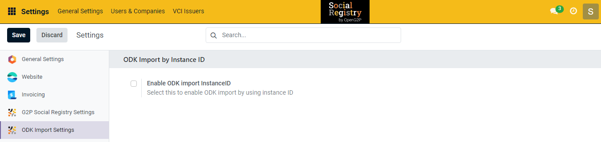
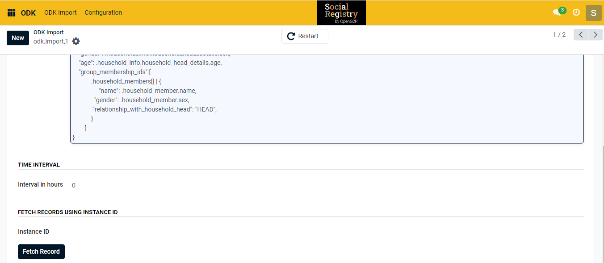
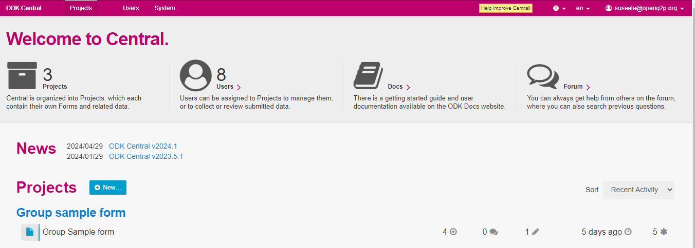
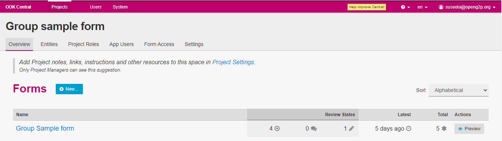
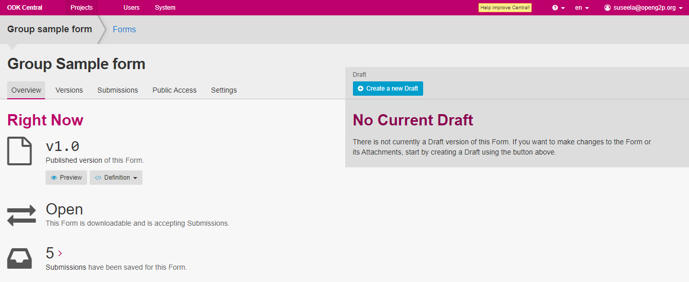
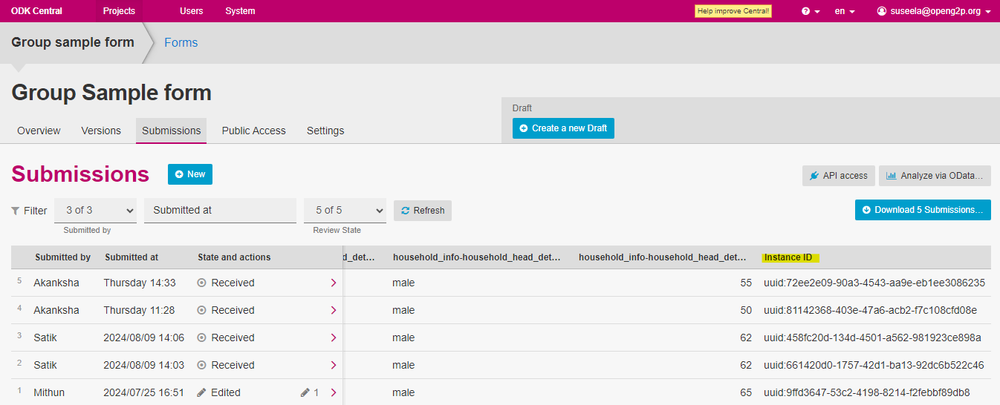

---
layout:
  title:
    visible: true
  description:
    visible: false
  tableOfContents:
    visible: true
  outline:
    visible: true
  pagination:
    visible: true
---

# 📔 Import Specific ODK Forms using ODK Instance ID

This document provides instructions for importing specific applicants/registrants' ODK forms hosted in ODK Central. It uses the unique [**Instance ID**](import-specific-odk-forms-using-odk-instance-id.md#instance-id) of the ODK forms to import them into the SR modules' relevant individual/group registries.

## Prerequisites

* A user must have an Administrator role to access ODK Central in SR module.

## Procedure

1. Click the main icon  and select _**Settings**_.

_**Settings**_ screen is displayed.&#x20;

<figure><figcaption></figcaption></figure>

2. Select the _**General Settings**_ tab.
3. Select the  _**ODK Import Settings**_ from the menu.
4. Check the _**Enable ODK Import InstanceID**_ box.

### Occurrence of Instance ID field

4. Use the main menu icon  to navigate to ODK -> ODK Import.&#x20;
5. Select the ODK Import from the current list.
6. Find an additional field labeled _**InstanceID**_ that appears at the bottom of the displayed screen.

<figure><figcaption></figcaption></figure>

7. Enter the _**Instance ID**_.
8. Fill in the remaining fields following the [import record configuration](user-guide/configure-and-import-odk-form.md) procedure.
9. Click the _**Fetch Record**_ to import the specific applicants/registrants' ODK form relevant to the entered Instance ID.


The SR  module may be able to import duplicate applicant/registrants' ODK forms if the same Instance ID is used more than once.


## Instance ID

1. Log into the _**ODK central**_ with the valid credentials.
2. Select a form below the _**Projects**_ section.

For example, here Group sample form is selected.

<figure><figcaption></figcaption></figure>

3. Select the Group Sample form in the _**Group Sample form**_ screen.

<figure><figcaption></figcaption></figure>

4. Click the _**Submission**_ tab.

<figure><figcaption></figcaption></figure>

5. Find the Instance ID in the current list of submitted ODK forms.

<figure><figcaption></figcaption></figure>
