---
layout:
  title:
    visible: true
  description:
    visible: false
  tableOfContents:
    visible: true
  outline:
    visible: true
  pagination:
    visible: true
---

# 📔 Create User

This document provides instructions to create user in the _**Social Registry**_ module.

## Prerequisites

* The user must have access to the Social Registry module.
* The user must have Registrar and Administrator role.

## Procedure

1. Click the main menu icon  and select _**Settings**_.

<figure>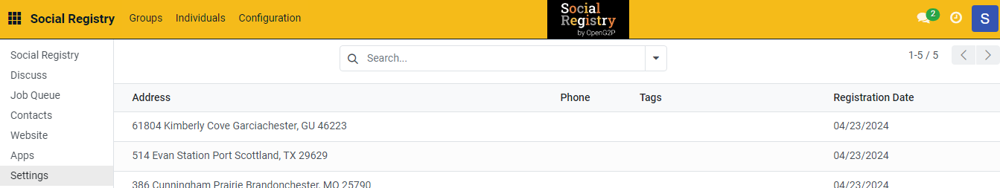<figcaption></figcaption></figure>

The _**Settings**_ screen is displayed.

<figure>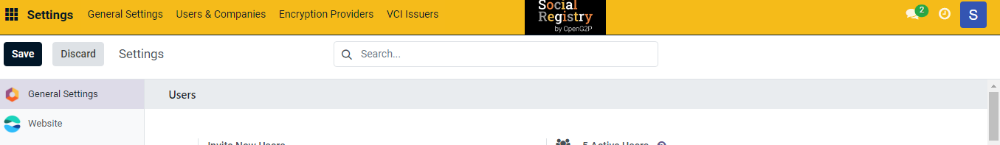<figcaption></figcaption></figure>

2. In the menu bar, click the _**Users & Companies**_ and then select Users.

<figure>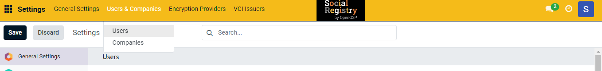<figcaption></figcaption></figure>

_**Users**_ screen is displayed. It is a dashboard which lists the details of all the available Users Name, Login, Language, Latest authentication and their status.

<figure>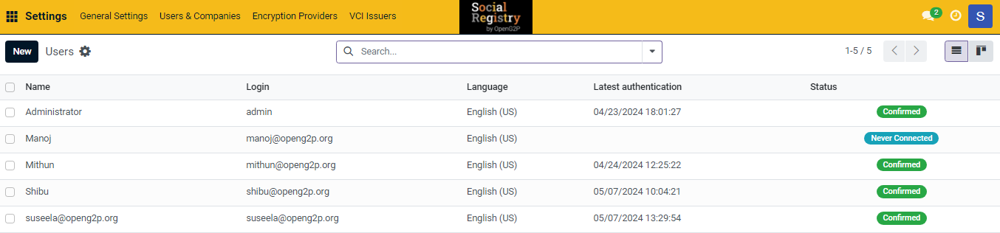<figcaption></figcaption></figure>

3. Click the _**New**_ button.

_**User New**_ screen is displayed.

<figure>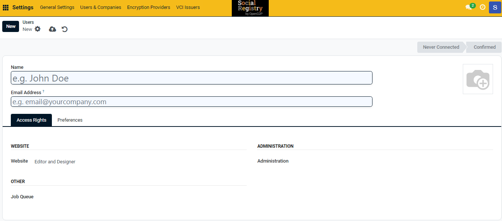<figcaption></figcaption></figure>

In _**Users New**_ screen, the available features and their descriptions are:

<table><thead><tr><th width="166">Feature</th><th>Description</th></tr></thead><tbody><tr><td>Name</td><td>Enter the new user name</td></tr><tr><td>Email Address</td><td>Enter the valid email Id. of the user. The invitation email will be sent to this email address.</td></tr><tr><td></td><td><ul><li>Select the icon, click the edit icon and then navigate to the user photo where it is stored</li><li>Export the user photo</li><li>Click the delete icon to delete the user photo</li></ul></td></tr></tbody></table>

4. Click the _**Access Rights**_ tab.

The fields and their descriptions are given below:

| Field          | Description                                                                                                                                                                                                                                                                                                                                   |
| -------------- | --------------------------------------------------------------------------------------------------------------------------------------------------------------------------------------------------------------------------------------------------------------------------------------------------------------------------------------------- |
| Accounting     | 
<em><strong>Invoicing</strong></em>

Select the appropriate value from the drop-down. The available values are
<ul><li>Billing </li><li>Billing Administrator</li></ul>
<em><strong>Bank</strong></em>

Select the appropriate value from the drop-down, The available value is 
<ul><li>Validate bank account</li></ul> |
| Website        | 
Select the appropriate value from the drop-down. The available values are 
<ul><li>Restricted Editor</li><li>Editor and Designer</li></ul>                                                                                                                                                                                              |
| Administration | 
Select the appropriate value from the drop-down. The available values are 
<ul><li>Access Rights</li><li>Settings</li></ul>                                                                                                                                                                                                             |
| Other          | 
<em><strong>Job Queue</strong></em>

Select the appropriate value from the drop-down. The available value is
<ul><li>Job Queue Manager</li></ul>
<em><strong>Dashboard</strong></em>

Select the appropriate value from the drop-down. The available value is
<ul><li>Admin</li></ul>                                    |

5. Click the _**Preferences**_ tab.

<figure>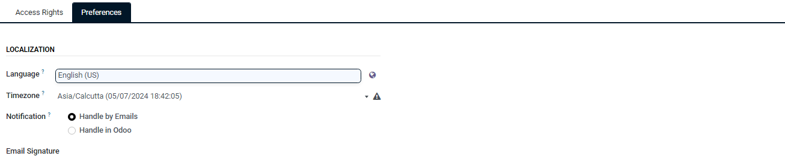<figcaption></figcaption></figure>

The fields and their descriptions are given below:

| Field           | Description                                                                                                           |
| --------------- | --------------------------------------------------------------------------------------------------------------------- |
| Language        | Select the preferred language from the drop-down.                                                                     |
| Timezone        | Select the timezone from the drop-down list.                                                                          |
| Notification    | 
Select the appropriate radio button. The values are: 
<ul><li>Handle by Emails</li><li>Handle in Odoo</li></ul> |
| Email Signature | Enter the valid Email ID.                                                                                             |

<figure>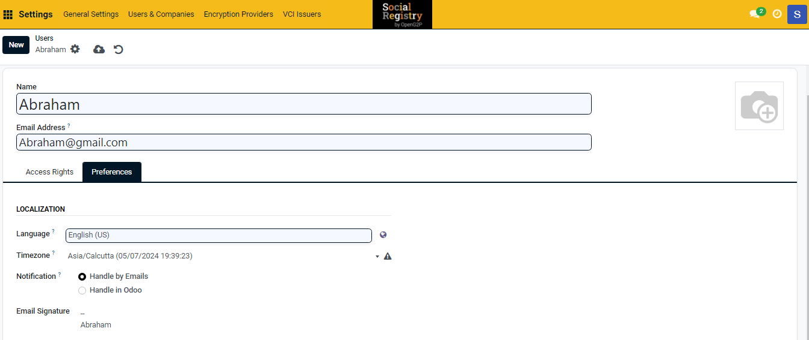<figcaption></figcaption></figure>

6. Click the _**Oauth**_ tab.

<figure>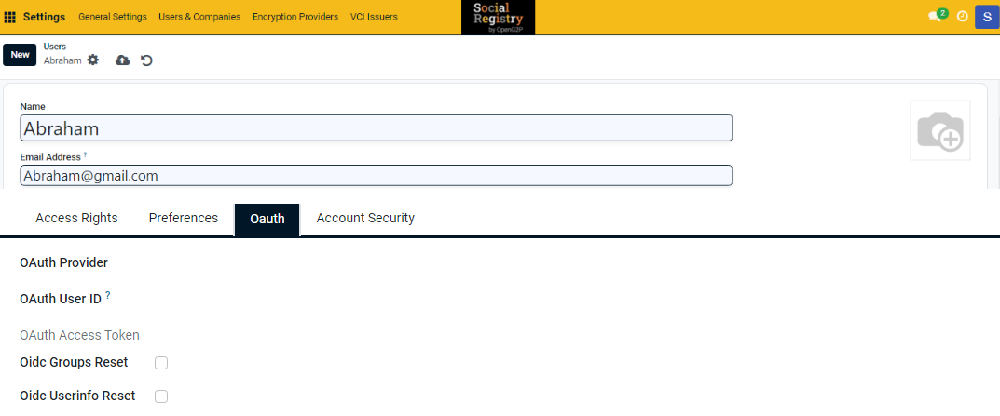<figcaption></figcaption></figure>

The fields and their descriptions are given below:

| Field              | Description                                                                                                                                                                     |
| ------------------ | ------------------------------------------------------------------------------------------------------------------------------------------------------------------------------- |
| OAuth Provider     | <ul><li>Select the appropriate value from the drop-down. </li></ul>
(or)
<ul><li>Search for the OAuth Provider using the Search more option from the drop-down. </li></ul> |
| OAuth User ID      | Enter the OAuth user ID.                                                                                                                                                        |
| OAuth Access Token | Check the _**OIDC Groups Rest**_ box or _**OIDC Userinfo Reset**_ box as per the requirement                                                                                    |

7. Click the _**Account Security**_ tab.

<figure>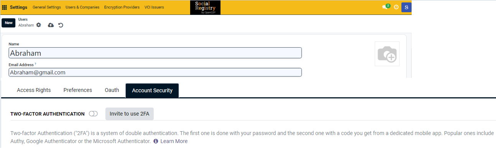<figcaption></figcaption></figure>

8. Click the _**Invite to use 2FA**_ button to enable 2FA for a user.

| Icon                                                                                         | Click to                                                                                                                                                                                                                                     |
| -------------------------------------------------------------------------------------------- | -------------------------------------------------------------------------------------------------------------------------------------------------------------------------------------------------------------------------------------------- |
| 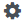              | 
Select the appropriate value. The available values are: 
<ul><li>Archive</li><li>Duplicate</li><li>Change Password</li><li>Disable two-factor authentication</li><li>Send Password Reset Instructions</li><li>Privacy Lookup</li></ul> |
|    | Save manually the individual data and exit from the screen.                                                                                                                                                                                  |
|  | Discard changes and exit from the screen.                                                                                                                                                                                                    |

The newly created user is added to the user list.

<figure>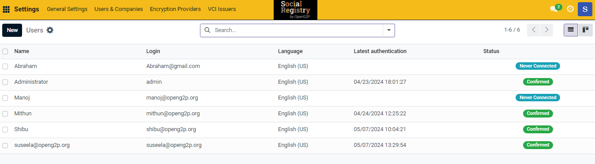<figcaption></figcaption></figure>

Assign user role
