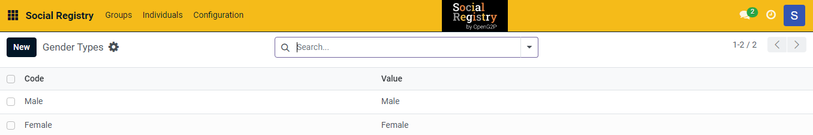
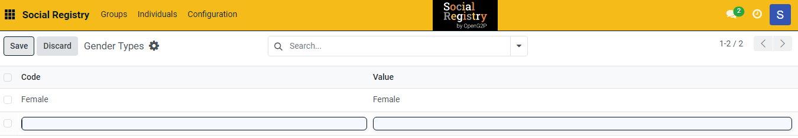
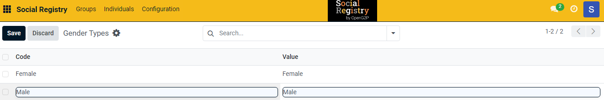
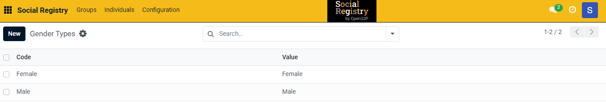

---
layout:
  title:
    visible: true
  description:
    visible: false
  tableOfContents:
    visible: true
  outline:
    visible: true
  pagination:
    visible: true
---

# 📔 Configure Gender Types

This document provides instructions to configure gender types in the _**Social Registry**_ module.

## Prerequisites

* The user must have Registrar and Administrator role.
* The user must have access to the Social Registry module.

## Procedure

1. Use the link _**socialregistry.explore.openg2p.org**_ to access Social Registry.
2. Click the main menu icon  and select _**Social Registry**_.

_**Social Registry**_ screen is displayed.

<figure><figcaption></figcaption></figure>

3. Click the _**Configuration**_ in the menu bar and then select _**Gender Types**_.

<figure><figcaption></figcaption></figure>

_**Gender Types**_ screen is displayed.

<figure><figcaption></figcaption></figure>

4. Click the _**New**_ button. It enables an empty field.

<figure><figcaption></figcaption></figure>

5. Enter the relevant [Gender Types](../../#gender-types) in the _**Code**_ field.
6. Enter the value of the code in the _**Value**_ field.

<figure><figcaption></figcaption></figure>

7. Click the _**Save**_ button to save the gender types.
8. Click the _**Discard**_ button to exit from the screen.

The newly created gender type is added to the gender types list.

<figure><figcaption></figcaption></figure>

9. Repeat the steps 4, 5, 6, and 7 to add the relevant gender types.

This completes the configuration of gender types in Social Registry module.

## Delete Gender Types

Refer to the user guide's [Configure Registrant Tags](configure-registrant-tags.md#delete-registrant-tags) section to delete gender type.
