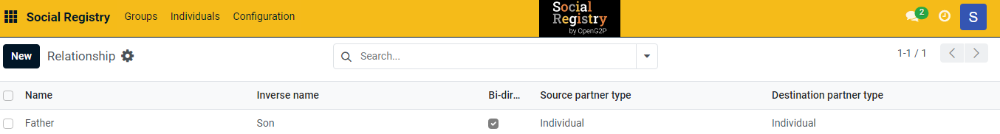

---
layout:
  title:
    visible: true
  description:
    visible: false
  tableOfContents:
    visible: true
  outline:
    visible: true
  pagination:
    visible: true
---

# 📔 Configure Relationships

This document provides instructions to configure relationships in the _**Social Registry**_ module.

## Prerequisites

* The user must have Registrar and Administrator role.
* The user must have access to the Social Registry module.

## Procedure

1. Use the link _**socialregistry.explore.openg2p.org**_ to access Social Registry.
2. Click the main menu icon  and select _**Social Registry**_.

_**Social Registry**_ screen is displayed.

<figure><figcaption></figcaption></figure>

3. Click the _**Configuration**_ in the menu bar and then select _**Relationships**_.

<figure><figcaption></figcaption></figure>

_**Relationship**_ screen is displayed.

<figure><figcaption></figcaption></figure>

4. Click the _**New**_ button. It enables an empty field.

<figure><figcaption></figcaption></figure>

5. Enter the relevant [Relationships](../../#relationships) in the _**Name**_ field.
6. Enter the _**Name**_, _**Inverse name**_, _**Bi-dir...**_ in the associated field.
7. Select the appropriate value from the drop-down for _**Source partner type**_ and _**Destination partner type**_ in the associated field.

<figure><figcaption></figcaption></figure>

8. Click the _**Save**_ button to save the relationships configuration.
9. Click the _**Discard**_ button to exit from the screen.

The newly created relationship is added to the relationship list.

<figure><figcaption></figcaption></figure>

10. Repeat the steps 4, 5, 6, 7 and 8 to add the relevant relationship.

This completes the configuration of relationship in Social Registry module.

## Delete Relationship

Refer to the user guide's [Configure Registrant Tags](configure-registrant-tags.md#delete-registrant-tags) section to delete relationship entry.
