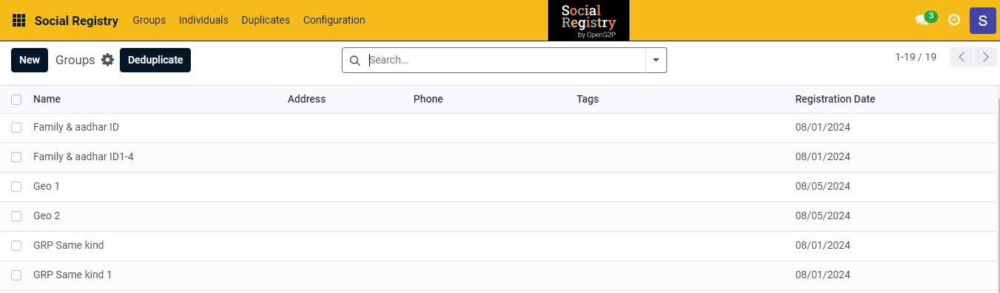
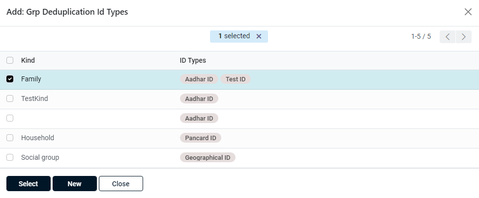
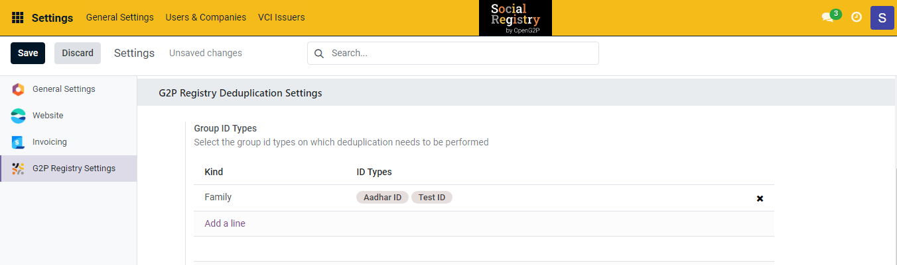
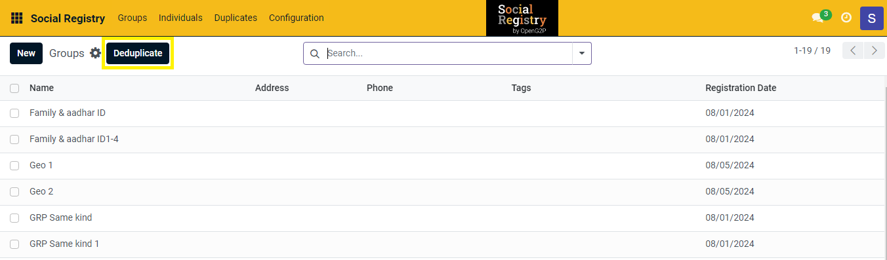
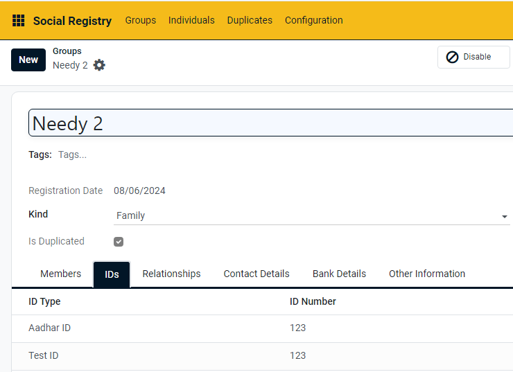
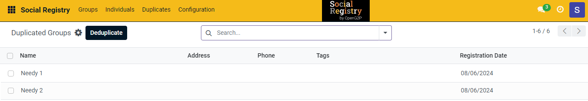
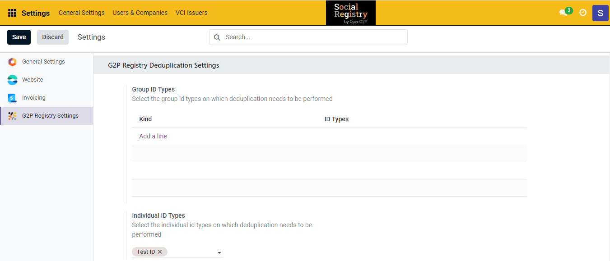
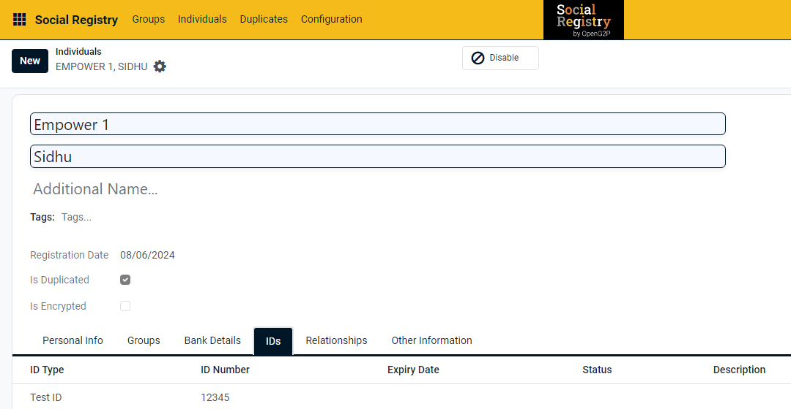
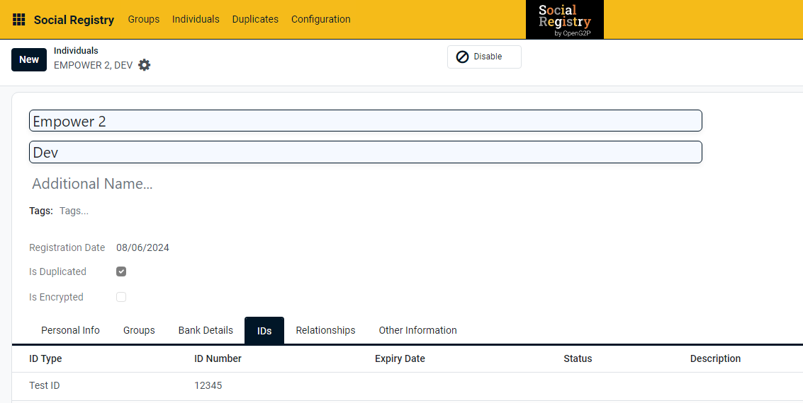
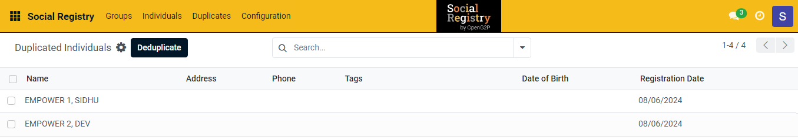

---
layout:
  title:
    visible: true
  description:
    visible: false
  tableOfContents:
    visible: true
  outline:
    visible: true
  pagination:
    visible: true
---

# 📔 Configure ID Deduplication, Deduplicate, and Save Duplicate Groups/Individuals

This document provides instructions to configure ID deduplication method. This will help you to deduplicate the data and save the duplicate groups/individuals in the appropriate registries.

## Prerequisites

* The user must have valid credentials to login to Social Registry.
* The user must have Registrar and Administrator role.
* The user must have the ID Deduplication Module installed.

## Procedure

1. Login to _**Social Registry**_.&#x20;
2. Click the main menu icon  and select _**Social Registry**_.

You can view the _**Groups**_ screen by default.

<figure><figcaption></figcaption></figure>

## Configure the ID deduplication

3. Click the main menu icon  and select _**Settings**_.
4. Select _**G2P Registry Settings**_ from the left menu bar.

Below the _**G2P Registry Deduplication Settings,**_ you can find two ID types.

* [Group ID Types](configure-id-deduplication.md#group-id-types)
* [Individual ID Types](configure-id-deduplication.md#individual-id-types)

<figure><figcaption></figcaption></figure>

### Group ID Types

5. In _**Group ID Types**_, click the _**Add a line**_.

**Add: Grp Deduplication Id Types** screen is displayed.

6. Select the criteria you want to apply to deduplicate the Group. For example, the criteria, Family: Aadhar ID, Test ID is selected.

<figure><figcaption></figcaption></figure>

7. Click the _**Close**_ button to exit from the screen.
8. Click the _**New**_ button to create group deduplication Id types.
9. Click the _**Select**_ button to choose the criteria.

<figure><figcaption></figcaption></figure>

10. Click the _**Save**_ button to save the configuration.

### Deduplicate Group

11. Click the main menu icon  and select _**Social Registry.**_

<figure><figcaption></figcaption></figure>

For example, there are two duplicate Groups Needy 1 and Needy 2 with same Aadhar ID and Test ID.

<figure><figcaption></figcaption></figure>

<figure><figcaption></figcaption></figure>

12. Click the _**Groups**_ tab in the menu bar.&#x20;
13. Click the _**Deduplicate**_ button.

A message popups with the number of duplicates found in the Group and the Group member based on the criteria defined in the [Group ID Types](configure-id-deduplication.md#group-id-types) section.

14. Click the _**Duplicates**_ tab in the menu bar. Select the _**Groups**_.

_**Duplicated Groups**_ screen is displayed.

<figure><figcaption></figcaption></figure>

You can find the duplicate groups.

## Individual ID Types

15. In _**Individual ID Types**_, click the drop-down and select the ID type.

For example, here _**Test ID**_ is selected.

<figure><figcaption></figcaption></figure>

16. Click the _**Save**_ button to save the configuration.

## Deduplicate Individuals

17. Click the main menu icon  and select _**Social Registry.**_
18. Click the _**Individuals**_ tab.

For example, there are two individuals (Empower 1, Empower 2) with the same Test ID.

<figure><figcaption></figcaption></figure>

<figure><figcaption></figcaption></figure>

19. Click the _**Individuals**_ tab in the menu bar.&#x20;
20. &#x20;Click the _**Deduplicate**_ button.

A message popups with the number of duplicates found in the Individuals based on the criteria defined in the [Individual ID Types](configure-id-deduplication.md#individual-id-types) section.

21. Click the _**Duplicates**_ tab in the menu bar. Select the _**Individuals**_.

_**Duplicated Individuals**_ screen is displayed.

<figure><figcaption></figcaption></figure>

You can find the duplicated individuals.

This completes the process of configuring ID deduplication, deduplicate, and save duplicate Groups/Individuals in the appropriate registries.
