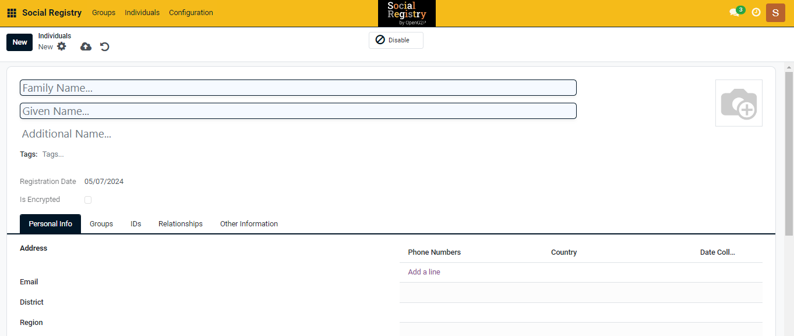
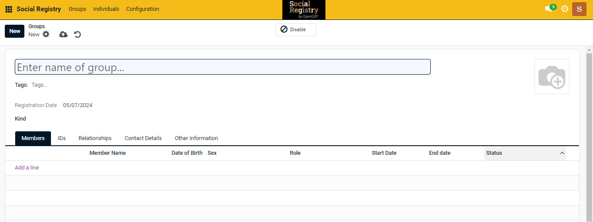

---
layout:
  title:
    visible: true
  description:
    visible: false
  tableOfContents:
    visible: true
  outline:
    visible: true
  pagination:
    visible: true
---

# Individuals and Groups

## Individual&#x20;

_**Individuals**_ refer to single persons, each with their own set of demographic data, such as name, date of birth, gender, and other relevant information.  The SR can maintain a registry of these individual records, allowing for the management and retrieval of information about each person.

The figure below displays the individual creation page, allowing users to input personal information.

<figure><figcaption></figcaption></figure>

## Group

_**Groups**_ in the Social Registry (SR) context typically refer to collections of individuals who are related or connected in some way. This could include households, families, communities, or other entities that consist of multiple people.

The figure below displays the household creation page, allowing users to input details about the members and their relationship with the household head.

<figure><figcaption></figcaption></figure>

### Social Registry can house

* **Registry of individuals**: The Social Registry allows the creation of a registry containing demographic data of individual people. This data is privacy-protected, ensuring the confidentiality of personal information. The Social Registry provides advanced features that ensure the registry can easily integrate into a country's digital public infrastructure (DPI).
* **Registry of households and families**: In addition to individuals, the Social Registry can also host demographic data of households and families. This feature enables the tracking and managing of group data, such as family relationships and household compositions. Like individual data, this group data is also privacy-protected.
* **Entities with group of people, like schools, and communities**: The Social Registry extends its functionality to entities that consist of groups of people, such as schools or communities. It provides demographic data for these entities, facilitating better management and service provision.

## Related user guides

:notebook\_with\_decorative\_cover:[Create an Individual Registrant](../../../pbms/functionality/beneficiary-management/beneficiary-registry/user-guides/create-an-individual-registrant.md)

:notebook\_with\_decorative\_cover:[Create a Group and Add Individual Registrants to the Group](../../../pbms/functionality/beneficiary-management/beneficiary-registry/user-guides/create-a-group-and-add-individual-registrants-to-the-group.md)

