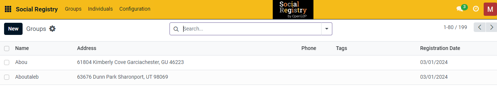

---
layout:
  title:
    visible: true
  description:
    visible: false
  tableOfContents:
    visible: true
  outline:
    visible: true
  pagination:
    visible: true
---

# 📔 Configure ID Types

This document provides instructions to configure ID types in the _**Social Registry**_ module.

## Prerequisites

* The user must have Registrar and Administrator role.
* The user must have access to the Social Registry module.

## Procedure

1. Use the link _**socialregistry.explore.openg2p.org**_ to access Social Registry.
2. Click the main menu icon  and select _**Social Registry**_.

_**Social Registry**_ screen is displayed.

<figure><figcaption></figcaption></figure>

3. Click the _**Configuration**_ in the menu bar and then select _**ID Types**_.

<figure><figcaption></figcaption></figure>

_**ID Types**_ screen is displayed.

<figure><figcaption></figcaption></figure>

4. Click the _**New**_ button. It enables an empty field.

<figure><figcaption></figcaption></figure>

5. Enter the relevant [ID Types](../../../../../pbms/functionality/beneficiary-management/beneficiary-registry-configurations.md#id-types) in the _**Name**_ field.
6. In the _**ID Type Validation**_ field, enter the Regexp to valid the ID types value.

For example, here, enter the ID Type as Beneficiary ID.&#x20;

7. Apply Regexp to define acceptance criteria to validate ID type value.&#x20;

For example, here, the acceptance criteria for the ID type (Beneficiary ID): The maximum length allowed is 10. It triggers an error message if you enter the ID type value beyond 10 numbers.

<figure><figcaption></figcaption></figure>

8. Click the _**Save**_ button to save the ID types.
9. Click the _**Discard**_ button to exit from the screen.

The newly created ID type is added to the ID types list.

<figure><figcaption></figcaption></figure>

10. Repeat the steps 4, 5, 6, 7 and 8 to add the relevant ID types.

This completes the configuration of ID types in Social Registry module.

## Delete ID Types

Refer to the user guide's [Configure Registrant Tags](configure-registrant-tags.md#delete-registrant-tags) section to delete ID types.
