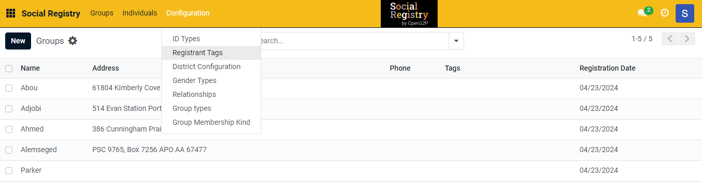
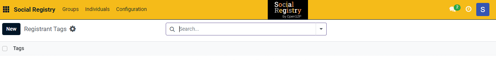
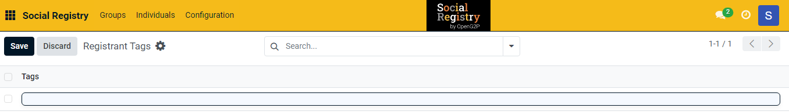
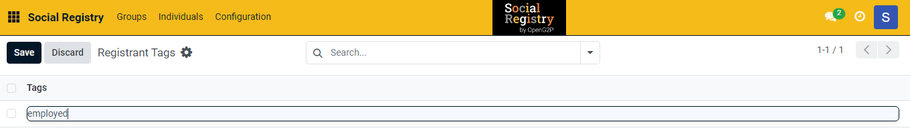
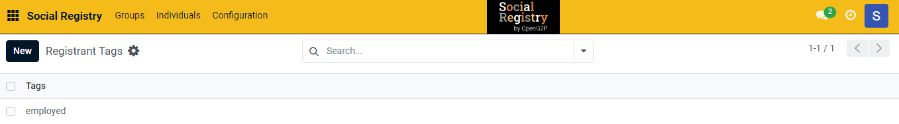
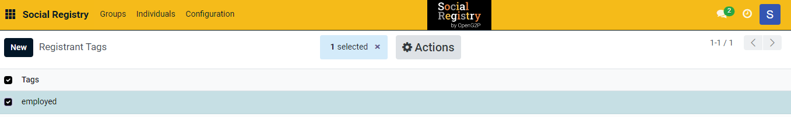
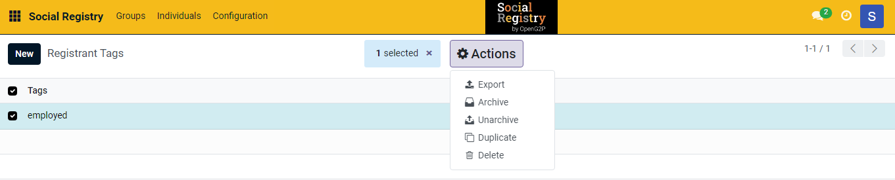
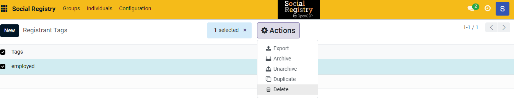

---
layout:
  title:
    visible: true
  description:
    visible: false
  tableOfContents:
    visible: true
  outline:
    visible: true
  pagination:
    visible: true
---

# 📔 Configure Registrant Tags

This document provides instructions to configure registrant tags in the _**Social Registry**_ module.

## Prerequisites

* The user must have Registrar and Administrator role.
* The user must have access to the Social Registry module.

## Procedure

1. Use the link _**socialregistry.explore.openg2p.org**_ to access Social Registry.
2. Click the main menu icon  and select _**Social Registry**_.

_**Social Registry**_ screen is displayed.

<figure><figcaption></figcaption></figure>

3. Click the _**Configuration**_ in the menu bar and then select Registrant Tags.

<figure><figcaption></figcaption></figure>

_**Registrant Tags**_ screen is displayed.

<figure><figcaption></figcaption></figure>

4. Click the _**New**_ button. It enables an empty field.

<figure><figcaption></figcaption></figure>

5. Enter the relevant [registrant tags](../../../../../pbms/functionality/beneficiary-management/beneficiary-registry-configurations.md#registrant-tags) in the _**Tags**_ field.

For example, here, enter the registrant tag as 'employed'.

<figure><figcaption></figcaption></figure>

6. Click the _**Save**_ button to save the registrant tag.
7. Click the _**Discard**_ button to exit from the screen.

The newly created registrant tag is added to the registrant tag list.

<figure><figcaption></figcaption></figure>

8. Repeat the steps 4, 5, and 6 to add the relevant registrant tags.

This completes the configuration of registrant tag in Social Registry module.

## Delete Registrant Tags

9. Select the registrant tag you want to delete. It enables the _**Actions**_ button. It also shows the number of selected tags you want to delete.

<figure><figcaption></figcaption></figure>

10. Click the _**Actions**_ button. It displays the list of actions you can perform.

<figure><figcaption></figcaption></figure>

11. Click the _**Delete**_ option in the list.&#x20;

<figure><figcaption></figcaption></figure>

_**Bye-bye, record!**_ dialog box is displayed.

<figure><figcaption></figcaption></figure>

12. Click the _**Delete**_ button to remove the selected tag from the Registrant Tags list.
13. Click the _**No, keep it**_ button to retain the selected tag.

This completes the deletion of selected tag from the Registrant Tags list.

