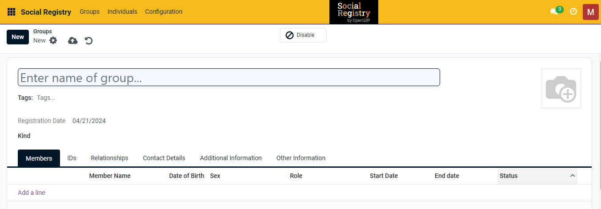
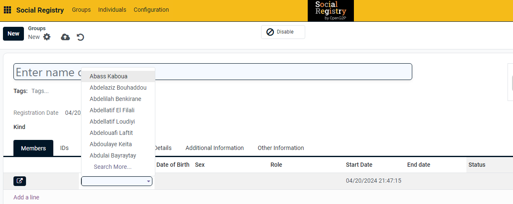
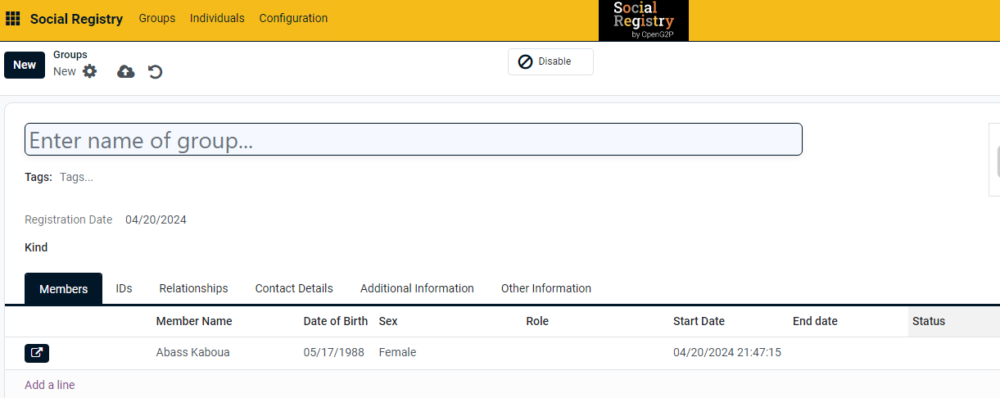
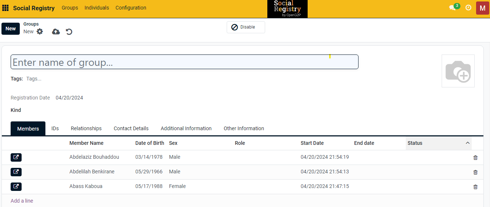
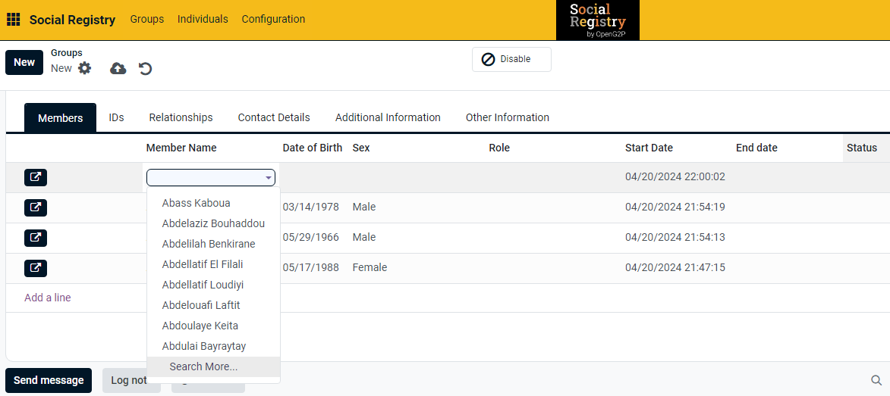
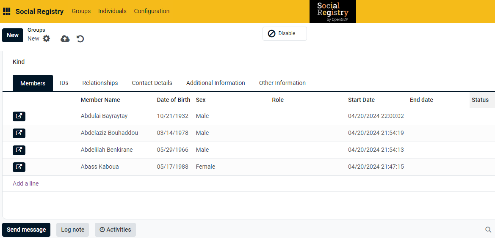

# Create a Group and Add Individual Registrants to the Group

This document provides instructions to create a group and add individual registrants to the group in _**Social Registry**_ module.&#x20;

## Prerequisites

* The user must have a Registrar or an Administrator role.
* The user must have access to the Social Registry module.

## Procedure

1. Use the link _**socialregistry.explore.openg2p.org**_ to access the Social Registry.
2. Click the main menu icon  and select _**Social Registry**_

You can view the _**Groups**_ screen by default.

<figure><figcaption></figcaption></figure>

3. Click the _**New**_ button.

_**Groups New**_ screen is displayed.

<figure><figcaption></figcaption></figure>

The fields and their descriptions are given below:

| Field                                                                               | Description                                               |
| ----------------------------------------------------------------------------------- | --------------------------------------------------------- |
| Enter name of the group                                                             | Enter the name of the new group. It is a mandatory field. |
| Tags                                                                                | Select the tag from the drop-down                         |
|  | Add the group member's photo                              |
| Registration Date                                                                   | Displays the current date by default                      |
| Kind                                                                                | Select the Kind from the drop-down                        |

4. Click the _**Members**_ tab.
5. Click the _**Add a line.**_

It enables the _**Member Name**_ field.

There are two method to add individual registrants to a group.

Method 1: Select the individual registrant name from the _**Member Name**_ drop-down.

Method 2: Select the _**Search More...**_ option in the drop-down and add individual registrants  to the group

### Method 1

6. Select the individual registrant name from the _**Member Name**_ drop-down.

<figure><figcaption></figcaption></figure>

It auto-populates the other fields as shown below.

<figure><figcaption></figcaption></figure>

7. Repeat the step 5 and 6 to add individual registrants to a group.

<figure><figcaption></figcaption></figure>

8. Click the delete icon to remove the individual registrants from the group.

### Method 2

8. Click the _**Search More...**_ option in the _**Member Name**_ drop-down.

<figure><figcaption></figcaption></figure>

_**Search: Member Name**_ screen is displayed.

<figure><figcaption></figcaption></figure>

You can search and find the name of the individual registrants in the search field (or) directly click the individual registrant in the member name list. It gets added or auto-populated in the Groups screen.

<figure><figcaption></figcaption></figure>

| Icon                                                                                         | Click to                                                                                                                                                                                                             |
| -------------------------------------------------------------------------------------------- | -------------------------------------------------------------------------------------------------------------------------------------------------------------------------------------------------------------------- |
|               | 
Select the appropriate value. The available values are: 
<ul><li>Archive</li><li>Duplicate</li><li>Send SMS Text Message</li><li>Download (vCard)</li><li>Privacy Lookup</li><li>Grand portal access</li></ul> |
|    | Save manually the individual data to the group and exit from the screen                                                                                                                                              |
|  | Discard changes and exit from the screen                                                                                                                                                                             |

The newly created group registrant gets added to the Groups list.

<figure><figcaption></figcaption></figure>

This completes the creation of a group and adding individual registrants to the group in the _**Social Registry**_ module.

