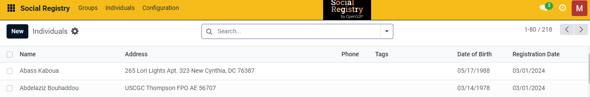
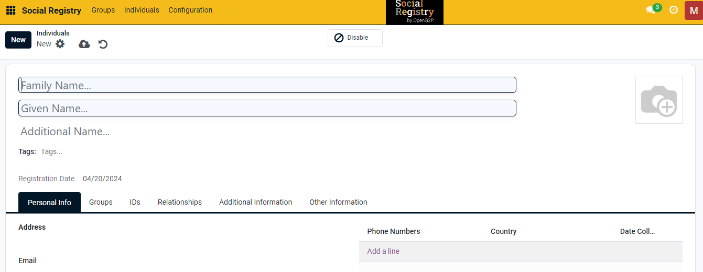
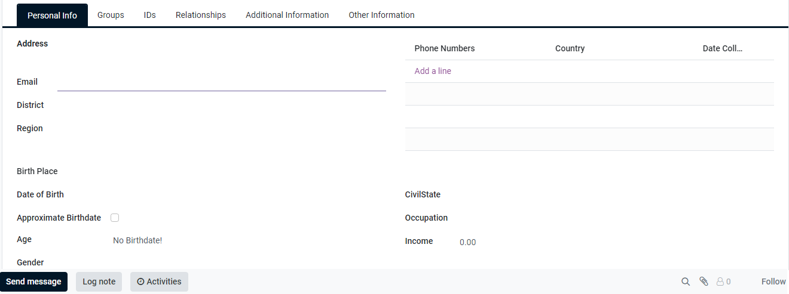

# Create an Individual Registrant

This document provides instructions to create an Individual Registrant in the Social Registry module.

## Prerequisites

* The user must have Registrar and Administrator right access.
* The user must have access to the Social Registry module.

## Procedure

1. Use the link _**socialregistry.explore.openg2p.org**_ to access Social Registry.
2. Click the main menu icon  and select _**Social Registry**_.

_**Social Registry**_ screen is displayed.

<figure><figcaption></figcaption></figure>

2. Click the _**Individual**_ in the menu bar.

_**Individual**_ screen is displayed.

<figure><figcaption></figcaption></figure>

3. Click the _**New**_ button.

_**Individual New**_ screen is displayed.

<figure><figcaption></figcaption></figure>

The fields and their descriptions are given below:

<table><thead><tr><th width="276">Field</th><th>Description</th></tr></thead><tbody><tr><td>Family Name</td><td>Enter the family name of the individual. It is a mandatory field.</td></tr><tr><td>Given Name</td><td>Enter the given name of the individual. It is a mandatory field.</td></tr><tr><td>Additional Name</td><td>Enter the additional name of the individual. It is a optional field.</td></tr><tr><td></td><td>Add the individual photo.</td></tr><tr><td>Tags</td><td>Select the appropriate tag from the drop-down.</td></tr><tr><td>Registration Date</td><td>Displays the current date by default</td></tr></tbody></table>

4. Click the _**Personal Info**_ tab.

<figure><figcaption></figcaption></figure>

The fields and their descriptions are given below:

| Field                 | Description                                                            |
| --------------------- | ---------------------------------------------------------------------- |
| Address               | Enter the Address of the individual                                    |
| Email                 | Enter the Email of the individual                                      |
| District              | Enter the district name of the individual                              |
| Region                | Ener the region of the individual                                      |
| Birth Place           | Enter the birth place of the individual                                |
| Date of Birth         | Enter the date of birth of the individual                              |
| Approximate Birthdate | Check the box, if the date of birth of the individual is not available |
| Age                   | Enter the approximate age                                              |
| Gender                | Select the appropriate option in the drop-down.                        |
| CivilState            | Enter the civil state of the individual                                |
| Occupation            | Enter the occupation of the individual                                 |
| Income                | Enter the income of the individual                                     |
| Disable               | Click the Disable button to disable the data                           |

5. Click the _**Add a line**_.
6. Enter the _**Phone Numbers**_, _**Country**_, and _**Date Collect**_.... of the individual.

| Icon                                                                                         | Click to                                                                                                                                                                                                             |
| -------------------------------------------------------------------------------------------- | -------------------------------------------------------------------------------------------------------------------------------------------------------------------------------------------------------------------- |
|               | 
Select the appropriate value. The available values are: 
<ul><li>Archive</li><li>Duplicate</li><li>Send SMS Text Message</li><li>Download (vCard)</li><li>Privacy Lookup</li><li>Grand portal access</li></ul> |
|    | Save manually the individual data and exit from the screen                                                                                                                                                           |
|  | Discard changes and exit from the screen                                                                                                                                                                             |

The newly created individual registrant gets added in the existing individual list.

<figure><figcaption></figcaption></figure>

This completes the creation of individual registrant in Social Registry module.
