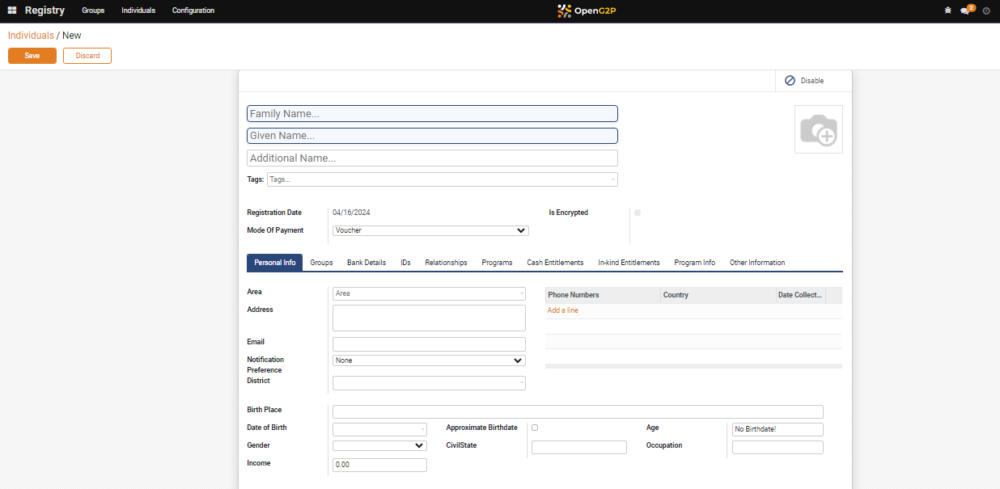

# Create an Individual Registrant

his document provides instructions to create registry for an individual in [Registry](../../../../pbms/features/beneficiary-registry.md) module

## Prerequisites

* The user must have Registrator and Administrator right access.
* The user must have access to the Registry module in OpenG2P systems.

## Procedure

1. Click the main menu icon  and select _**Registry**_.

<figure><figcaption></figcaption></figure>

_**Registry**_ screen is displayed.

<figure><figcaption></figcaption></figure>

2. Click the _**Individual**_ in the menu bar.

_**Individual**_ screen is displayed.

<figure><figcaption></figcaption></figure>

3. Click the _**Create**_ button.

_**Individual/New**_ screen is displayed.

<figure><figcaption></figcaption></figure>

The fields and their descriptions are given below:

<table><thead><tr><th width="374">Field</th><th>Description</th></tr></thead><tbody><tr><td>Family Name</td><td>Enter the family name of the individual. It is a mandatory field.</td></tr><tr><td>Given Name</td><td>Enter the given name of the individual. It is a mandatory field.</td></tr><tr><td>Additional Name</td><td>Enter the additional name of the individual. It is a optional field.</td></tr><tr><td></td><td>Incorporate the individual photo.</td></tr><tr><td>Tags</td><td>Select the appropriate tag from the drop-down.</td></tr><tr><td>Registration Date</td><td>Auto-populates the current date </td></tr><tr><td>Mode of Payment</td><td>
Select the appropriate mode of payment from the drop-down. The available options are: 
<ul><li>Cash</li><li>Voucher</li><li>Digital</li></ul></td></tr><tr><td>Is Encrypted</td><td>Check the box, if the individual requires encryption</td></tr></tbody></table>

4. Click the _**Personal Info**_ tab.

The fields and their descriptions are given below:

| Field                 | Description                                                                                                                                                                                      |
| --------------------- | ------------------------------------------------------------------------------------------------------------------------------------------------------------------------------------------------ |
| Area                  | Enter the area of the individual                                                                                                                                                                 |
| Address               | Enter the address of the individual                                                                                                                                                              |
| Email                 | Enter the email id of the individual                                                                                                                                                             |
| Notification          | 
Select the individual's preferred way to receive notification in the drop-down. The available options are: 
<ul><li>None</li><li>Email</li><li>SMS</li><li>Both Email &#x26; SMS</li></ul> |
| Preference District   | Enter the individual's preferred district name                                                                                                                                                   |
| Birth Place           | Enter the birth place of the individual                                                                                                                                                          |
| Date of Birth         | Enter the date of birth of the individual                                                                                                                                                        |
| Approximate Birthdate | Check the box, if the date of birth of the individual is not available                                                                                                                           |
| Age                   | Enter the approximate age                                                                                                                                                                        |
| Gender                | Select the appropriate option in the drop-down.                                                                                                                                                  |
| CivilState            | Enter the civil state of the individual                                                                                                                                                          |
| Occupation            | Enter the occupation of the individual                                                                                                                                                           |
| Income                | Enter the income of the individual                                                                                                                                                               |

5. Click the _**Add a line**_.
6. Enter the _**Phone Numbers**_, _**Country**_, and _**Date Collect**_.... of the individual.
7. Click the _**Save**_ button.
8. Click the _**Discard**_ button to exit the screen.&#x20;

The newly created registry for an individual gets added in individual list.

<figure><figcaption></figcaption></figure>

&#x20;This completes the creation of registry for an individual in _**Registry**_ module.
