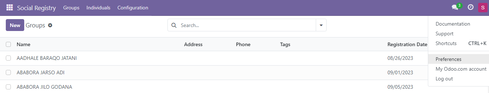
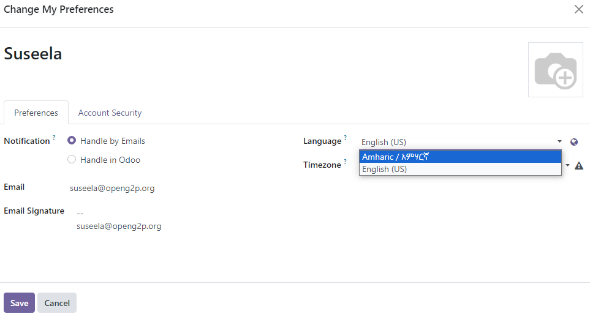
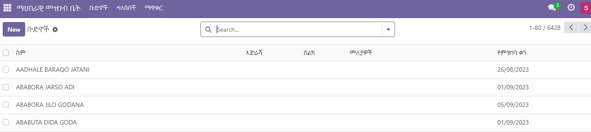
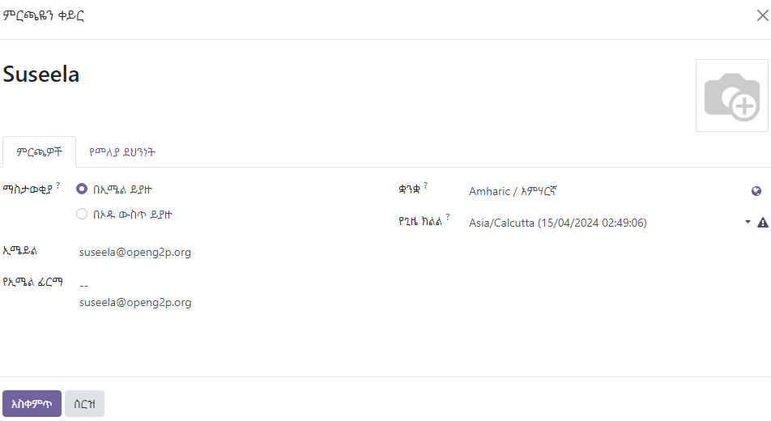

# Set Language Preference

Social Registry (SR) has the option to load the application in multiple languages. Each user logging into the application can set the languages according to his/her preferences.  This document provides instructions for the user to set their preferred language in the application. Once the preferred language is updated, the default language is changed to the preferred language in the user interface.

## Prerequisites

The user must have valid credentials to login to Social Registry.

## Procedure

1. Login to _**Social Registry**_.

Social Registry application is displayed.

<figure><figcaption></figcaption></figure>

2. Click the user profile at the top right corner of the application.

<figure><figcaption></figcaption></figure>

3. Choose _**Preferences**_.

_**Change My Preferences**_ screen is displayed.

4. Click the _**Preferences**_ tab.
5. Select the preferred language in the _**Language**_ drop-down.

<figure><figcaption></figcaption></figure>

6. Click the _**Save**_ button.

Once the preferred language is updated, you can find the default language is changed to the preferred language in the user interface. For example,&#x20;

<figure><figcaption></figcaption></figure>

<figure><figcaption></figcaption></figure>
