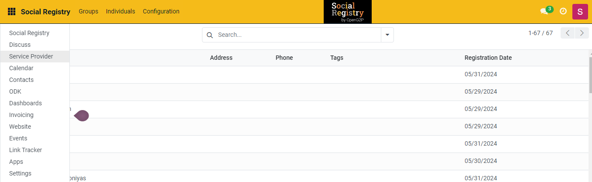
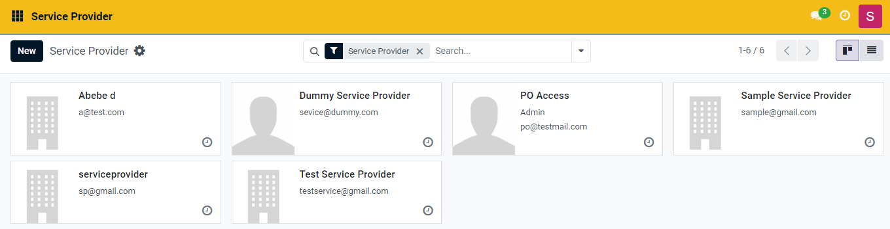
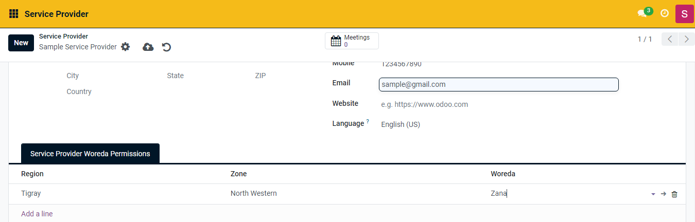
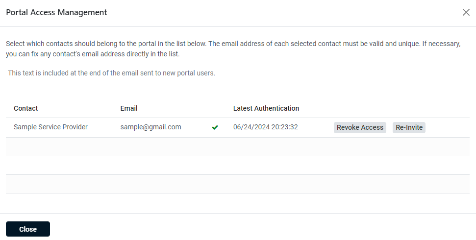
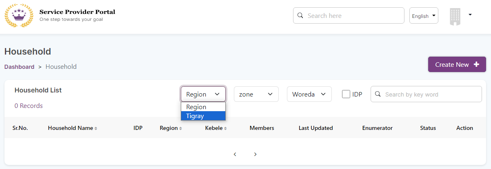
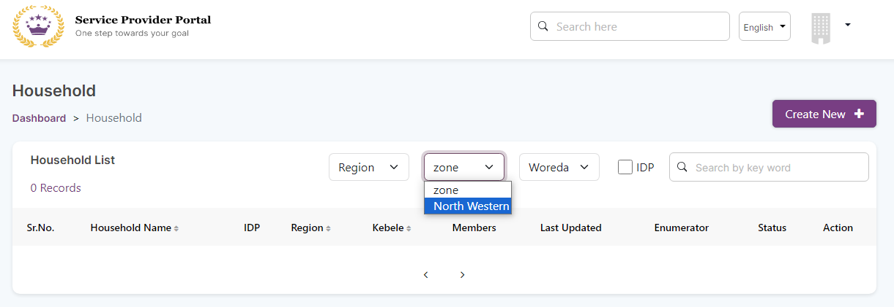
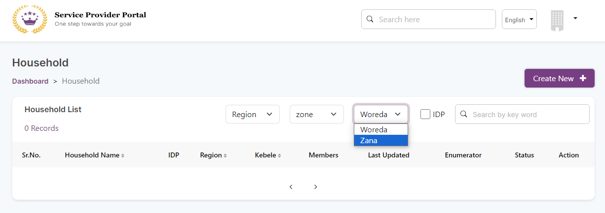
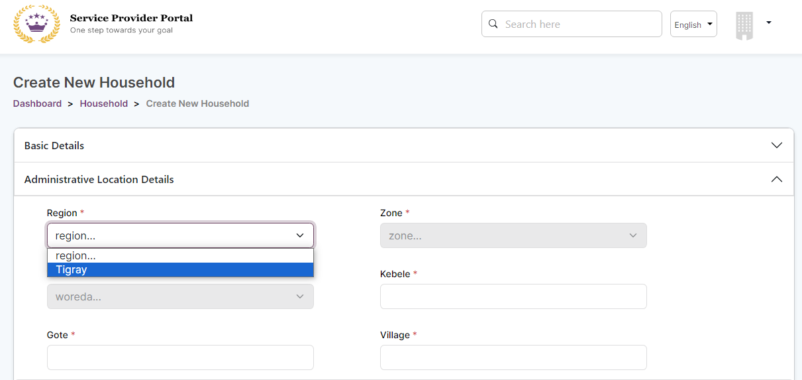
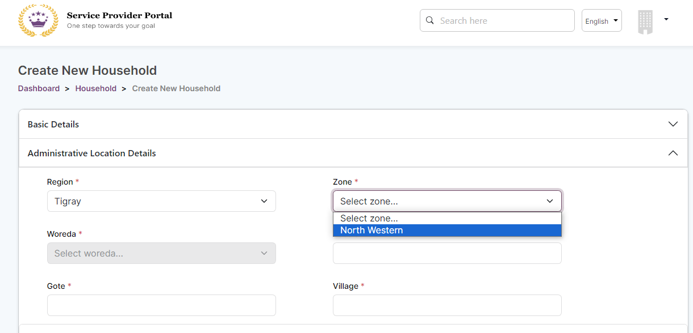
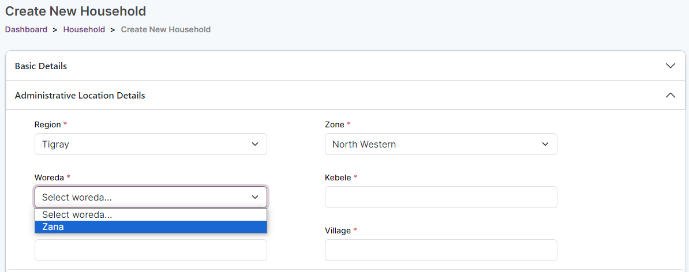

---
layout:
  title:
    visible: true
  description:
    visible: false
  tableOfContents:
    visible: true
  outline:
    visible: true
  pagination:
    visible: true
---

# 📔 Configure Registration Portal User to Limit Accessing Location

This document contains step-by-step instructions to configure registration portal user to access only the limited locations in the registration portal where they have recorded the details from the individual/group registrants.&#x20;

## Prerequisites

* A user must have access to the Social Registry and Registration Portal.

## Procedure

### Social Registry

1. Use the link _**socialregistry.\<projectspecific>.openg2p.org/web/login**_ to access Social Registry.
2. Enter the valid login credentials to log into Social Registry.

_**Social Registry**_ screen is displayed.

<figure><figcaption></figcaption></figure>

3. Click the main menu icon  and select Registrant.

_**Registrant**_ screen is displayed.

<figure><figcaption></figcaption></figure>

4. Click the _**Registrant**_ user to provide permission to access only the limited location in the Registration Portal.

For example, the user Sample Registrant is selected.

Sample Registrant screen is displayed.

<figure><figcaption></figcaption></figure>

5. Click the _**Add a line**_ in the Region column in the _**Registrant Woreda Permissions**_ section.
6. Select the appropriate region from the drop-down in the _**Region**_ column.

For example, the region Tigray is selected.

7. Select the appropriate zone from the drop-down in the _**Zone**_ column.&#x20;

For example, the zone North Western is selected.

8. Select the appropriate woreda from the drop-down in the _**Woreda**_ column.

For example, the woreda Zana is selected.

<figure><figcaption></figcaption></figure>

9. Click the icon, and select the _**Grant portal access**_.
10. Check the grant portal access status of the Registrant user.

For example, the user Sample Registrant has grant portal access.

<figure><figcaption></figcaption></figure>

10. Click the _**Close**_ button to exit from the screen.
11. Click the iconto save manually and exit from the screen.&#x20;
12. Click the icon to discard and exit from the screen without saving the data.

### Registration Portal

13. Log in to Registration Portal. For example, log in as the user Sample Registrant.

Sample Registrant dashboard screen is displayed.

In the respective Region, Zone, and Woreda drop-downs, only the permitted locations are listed for the user Sample Registrant.

**Region drop-down**

<figure><figcaption></figcaption></figure>

**Zone drop-down**

<figure><figcaption></figcaption></figure>

**Woreda drop-down**

<figure><figcaption></figcaption></figure>

14. Click the _**Create New +**_ button to create new household.

_**Create New Household**_ screen is displayed.

15. Enter the _**Basic Details**_.
16. In the _**Administrative Location Details**_, only the permitted location is listed in the Region, Zone, and Woreda drop-downs.

**Administrative location details - Region**

<figure><figcaption></figcaption></figure>

**Administrative location details - Zone**

<figure><figcaption></figcaption></figure>

**Administrative location details - Woreda**

<figure><figcaption></figcaption></figure>

Note:

The sequence must be followed to select the location.&#x20;

* First, select the region from the _**Region**_ drop-down. It enables the _**Zone**_ drop-down.
* Second, select the zone from the Zone drop-down. It enables the _**Woreda**_ drop-down.
* Third, select the Woreda from the Woreda drop-down.

This completes the process of configuring the registrant user to access the limited location in the Registration Portal.
