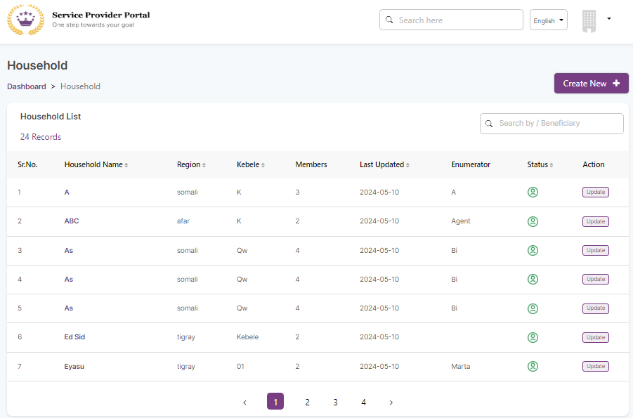
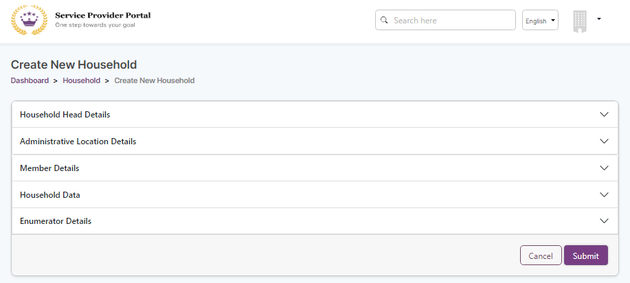
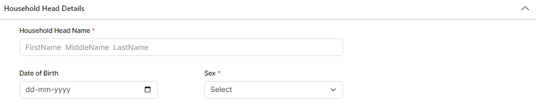
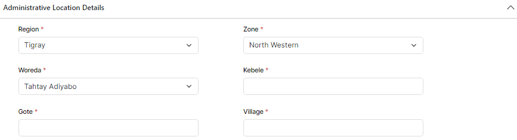
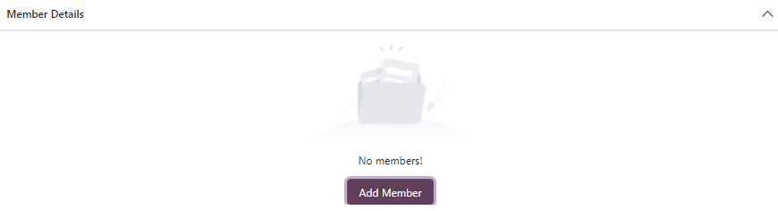
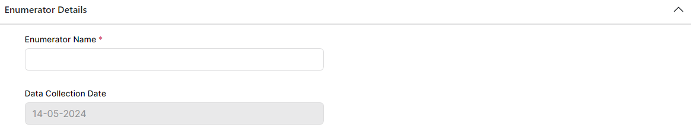
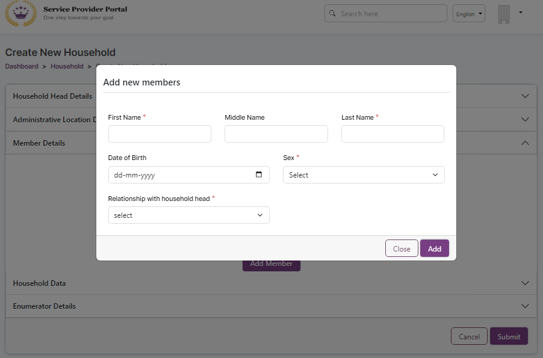

---
layout:
  title:
    visible: true
  description:
    visible: false
  tableOfContents:
    visible: true
  outline:
    visible: true
  pagination:
    visible: true
---

# 📔 Create a New Household

This document provides instructions to create new household in Service Provider portal.

## Prerequisites

A user must have access to the Service Provider portal.

## Procedure

1. Open the URL www.\<projectbaseurl>.org/serviceprovider/login in your Browser.

_**Login**_ screen is displayed.

<figure><figcaption></figcaption></figure>

2. Enter the valid _**Email ID or Phone**_ number.
3. Enter the valid _**Password**_.
4. Click the _**Reset Password**_ to reset the password.
5. Click the _**Login**_ button.

Service Provider portal _**Household Dashboard**_ screen is displayed.

<figure><figcaption></figcaption></figure>

| Field                                                                                | Description                                                                                                                                                                |
| ------------------------------------------------------------------------------------ | -------------------------------------------------------------------------------------------------------------------------------------------------------------------------- |
| Search field                                                                         | Enter the data to search and retrieve the information.                                                                                                                     |
| Language preference                                                                  | Select the preferred language from the drop-down.                                                                                                                          |
|  | 
Select the appropriate option from the drop-down.  
<ul><li>My Profile - To view your profile</li><li>Logout - To logout from the service provider portal </li></ul> |

The Household list contains the below information. It displays the number of records available in the household list. You can use the search field option to retrieve the specific household list.

| Field          | Description                                                                                                                                            |
| -------------- | ------------------------------------------------------------------------------------------------------------------------------------------------------ |
| Household Name | Displays the household name.                                                                                                                           |
| Region         | Displays the region name.                                                                                                                              |
| Kebele         | Displays the kebele name.                                                                                                                              |
| Members        | Displays the number of members.                                                                                                                        |
| Last Updated   | Displays the last updated date.                                                                                                                        |
| Enumerator     | Displays the name of the person who has collected the household data.                                                                                  |
| Status         | 
Displays the status of the household list. 
<ul><li>Green status - Active household list</li><li>Grey status - Inactive household list</li></ul> |
| Action         | Click the Update button to edit the household entry.                                                                                                   |

## Create new household

6. Click the _**Create New**_ button to create a new household entry.

_**Create New Household**_ screen is displayed.

<figure><figcaption></figcaption></figure>

The fields and their descriptions of each tab are given below.



<figure><figcaption></figcaption></figure>

| Field               | Description                                                                                     |
| ------------------- | ----------------------------------------------------------------------------------------------- |
| Household Head Name | Enter the first name, middle name and last name of the household head. It is a mandatory field. |
| Date of Birth       | Click the calendar widget and select the date of birth of the household head.                   |
| Sex                 | Select the sex from the drop-down. It is a mandatory field.                                     |



<figure><figcaption></figcaption></figure>

| Field     | Description                                       |
| --------- | ------------------------------------------------- |
| Region\*  | Select the appropriate region from the drop-down. |
| Zone\*    | Enter the zone name.                              |
| Woreda\*  | Enter the woreda name.                            |
| Kebele\*  | Enter the kebele name.                            |
| Gote\*    | Enter the gote name.                              |
| Village\* | Enter the village name.                           |

Note:

The fields with \* mark are the mandatory fields.



<figure><figcaption></figcaption></figure>

Click the Add Member button. [Add new members](create-a-new-household.md#add-new-members) screen is displayed.



Enter the required information in the respective fields. You must fill all the mandatory fields.



<figure><figcaption></figcaption></figure>

| Field                | Description                                                                          |
| -------------------- | ------------------------------------------------------------------------------------ |
| Enumerator Name      | Enter the person name who has collected the household data. It is a mandatory field. |
| Data Collection Date | Enter the household data collection date. Displays the current date by default       |
| Submit               | Click the submit button to save the data and exit from the screen                    |
| Cancel               | Click the cancel button to exit from the screen                                      |



7. Click the _**Submit**_ button to save the data and exit from the screen.
8. Click the _**Cancel**_ button to exit from the screen.

The newly added household data is displayed in the household dashboard screen.

### Add new members

<figure><figcaption></figcaption></figure>

| Field                            | Description                                                       |
| -------------------------------- | ----------------------------------------------------------------- |
| First Name                       | Enter the member's first name. It is a mandatory field.           |
| Middle Name                      | Enter the member's middle name.                                   |
| Last Name                        | Enter the member's last name. It is a mandatory field.            |
| Date of Birth                    | Click the calendar widget and select the member's date of birth.  |
| Sex                              | Select the sex from the drop-down. It is a mandatory field        |
| Relationship with household head | Select the appropriate value from the drop-down.                  |

9. Click the _**Add**_ button to save the data and exit from the screen.
10. Click the _**Close**_ button to exit from the screen.

The newly added member is displayed below the Member Details tab.
