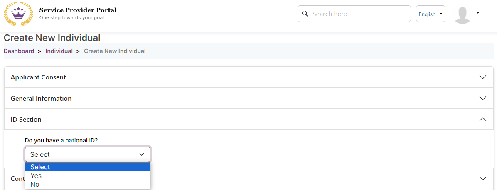
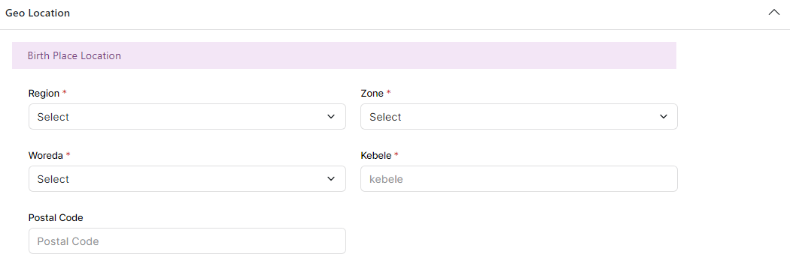

---
layout:
  title:
    visible: true
  description:
    visible: false
  tableOfContents:
    visible: true
  outline:
    visible: true
  pagination:
    visible: true
---

# 📔 Create a New Individual in Service Provider Portal

This document provides instructions to create a new individual in service provider portal.

## Prerequisites

A user must have access to the Service Provider portal.

## Procedure

1. Open the URL www.\<projectbaseurl>.org/serviceprovider/login in your Browser.

_**Login**_ screen is displayed.

<figure><figcaption></figcaption></figure>

2. Enter the valid _**Email ID or Phone**_ number.
3. Enter the valid _**Password**_.
4. Click the _**Reset Password**_ to reset the password.
5. Click the _**Login**_ button.

Service Provider Portal _**Individual Dashboard**_ screen is displayed.

<figure><figcaption></figcaption></figure>

| Field                                                                           | Description                                                                                                                                                                |
| ------------------------------------------------------------------------------- | -------------------------------------------------------------------------------------------------------------------------------------------------------------------------- |
| Search field                                                                    | Enter the data to search and retrieve the information.                                                                                                                     |
| Language preference                                                             | Select the preferred language from the drop-down.                                                                                                                          |
|  | 
Select the appropriate option from the drop-down.  
<ul><li>My Profile - To view your profile</li><li>Logout - To logout from the service provider portal </li></ul> |

The Individual list contains the below information. It displays the number of records available in the individual list. You can use the search field option to retrieve the specific individual list.

| Field        | Description                                                            |
| ------------ | ---------------------------------------------------------------------- |
| Name         | Displays the individual name.                                          |
| Region       | Displays the region name.                                              |
| Kebele       | Displays the kebele name.                                              |
| Last Updated | Displays the last updated date.                                        |
| Enumerator   | Displays the name of the person who has collected the individual data. |
| Status       | Click the Update button to edit the individual's data.                 |

## Create a new individual

6. Click the _**Create New**_ button to create a new individual's data.

_**Create New Individual**_ screen is displayed.

<figure><figcaption></figcaption></figure>

The fields and their descriptions of each tab are given below.



1. Click the _**Applicant Consent**_ tab.

<figure><figcaption></figcaption></figure>

2.  Choose the appropriate applicant consent in the drop-down. The valid values are:

    &#x20;         \-  Yes&#x20;

&#x20;                 \-  No



1. Click the _**General Information**_ tab.

<figure><figcaption></figcaption></figure>

<table><thead><tr><th width="217">Field</th><th>Description</th></tr></thead><tbody><tr><td>Given Name*</td><td>Enter the name of an individual.</td></tr><tr><td>Father Name*</td><td>Enter the father name of an individual.</td></tr><tr><td>Grand Father's Name*</td><td>Enter the grand father name of an individual.</td></tr><tr><td>Date of Birth</td><td><ul><li>Click the calendar widget.</li><li>Select the date of birth of an individual.</li></ul></td></tr><tr><td>Gender*</td><td>
Select the appropriate value from the drop-down. The values are:
<ul><li>Male</li><li>Female</li></ul></td></tr><tr><td>Religion*</td><td>

Select the appropriate value from the drop-down. The values are:
<ul><li>Catholic</li><li>Orthodox</li><li>Protestant</li><li>Muslim</li><li>Other</li></ul></td></tr></tbody></table>

Note:

The fields with \* mark are the mandatory fields.



1. Click the _**ID Section**_ tab.

<figure><figcaption></figcaption></figure>

2. Choose the appropriate values in the drop-down to confirm the existence of the national ID. The valid values are:

&#x20;       \-  Yes&#x20;

&#x20;        \-  No



1. Click the _**Contact Details**_ tab.

<figure><figcaption></figcaption></figure>

<table><thead><tr><th width="252">Field</th><th>Description</th></tr></thead><tbody><tr><td>Email</td><td>Enter the email ID of an individual.</td></tr><tr><td>Primary phone number*</td><td>Enter the primary phone number of an individual.</td></tr><tr><td>Secondary phone number</td><td>Enter the secondary phone number of an individual.</td></tr></tbody></table>

Note:

The fields with \* mark are the mandatory fields.



1. Click the _**Geo Location**_ tab.

There are two sections:

* Birth Place Location
* Current Location

_**Birth Place Location**_

<figure><figcaption></figcaption></figure>

<table><thead><tr><th width="249">Field</th><th>Description</th></tr></thead><tbody><tr><td>Region*</td><td>Select the appropriate region from the drop-down</td></tr><tr><td>Zone*</td><td>Select the appropriate zone from the drop-down.</td></tr><tr><td>Woreda*</td><td>Enter the appropriate woreda from the drop-down</td></tr><tr><td>Kebele*</td><td>Enter the kebele name.</td></tr><tr><td>Postal Code</td><td>Enter the postal code.</td></tr></tbody></table>

Note:

The fields with \* mark are the mandatory fields.

_**Current Location**_

<figure><figcaption></figcaption></figure>

| Field       | Description                                         |
| ----------- | --------------------------------------------------- |
| Region\*    | Select the appropriate region from the drop-down    |
| Zone\*      | Select the appropriate zone from the drop-down.     |
| Woreda\*    | Select the appropriate woreda from the drop-down    |
| Kebele\*    | Enter the kebele name.                              |
| Postal Code | Enter the postal code.                              |
| Hot Spot\*  | Select the appropriate hot spot from the drop-down. |

Note:

The fields with \* mark are the mandatory fields.



Enter the required information in the respective fields. You must fill all the mandatory fields.



1. Click the _**Consent**_ tab.

_**Enumerator Consent**_

1. The Enumerator selects the appropriate value in the drop-down. He/she agrees and confirms whether the collected information is true or false. The valid values are:

&#x20;              \- Yes

&#x20;              \- No

2. Enter the name of the Consent in the _**Consent Name**_ field.
3. Click the calendar widget and select the date on which the Enumerator collected the information.



7. Click the _**Submit**_ button to save the data and exit from the screen.
8. Click the _**Cancel**_ button to exit from the screen.

The newly created individual data is displayed in the individual list.
