---
layout:
  title:
    visible: true
  description:
    visible: false
  tableOfContents:
    visible: true
  outline:
    visible: true
  pagination:
    visible: true
---

# 📔 Create a New Service Provider

This document provides instructions to create a new service provider and grand portal access to the service provider in the Social Registry module.

## Prerequisites

* The user must have access to Social Registry module
* The user must have Registrar and Administrator role.

## Table of Contents

[Create a new service provider](create-a-new-service-provider.md#create-a-new-service-provider)

[Grand access to a service provider](create-a-new-service-provider.md#grant-portal-access-to-a-service-provider)

[Delete a service provider user](create-a-new-service-provider.md#delete-a-service-provider-user)

[Delete a service provider](create-a-new-service-provider.md#delete-a-service-provider)

## Procedure

### Create a new service provider

1. Use the link _**socialregistry.\<projectspecific>.openg2p.org/web/login**_ to access Social Registry.

_**Login**_ screen is displayed.

<figure>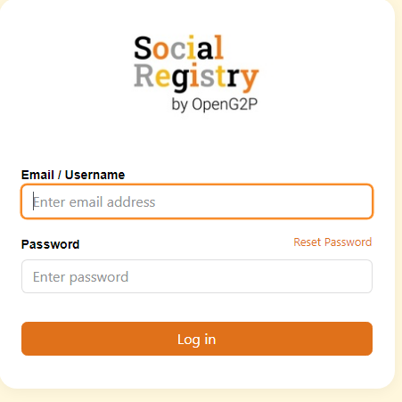<figcaption></figcaption></figure>

2. Enter the valid _**Email ID or Username.**_
3. Enter the valid _**Password**_.
4. Click the _**Reset Password**_ to reset the password.
5. Click the _**Login**_ button.

_**Social Registry**_ screen is displayed.

<figure>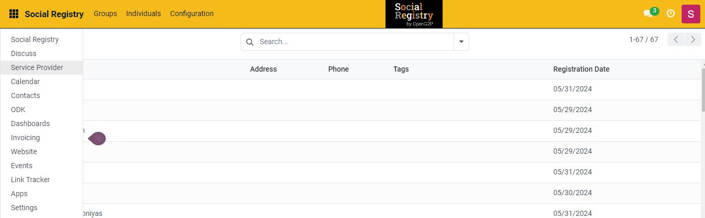<figcaption></figcaption></figure>

6. Click the main menu icon  and select Service Provider.

_**Service Provider**_ screen is displayed.

<figure>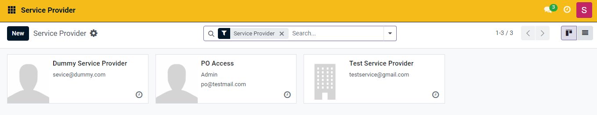<figcaption></figcaption></figure>

7. Click the _**New**_ button.

_**Service Provider New**_ screen is displayed.

<figure>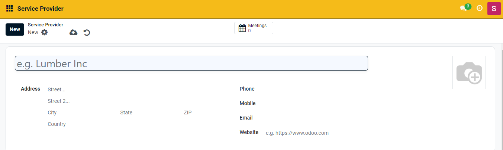<figcaption></figcaption></figure>

8. Enter the _**Service Provider**_ name.
9. Enter the _**Address**_ details.
10. Enter the _**Phone**_ number.
11. Enter the _**Mobile**_ number.
12. Enter the _**Email**_ ID.
13. Enter the _**Website**_ link.

| Icon                                                                                         | Click to                                                                                                                                                                                                             |
| -------------------------------------------------------------------------------------------- | -------------------------------------------------------------------------------------------------------------------------------------------------------------------------------------------------------------------- |
|               | 
Select the appropriate value. The available values are: 
<ul><li>Archive</li><li>Duplicate</li><li>Send SMS Text Message</li><li>Download (vCard)</li><li>Privacy Lookup</li><li>Grand portal access</li></ul> |
|    | Save manually the service provider data and exit from the screen                                                                                                                                                     |
|  | Discard changes and exit from the screen                                                                                                                                                                             |

<figure>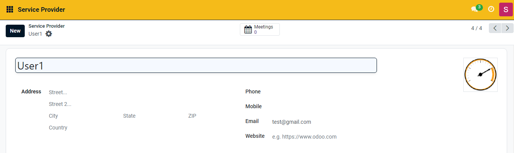<figcaption></figcaption></figure>

You can find the newly created service provider in the service provider dashboard.

<figure>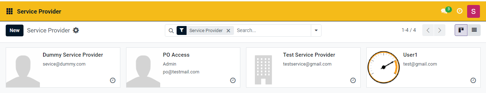<figcaption></figcaption></figure>

### Grant portal access to a service provider

14. Click the service provider that requires a grand portal access

For example, here, the service provider User1 is selected.

_**Service Provider User1**_ screen is displayed.

<figure><figcaption></figcaption></figure>

15. Click the _**Action**_ button and select _**Grand Portal Access**_.

<figure>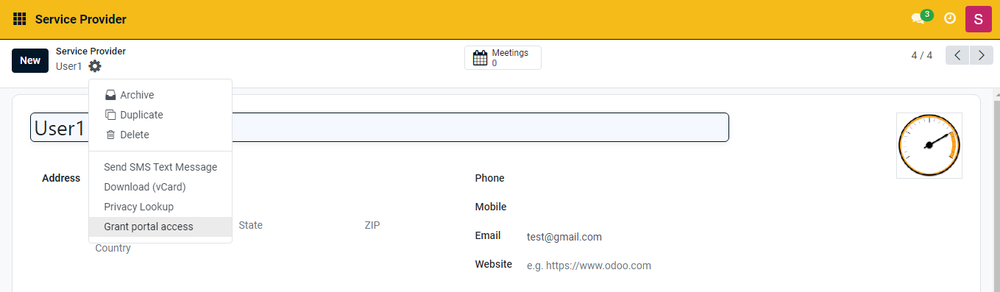<figcaption></figcaption></figure>

_**Portal Access Management**_ screen is displayed.

<figure>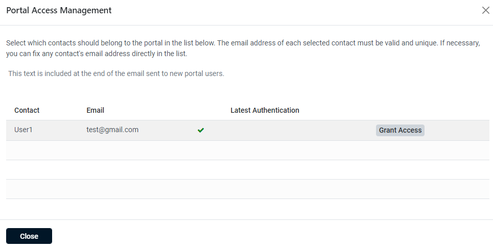<figcaption></figcaption></figure>

15. Click the _**Grant Access**_ button.

The user is enabled to access the service provider portal.

<figure>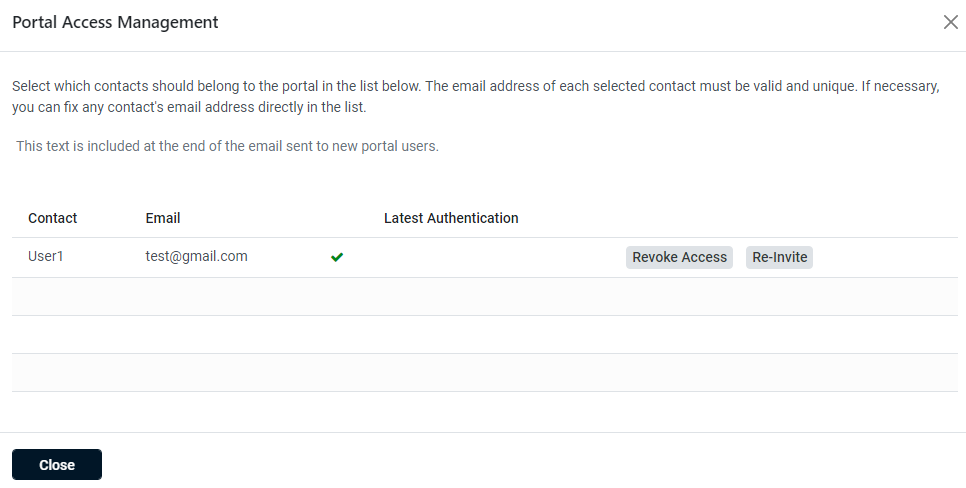<figcaption></figcaption></figure>

17. Click the _**Close**_ button to exit from the screen.

### Delete a service provider user

18. Click the main menu icon  and select _**Settings**_.

_**Settings**_ screen is displayed.

<figure>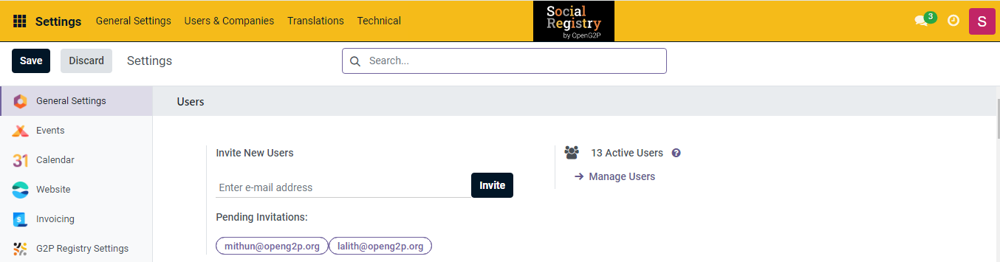<figcaption></figcaption></figure>

19. In the menu bar, Click the _**User & Companies**_ ant select _**Users**_.

_**Users**_ screen is displayed.

<figure>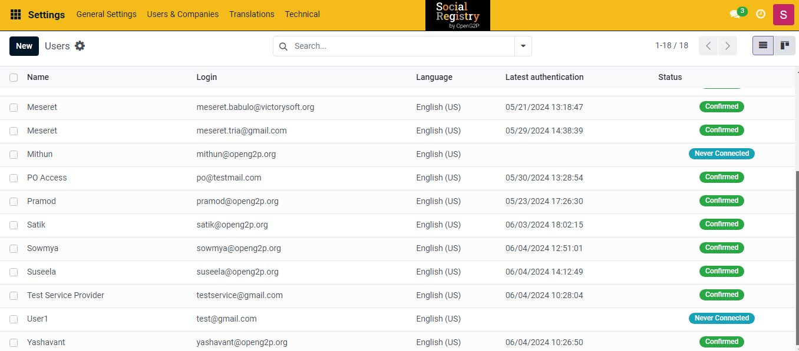<figcaption></figcaption></figure>

19. Click the user that has to be removed.

For example, here, the user User1 is selected.

User1 screen is displayed.

20. &#x20;Click the _**Action**_ icon and select _**Delete**_.

<figure>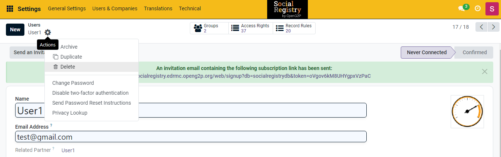<figcaption></figcaption></figure>

20. &#x20;Click the _**Delete**_ button in the _**Bye-bye, record!**_ dialogue box screen to delete the user
21. Click the _**No, keep it**_ button to retain the user

<figure><figcaption></figcaption></figure>

The user is removed from the service provider user list.

### Delete a service provider

22. Click the main menu icon  and select Service Provider.

_**Service Provider**_ screen is displayed.

23. Click the service provider that has to removed&#x20;

<figure><figcaption></figcaption></figure>

For example, here, the service provider User1 is selected.

_**Service Provider User1**_ screen is displayed.

<figure><figcaption></figcaption></figure>

19. Click the _**Action**_ button and select _**Delete**_.

<figure><figcaption></figcaption></figure>

20. &#x20;Click the _**Delete**_ button in the _**Bye-bye, record!**_ dialogue box screen to delete the service provider
21. Click the _**No, keep it**_ button to retain the service provider.

<figure><figcaption></figcaption></figure>

The service provider is removed from the service provider screen.

<figure><figcaption></figcaption></figure>
