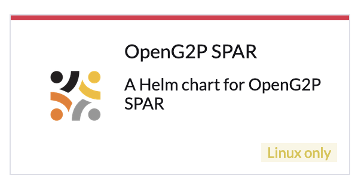

# Deployment

The instructions here pertain to the deployment of all SPAR components on the Kubernetes cluster using[ Helm charts](../deployment/helm-charts.md). The Helm charts may be installed with the following methods:

* Using Rancher UI&#x20;
* Using command line

Before you deploy SPAR, make sure the following are available:

* [Base infrastructure](../deployment/base-infrastructure/)
* [eSignet](../deployment/common-components/esignet.md) (required only if SPAR Self Service API is being installed)
* Cluster Owner permission on your cluster
* Namespace in which you would be installing SPAR is created on the cluster

## Installation using Rancher UI

1. Log in to Rancher admin console.
2. Select your cluster.
3. Under _Apps -> Repositories_ click on _Create_ to add a repository.
4. Provide _Name_ as "openg2p" and target HTTPS _Index URL_ as [https://openg2p.github.io/openg2p-helm/rancher](https://openg2p.github.io/openg2p-helm/rancher) and click _Create_.
5. &#x20;Navigate to _Apps->Charts_ page on Rancher. You should see OpenG2P SPAR Helm chart listed.

<div align="left">

<figure><figcaption></figcaption></figure>

</div>

6. Click on the Helm chart, select the version to be installed and click _Install_.
7. Select the namespace in which you would like the chart to be installed (you will need to create a namespace upfront if it does not already exist) and select the checkbox _Customise Helm options before install._
8. Provide _Global Hostname_ of the installation. Refer to [DNS requirements](../deployment/hardware-requirements.md#dns-requirements) for mapping the hostname.
9. Select the components to be installed and the eSignet base URL. The latter is required only if you are installing [SPAR Self Service](features/spar-self-service.md). &#x20;
10. Click _Next_ and then _Install_.  &#x20;

## Installation using the command line

* Install following utilities on your machine:
  * `kubectl`, `istioctl`, `helm`, `jq`, `curl`, `wget`, `git`, `bash`, `envsubst`.
* Clone the [https://github.com/openg2p/openg2p-spar-deployment](https://github.com/OpenG2P/openg2p-spar-deployment/) repo. Switch to the branch of interest.  Navigate to `deployment` directory.
*   Run.&#x20;

    ```bash
    SPAR_HOSTNAME=spar.openg2p.sandbox.net \
      NS=openg2p \
      ./install.sh
    ```

## Access links

After installation, SPAR is accessible over following URLs based on the `SPAR_HOSTNAME` given above:

* SPAR Self Service UI:  _https://spar.openg2p.sandbox.net_
* SPAR Self Service API: _https://spar.openg2p.sandbox.net/spar/v1_
* SPAR Mapper: _https://spar.openg2p.sandbox.net/mapper/v1_

## Onboard SPAR on eSignet

* Create OIDC Client for SPAR in eSignet. Follow the method suggested by the ID Provider.
  * If using mock eSignet, use this API to create OIDC client.
* During OIDC client creation, you will be asked for (or given) a client ID and private key JWK as client secret.
* Edit the SPAR DB, `login_provider` table and modify the `authorization_parameters` row of the first entry, with:
  * appropriate URLs for `authorize_endpoint` , `token_endpoint` , `validate_endpoint`, `jwks_endpoint`, and `redirect_uri` fields.
  * above client ID under the `client_id` field.
  * and above private key jwk under the `client_assertion_jwk` field.
* Seed/edit metadata of banks, wallets, branches, etc for the SPAR self-service portal in database. TODO: Elaborate.
