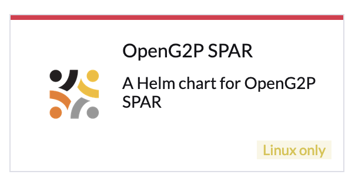

# Deployment

The instructions here pertain to the deployment of all SPAR components on the Kubernetes cluster using [Helm charts](https://docs.openg2p.org/spar/deployment/helm-charts).  The charts install SPAR components along with the Postgresql server specific to SPAR. All the components are installed in the same namespace. The deployment may be achieved by the following methods:

* [Using Rancher UI ](./#installation-using-rancher-ui)
* [Using command line](./#installation-using-the-command-line)

## Prerequisites

Before you deploy SPAR, make sure the following are available:

* [Base infrastructure](https://docs.openg2p.org/deployment/base-infrastructure) along with domain name and certificates for Rancher and Keycloak
* [Domain names and certificates](https://docs.openg2p.org/spar/deployment/domain-names-and-certificates) specific to Social Registry.
* Nginx server configuration
  * A conf file is created under `sites-enabled` on Nginx containing the above SSL certs. See [sample conf file](https://github.com/OpenG2P/openg2p-deployment/blob/main/kubernetes/nginx/server.sample.conf).
* Namespace is created (On Rancher a namespace is created under a Project).
* [Project Owner](https://ranchermanager.docs.rancher.com/how-to-guides/new-user-guides/authentication-permissions-and-global-configuration/manage-role-based-access-control-rbac/cluster-and-project-roles#project-roles) permission on the namespace of OpenG2P cluster.
* Gateways are setup for the domain as given here [Istio namespace setup](https://docs.openg2p.org/deployment/base-infrastructure/openg2p-cluster/cluster-setup/istio#namespace-setup).

## Installation using Rancher UI

1. Log in to Rancher admin console.
2. Select your cluster.
3. Under _**Apps -> Repositories**_ click the _**Create**_ to add a repository.
4. Provide _**Name**_ as "openg2p" and target HTTPS _**Index URL**_ as [https://openg2p.github.io/openg2p-helm/rancher](https://openg2p.github.io/openg2p-helm/rancher) and click on _**Create**_.
5. Select the namespace in which you would like to install PBMS, from the namespace filter on the top-right.
6. To display prerelease versions of OpenG2P apps, click on your user avatar in the upper right corner of the Rancher dashboard. Then click on _**Include Prerelease Versions**_ under _**Preferences**_ below the _**Helm Charts**_.
7. Navigate to **Apps->Charts** page on Rancher. You can find the _**OpenG2P SPAR**_ is listed in the dashboard.

<div align="left">

<figure><figcaption></figcaption></figure>

</div>

6. Click on the Helm chart, select the version to be installed, and click _**Install**_.
7. On the next screen, choose a name for installation, like `spar`. Select the checkbox _**Customise Helm**_ before the installation, and then click on _**Next**_.
8. Navigate to each app's configuration page, and configure the following:
   1. Configure a hostname for each app in the following way. `<appname>.<base-hostname>` , where base hostname is the wildcard hostname chosen during [Istio namespace setup](https://docs.openg2p.org/deployment/base-infrastructure/openg2p-cluster/cluster-setup/istio#namespace-setup). Example: `spar.dev.openg2p.org`  etc. `<appname>` is arbitrary - default names have been provided.
   2. Your organization-wide Keycloak URL is _Keycloak Base Url_ . (Refer to [Keycloak installation](https://docs.openg2p.org/deployment/base-infrastructure/rancher#keycloak-installation)).
   3. Create a Keycloak client.
   4. Provide the OIDC Client details. Refer to [Keycloak Client Creation](https://docs.openg2p.org/deployment/deployment-guide/keycloak-client-creation) guide.
   5. Click on _**Next**_ to navigate to _**Helm Options**_ page. Disable `wait` flag. Click on _**Install**_.
   6. Watch for every pods to enter a _**Running**_ state. This may take several minutes.

## Installation using the command line

* Install the following utilities on your machine:
  * `kubectl`, `istioctl`, `helm`, `jq`, `curl`, `wget`, `git`, `bash`, `envsubst`.
* Clone the [https://github.com/openg2p/openg2p-spar-deployment](https://github.com/OpenG2P/openg2p-spar-deployment/) repo. Switch to the branch of interest.  Navigate to `deployment` directory.
*   Run.&#x20;

    ```bash
    SPAR_HOSTNAME=spar.openg2p.sandbox.net \
      NS=<namespace> \
      ./install.sh
    ```

## Access links

After installation, SPAR is accessible over following URLs based on the `SPAR_HOSTNAME` given above:

* SPAR Self Service UI:  _https://spar.openg2p.sandbox.net_
* SPAR Self Service API: _https://spar.openg2p.sandbox.net/api/selfservice_
* SPAR Mapper: _https://spar.openg2p.sandbox.net/api/mapper_

## Database

Postgresql is installed as part of the above procedure in the same namespace. The default database created is `spardb` .

## Onboard SPAR on eSignet

* Create OIDC Client for SPAR in eSignet. Follow the method suggested by the ID Provider.
  * If using mock eSignet, use this API to create OIDC client.
* During OIDC client creation, you will be asked for (or given) a client ID and private key JWK as client secret.
* Edit the SPAR DB, `login_provider` table and modify the `authorization_parameters` row of the first entry, with:
  * appropriate URLs for `authorize_endpoint` , `token_endpoint` , `validate_endpoint`, `jwks_endpoint`, and `redirect_uri` fields.
  * above client ID under the `client_id` field.
  * and above private key jwk under the `client_assertion_jwk` field.
* Seed/edit metadata of banks, wallets, branches, etc for the SPAR self-service portal in database. TODO: Elaborate.

## Sanity testing

TBD
