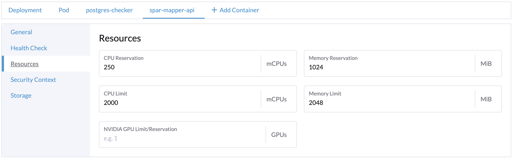
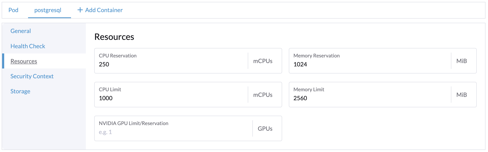
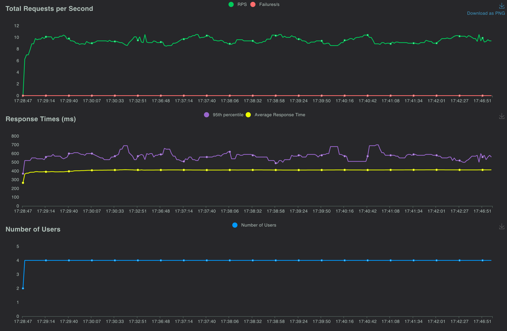
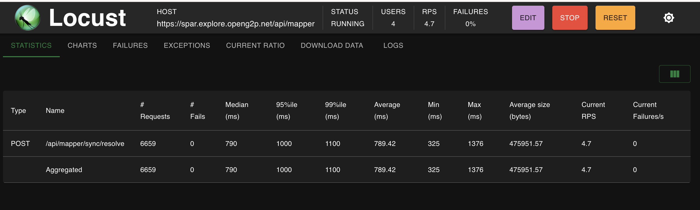

# Load Testing

## Benchmark report

With a **single mapper POD** (Limit - 2 CPU, 2 GB RAM) and **single postgresql POD** (Limit - 1 CPU, 2.5 GB RAM) and various combinations of&#x20;

1. number of concurrent API requests
2. payload size

we can achieve the following throughput at almost **100% CPU utilization** of the mapper POD


1 mapper POD


## Setup

### K8S Cluster

### POD Configurations

First round of measurements were done with a Single POD, with autoscaling suppressed. The mapper POD and the postgresql POD had the following configurations

<table><thead><tr><th width="133">POD</th><th>CPU reserve</th><th>CPU limit</th><th>Mem reserve </th><th>Mem limit</th></tr></thead><tbody><tr><td>mapper</td><td>0.250 cpu</td><td>2 cpu</td><td>1 GB</td><td>2 GB</td></tr><tr><td>postgresql</td><td>0.250 cpu</td><td>1 cpu</td><td>1 GB</td><td>2.5 GB</td></tr></tbody></table>

<figure><figcaption>
mapper-api POD configuration
</figcaption></figure>

<figure><figcaption>
Postgresql POD configuration
</figcaption></figure>

### DB Specific configurations

### Test Server

### Test Tools

Locust ([https://locust.io/](https://locust.io/)) - to generate API load

Grafana charts & Prometheus - to monitor and measure POD resource utilizations

## Approach

The methodology is detailed for every API

## Resolve API

10 Million ID-FA Records were created, starting from id value as 1 to id value as 10,000,000. The script to create these records can be found here.

### Test Script description

The test script allows you to adjust the number of records that are submitted in each Resolve Request. All the IDs that are sent in the Resolve request are randomly generated integers (values between 1 and 10,000,000).&#x20;

This script is then submitted using Locust API requests, where we can specify the number of concurrent users (concurrent API invocations).

The Test script can be found here.

### **Readings before test**

The following readings were recorded prior to starting the test.

<table><thead><tr><th width="220">POD</th><th width="217">CPU Utilization</th><th>Memory Utilization</th></tr></thead><tbody><tr><td>Mapper POD</td><td>0.0225 cpu</td><td>477 MB</td></tr><tr><td>Postgres POD</td><td>0.0080 cpu</td><td>20 MB</td></tr></tbody></table>

### **Test scenarios**

#### <mark style="color:green;">**8 concurrent users, 1000 requests per API, 1 second ramp up time per user**</mark>

The following readings were taken 30 minutes after starting the test. The readings were taken while the test was still running.

<table><thead><tr><th width="220">POD</th><th width="217">CPU Utilization</th><th>Memory Utilization</th></tr></thead><tbody><tr><td>Mapper POD</td><td>2 cpu</td><td>546 MB</td></tr><tr><td>Postgres POD</td><td>0.25 cpu</td><td>1.7 GB</td></tr></tbody></table>

The Locust dashboard at the 30 minute showed the following readings

<figure><figcaption>
Locust Dashboard - 30 minutes - 8 concurrent users - 1000 records per API
</figcaption></figure>

<figure><figcaption>
Locust Charts - 30 minutes - 8 concurrent users - 1000 records per API
</figcaption></figure>

The CPU for the Mapper POD showed a 100% throttle at this stage

<figure><figcaption>
CPU throttle - 30 minutes - 8 concurrent users - 1000 records per API
</figcaption></figure>

#### <mark style="color:green;">**4 concurrent users, 1000 requests per API, 1 second ramp up time per user**</mark>

The following readings were taken 30 minutes after starting the test. The readings were taken while the test was still running.

<table><thead><tr><th width="220">POD</th><th width="217">CPU Utilization</th><th>Memory Utilization</th></tr></thead><tbody><tr><td>Mapper POD</td><td>2 cpu</td><td>546 MB</td></tr><tr><td>Postgres POD</td><td>0.225 cpu</td><td>1.7 GB</td></tr></tbody></table>

The Locust dashboard at the 30 minute showed the following readings

<figure><figcaption>
Locust Dashboard - 30 minutes - 4 concurrent users - 1000 records per API
</figcaption></figure>

<figure><figcaption>
Locust Charts - 30 minutes - 4 concurrent users - 1000 records per API
</figcaption></figure>

The CPU for the Mapper POD showed a 100% throttle at this stage

<figure><figcaption>
CPU throttle - 30 minutes - 4 concurrent users - 1000 records per API
</figcaption></figure>

#### <mark style="color:green;">**4 concurrent users, 2000 requests per API, 1 second ramp up time per user**</mark>

The following readings were taken 30 minutes after starting the test. The readings were taken while the test was still running.

<table><thead><tr><th width="220">POD</th><th width="217">CPU Utilization</th><th>Memory Utilization</th></tr></thead><tbody><tr><td>Mapper POD</td><td>2 cpu</td><td>590 MB</td></tr><tr><td>Postgres POD</td><td>0.235 cpu</td><td>1.7 GB</td></tr></tbody></table>

The Locust dashboard at the 30 minute showed the following readings

<figure><figcaption>
Locust Dashboard - 30 minutes - 4 concurrent users - 2000 records per API
</figcaption></figure>

<figure><figcaption>
Locust Charts - 30 minutes - 4 concurrent users - 2000 records per API
</figcaption></figure>

The CPU for the Mapper POD showed a 100% throttle at this stage

<figure><figcaption>
CPU throttle - 30 minutes - 4 concurrent users - 2000 records per API
</figcaption></figure>

The table below summarizes these measurements


Resolve API - Measurements

