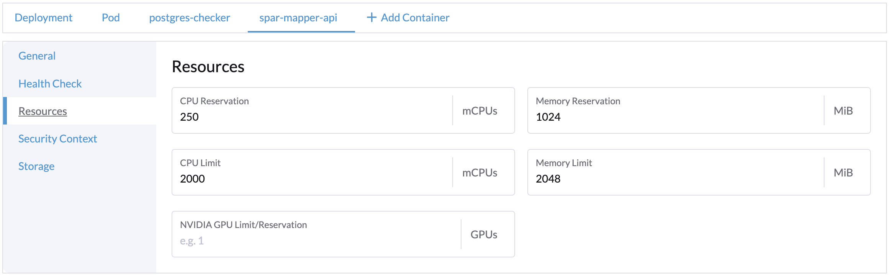
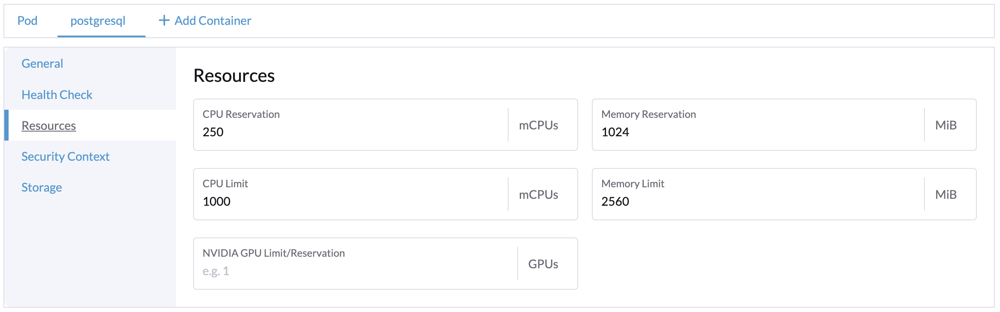

# Mapper

## Benchmark summary &#x20;

We conducted a series of measurements under varying combinations of&#x20;

1. Number of concurrent API requests
2. Payload size

The configuration that yielded maximum throughput at 100% utilization (either CPU or Memory) in one of the two PODs ([Mapper](../../../../features/spar-mapper.md) and Postgresql DB) is detailed below.  Each API is reported under a separate sheet.


1 mapper POD


## Test setup

Testing was conducted on [V4 deployment architecture](../../../../../deployment/#deployment-architecture-v4) with 2 nodes. The underlying machines specifications (TBD).&#x20;

### POD configurations

First round of measurements were done with a Single POD, with autoscaling suppressed. The mapper POD and the postgresql POD had the following configurations

<table><thead><tr><th width="133">POD</th><th>CPU reserve</th><th>CPU limit</th><th>Mem reserve </th><th>Mem limit</th></tr></thead><tbody><tr><td>Mapper</td><td>0.250 cpu</td><td>2 cpu</td><td>1 GB</td><td>2 GB</td></tr><tr><td>Postgresql</td><td>0.250 cpu</td><td>1 cpu</td><td>1 GB</td><td>2.5 GB</td></tr></tbody></table>

<figure><figcaption>
mapper-api POD configuration
</figcaption></figure>

<figure><figcaption>
Postgresql POD configuration
</figcaption></figure>

### Postgresql configuration

TBD

### Test tools

* [Locust](https://locust.io/) to generate API load.
* [Grafana charts & Prometheus](../../../../../deployment/base-infrastructure/openg2p-cluster/prometheus-and-grafana.md) to monitor and measure POD resource utilizations

## APIs

* [Resolve API](resolve-api.md)
