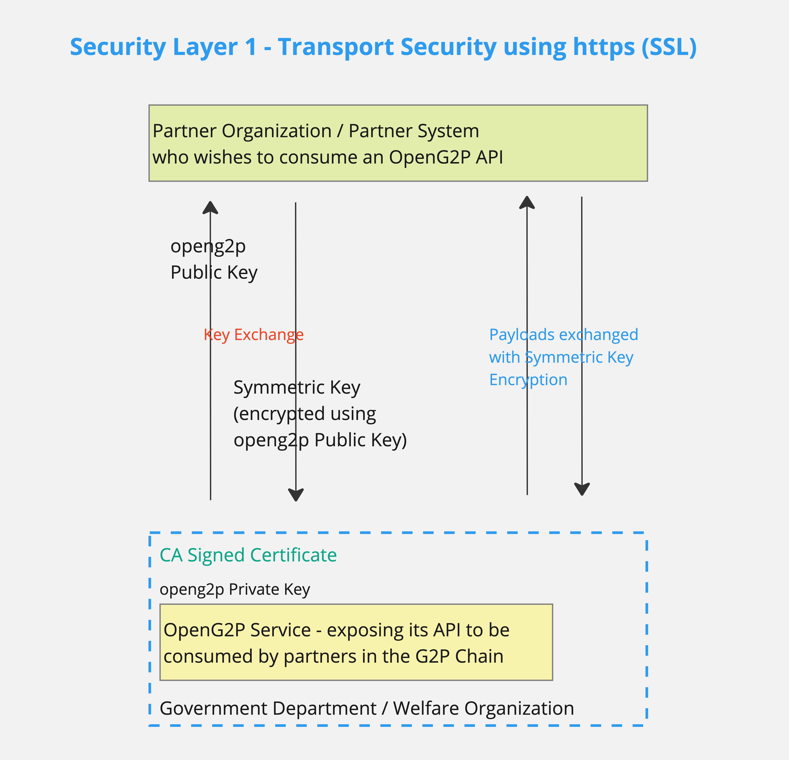
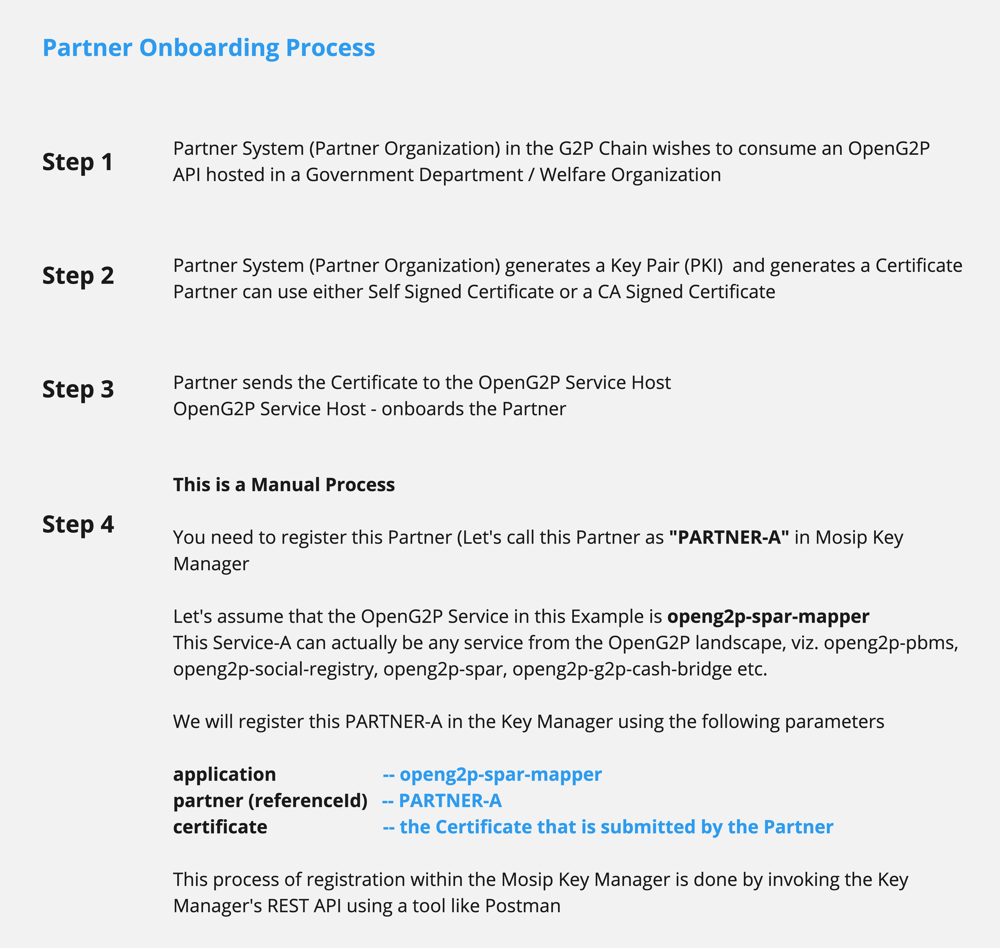
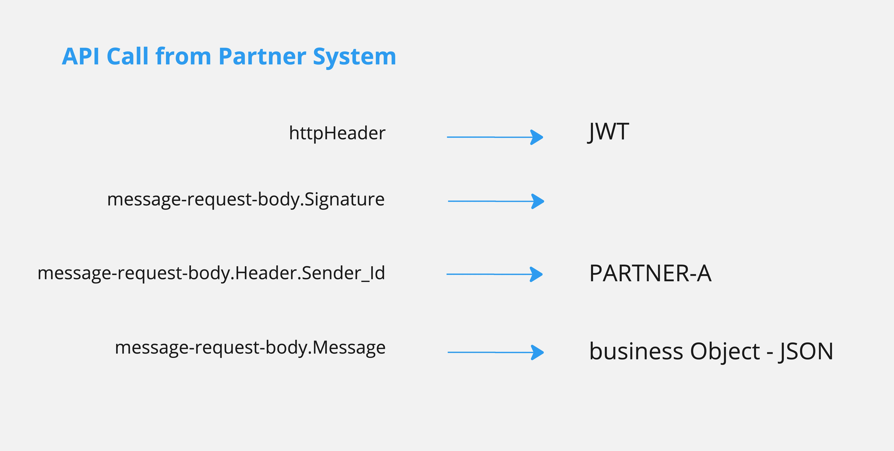
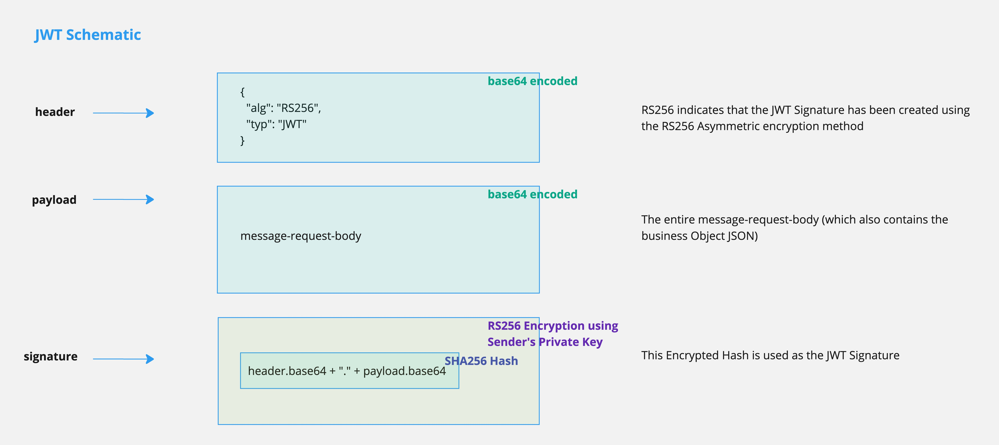
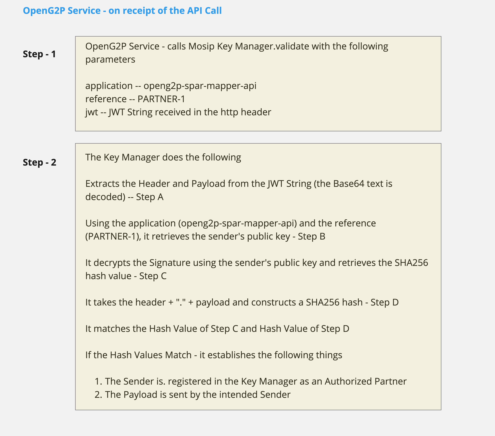

# Privacy & Security

### Authentication & authorization

SPAR APIs are consumed by two categories of clients

1. Beneficiaries (via a front-end built on top of the Beneficiary Portal) consuming the APIs provided by openg2p-spar-bene-portal-api
2. Partner systems consuming the Mapper APIs provided by openg2p-spar-mapper-partner-api. These partner systems can be Banks, National Clearing, PBMS/MIS Systems - systems in the G2P chain, using the lookup (resolve) API of Mapper. \
   \
   The openg2p-spar-bene-portal-api (of point 1) in turn consumes the mapper APIs. In this context, the openg2p-spar-bene-portal-api will behave like a partner system&#x20;

### Transport security using a secure tunnel

Security of the payload during transmission (in both cases mentioned above) is handled using the https (SSL) implementation, using PKI.

<figure><figcaption>
OpenG2P - SSL and TLS
</figcaption></figure>

### Authentication

#### Case 1 - Authentication of Beneficiaries consuming bene-portal APIs

This is handled by the Beneficiary Portal API - integration with an OIDC - OAuth2.0 Login Provider. The beneficiary logs in using his/her National ID.

The Login Provider authorizes the beneficiary and provides the ID and Access tokens. The subsequent requests from the user then carry these tokens to get access to the APIs.

There are two API paths, viz. <mark style="color:blue;">**auth**</mark> and <mark style="color:blue;">**oauth**</mark>, in the bene-portal-api, that fulfil these functionalities.

#### Case 2 - Authentication of Partner Systems consuming mapper-apis

(the Beneficiary Portal API also consumes mapper-apis - In this case, it is treated like a partner system consuming mapper apis)

### Partner authorization

#### Onboarding a Partner to consume an OpenG2P API

<figure><figcaption>
Partner Onboarding for OpenG2P API
</figcaption></figure>

#### API call by Partner

<figure><figcaption>
OpenG2P API call from Partner Organization / Partner System
</figcaption></figure>

#### JWT Schematic

<figure><figcaption>
OpenG2P - JWT Schematic
</figcaption></figure>

#### Validation of the partner signature

The signature mechanism is **not implemented in SPAR** — it lives in
`openg2p-fastapi-common` behind the `CryptoHelper` interface. SPAR uses the
**`partner-mgmt`** backend (`PyJWTCryptoHelper` + `PartnerMgmtKeyStore`): it fetches
the partner's public key from the **Partner Manager (PM)** service to verify the JWS.
**No local key store.**

See [PyJWTCryptoHelper](../../platform/platform-services/privacy-and-security/pyjwtcryptohelper.md)
for the full design. SPAR-specific notes:

* **SPAR only verifies — it never signs** (no private key / `.p12` is configured).
  Outbound signing is a concern of the *caller* (e.g. the G2P Bridge signs its
  resolve requests).
* A partner sends a **detached JWS** (`header..signature`) in the **`Signature`**
  header; the JSON business payload is the request body. SPAR rebuilds the signing
  input from the body and verifies it against the partner's public key, fetched from
  PM as `GET {partner_mgmt_api_url}/keys/PARTNER_<sender_app_mnemonic>` (matching the
  JWS `kid`, short-cached). **Signature validity only** — no trusted-root / CA-chain
  check. **RS256 only**; `none` and HMAC (`HS*`) are always rejected.
* Verification is enforced when `SPAR_MAPPER_PARTNER_API_JWT_AUTH_ENABLED` is on
  (the trial default). Partners are onboarded **in Partner Manager**, not in SPAR —
  the bundled trial's G2P Bridge chart runs a `pm-seed` Job that onboards the Bridge
  as `PARTNER_G2P_BRIDGE` (plus the sanity/walkthrough test partners) in PM, so a
  signed Bridge → SPAR resolve call is verified out of the box.

#### Integration with Partner Manager (PM)

SPAR's PM integration is **verify-only** and touches **only PM's read surface**
(`GET /keys/…`, unauthenticated, in-cluster): SPAR never onboards partners, holds no
admin token, and registers no key of its own. The runtime verify flow — fetch the
signer's key by `PARTNER_<mnemonic>` + `kid`, cache it (soft TTL / refresh-on-unknown-kid
/ negative-cache / serve-stale), then check the RS256 signature over the canonical
body — is **identical** to the G2P Bridge's inbound verification.

Rather than duplicate it, see the **"Verifying an inbound partner signature"** sequence
diagram and the caching details in
[G2P Bridge → Partner APIs → Integration with Partner Manager (PM)](../../products/g2p-bridge/design-specifications/partner-apis.md#integration-with-partner-manager-pm).
The only differences for SPAR: the caller is typically the **G2P Bridge**
(`PARTNER_G2P_BRIDGE`, which the Bridge chart self-registers in the **same** PM), and
SPAR uses **none** of PM's admin/onboarding surface (it has no `pm-register` Job and
no `partner_manager` credentials).


**Legacy:** SPAR 1.0.0 validated signatures via the remote MOSIP Key Manager (a
`keymanager` backend still exists in `openg2p-fastapi-common` for backward
compatibility, but is not used by the current deployment). The diagram below shows
that legacy flow.


<figure><figcaption>
OpenG2P - Validation of JWT in MOSIP Key Manager (legacy / 1.0.0)
</figcaption></figure>
