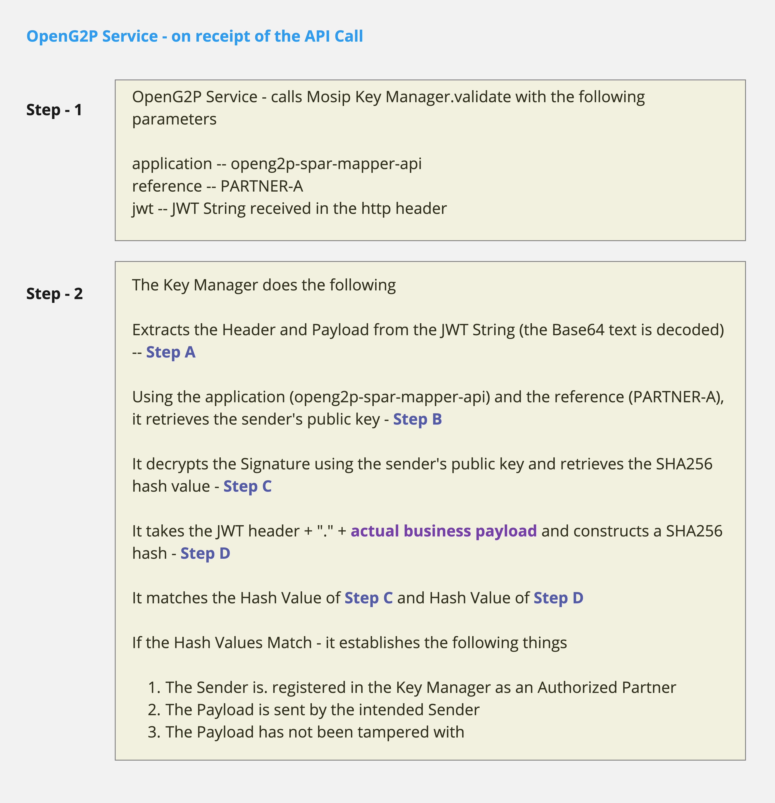

# Privacy & Security

### Transport Security using a Secure Tunnel

<figure><figcaption>
OpenG2P - SSL and TLS
</figcaption></figure>

### Partner Authorization

#### Onboarding a Partner to consume an OpenG2P API

<figure><figcaption>
Partner Onboarding for OpenG2P API
</figcaption></figure>

#### API Call by Partner

<figure><figcaption>
OpenG2P API call from Partner Organization / Partner System
</figcaption></figure>

#### JWT Schematic

<figure><figcaption>
OpenG2P - JWT Schematic
</figcaption></figure>

#### Validation of JWT using MOSIP Key Manager

<figure><figcaption>
OpenG2P - Validation of JWT in MOSIP Key Manager
</figcaption></figure>
