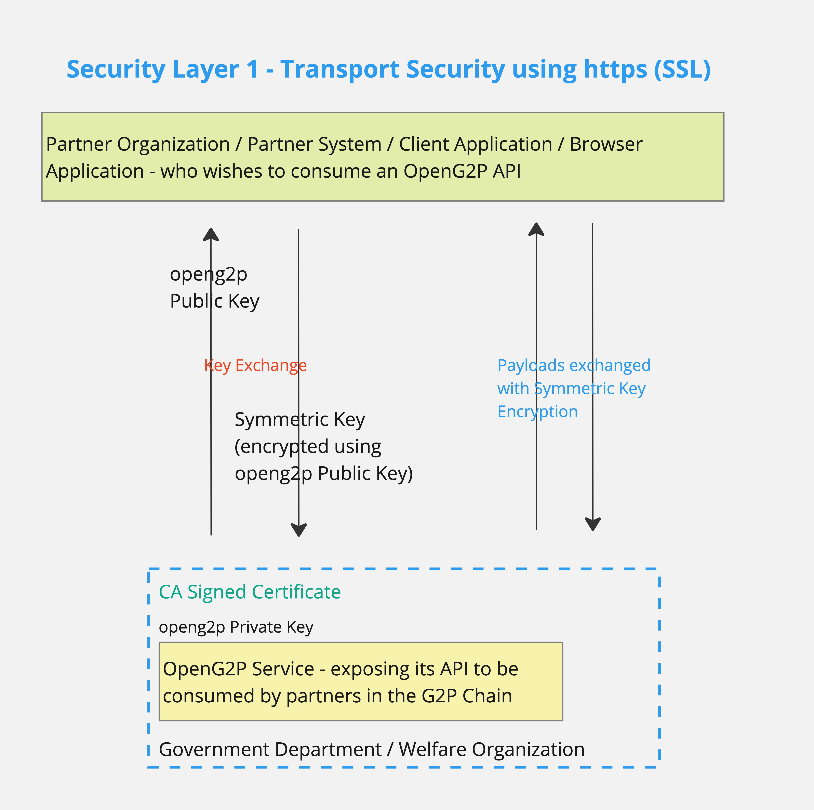
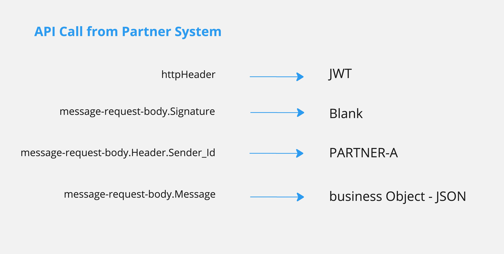

# Privacy & Security

### SPAR APIs are consumed by two categories of clients

1. Beneficiaries logging on to the Self-Service-Portal (through the Self-Service-Client) and consuming the APIs provided by openg2p-self-service-api
2. Partner systems consuming the Mapper APIs provided by openg2p-spar-mapper-api. These partner systems can be Banks, National Clearing, PBMS/MIS Systems - systems in the G2P chain, using the lookup (resolve) API of Mapper. \
   \
   The openg2p-spar-self-service-api (of point 1) which serves the self-service-ui, in turn has to consume the mapper APIs. In this context, the openg2p-spar-self-service-api will behave like a partner system&#x20;

### Transport Security using a Secure Tunnel

<figure><figcaption>
OpenG2P - SSL and TLS
</figcaption></figure>

### There are two usages

### Partner Authorization

#### Onboarding a Partner to consume an OpenG2P API

<figure><figcaption>
Partner Onboarding for OpenG2P API
</figcaption></figure>

#### API Call by Partner

<figure><figcaption>
OpenG2P API call from Partner Organization / Partner System
</figcaption></figure>

#### JWT Schematic

<figure><figcaption>
OpenG2P - JWT Schematic
</figcaption></figure>

#### Validation of JWT using MOSIP Key Manager

<figure><figcaption>
OpenG2P - Validation of JWT in MOSIP Key Manager
</figcaption></figure>
