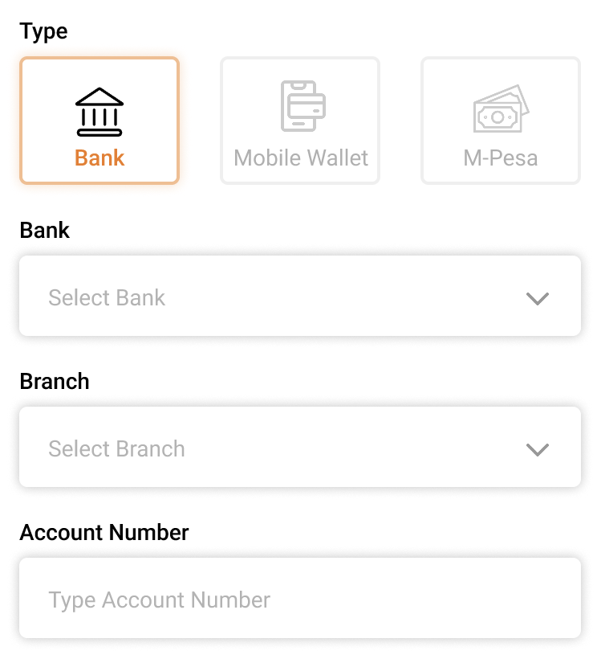

---
layout:
  title:
    visible: true
  description:
    visible: false
  tableOfContents:
    visible: true
  outline:
    visible: true
  pagination:
    visible: true
---

# Tech Guides

### Persistent Entities in openg2p-spar-mapper-api

#### id\_fa\_mappings&#x20;

Contains the records for id\_value (beneficiary Id) and fa\_value (Financial Address) mapping

| Column           | Description                                                                                                                                                                                                                                                                                                                                                                                                                                                                                                                                                                                                                                                                                                                                                                                                                                                                              |
| ---------------- | ---------------------------------------------------------------------------------------------------------------------------------------------------------------------------------------------------------------------------------------------------------------------------------------------------------------------------------------------------------------------------------------------------------------------------------------------------------------------------------------------------------------------------------------------------------------------------------------------------------------------------------------------------------------------------------------------------------------------------------------------------------------------------------------------------------------------------------------------------------------------------------------- |
| id\_value        | 
This is the Beneficiary ID - that will travel in the G2P Chain. This the beneficiary id for which the upstream PBMS / MIS platforms will create disbursements  The id_value is constructed using a construction strategy (decided based on implementation).   If the mapper is maintained using the self service paradigm, one of the ways that you can construct the ID Value is using the "auth" attributes from the Login Provider. An OIDC / OAuth2.0 Login provider usually provides the following attributes
<ul><li>sub - Subject. Usually the ID/Token of the Beneficiary</li><li>iss - Issuer URL</li><li>name - Name of Beneficiary</li><li>email - Email of Beneficiary</li><li>phone_number - Phone Number of Beneficiary </li></ul>
If we decide that the Banks update the Mapper, then a suitable construction strategy needs to be arrived at.
 |
| fa\_value        | 
This is the Financial Address of the Beneficiary - Usually will represent the Savings/ Checking /Current account of the beneficiary in a Bank.   The fa_value should be the full account details, such that this value alone is sufficient to enable a payment transaction into the account using the National Clearing Network. 
                                                                                                                                                                                                                                                                                                                                                                                                                                                                                                                                           |
| name             | 
The name of the beneficiary.   It is a good idea to have the name of the beneficiary travel back to the upstream systems as part of the "disbursement settlement status" -- The Disbursement settlement status should be sent by the final destination bank (where the beneficiary is credited).
                                                                                                                                                                                                                                                                                                                                                                                                                                                                                                                                                                            |
| phone            | Phone number of the beneficiary                                                                                                                                                                                                                                                                                                                                                                                                                                                                                                                                                                                                                                                                                                                                                                                                                                                          |
| additional\_info | 
This is an extensibility feature - to store additional attributes required in an implementation.  The SPAR Self Service - populates this column with the strategy-Id (specifies the strategy used for constructing the fa_value)
                                                                                                                                                                                                                                                                                                                                                                                                                                                                                                                                                                                                                                            |

### Persistent Entities in openg2p-spar-self-service-api

dfsp\_level and dfsp\_level\_values - are static tables that contain the information pertaining to the Banks (and other financial service providers), their branches.  The use of these two tables are explained below using examples

#### dfsp\_levels

<table><thead><tr><th width="78">id</th><th width="227">name</th><th width="246">level_type - ENUM</th><th>parent</th></tr></thead><tbody><tr><td>1</td><td>Bank</td><td>bank</td><td>0</td></tr><tr><td>2</td><td>Branch</td><td>branch</td><td>1</td></tr><tr><td>3</td><td>Account number</td><td>account</td><td>2</td></tr></tbody></table>

The above data indicates that, to fully express the Financial Address of a Beneficiary's bank account, the self service platform needs to capture 3 attributes for the Financial Address, viz. Bank, Branch & Account

Similarly for a Mobile Number based Wallet, we can think of the following dfsp\_level configuration

<table><thead><tr><th width="61">id</th><th width="279">name</th><th width="224">level_type - ENUM</th><th>parent</th></tr></thead><tbody><tr><td>4</td><td>Mobile Wallet Service Provider</td><td>mobile_wallet_provider</td><td>0</td></tr><tr><td>5</td><td>Mobile number</td><td>mobile_number</td><td>5</td></tr></tbody></table>

For a Email Address based Wallet, we can have the following dfsp\_level configuration

<table><thead><tr><th width="61">id</th><th width="279">name</th><th width="224">level_type - ENUM</th><th>parent</th></tr></thead><tbody><tr><td>6</td><td>Email Wallet Service Provider</td><td>email_wallet_provider</td><td>0</td></tr><tr><td>7</td><td>Email address</td><td>email_address</td><td>6</td></tr></tbody></table>

The self-service-ui uses the api - "get\_levels (parent)" to paint the UI fields to capture the input for these attributes - parent = 0, will provide the first level for the FA hierarchy

<figure><figcaption>
Self Service UI - showing capture of FA information
</figcaption></figure>

#### dfsp\_level\_values

For facilitating capture of a Bank Account, we can visualize the following dfsp\_level\_values configuration

<table><thead><tr><th width="66">id</th><th width="220">name</th><th width="177">code</th><th>parent</th><th>level_id</th></tr></thead><tbody><tr><td>1</td><td>Bank One</td><td>Bank001</td><td>0</td><td>1</td></tr><tr><td>2</td><td>Bank Two</td><td>Bank002</td><td>0</td><td>1</td></tr><tr><td>3</td><td>Bank Three</td><td>Bank003</td><td>0</td><td>1</td></tr></tbody></table>

The API - get\_level\_values (parent = 0, level\_id = 1) - will yield the UI a drop down of these 3 banks.

<table><thead><tr><th width="66">id</th><th width="141">name</th><th width="258">code</th><th width="97">parent</th><th>level_id</th></tr></thead><tbody><tr><td>1</td><td>Branch 001</td><td>Branch001-Bank001</td><td>1</td><td>2</td></tr><tr><td>2</td><td>Branch 002</td><td>Branch002-Bank001</td><td>1</td><td>2</td></tr><tr><td>3</td><td>Branch 003</td><td>Branch003-Bank001</td><td>1</td><td>2</td></tr></tbody></table>

The API - get\_level\_values (parent = 1, level\_id = 2) - will yield the UI a drop down of these 3 branches for Bank One

#### login\_providers

<table><thead><tr><th width="66">id</th><th width="102">name</th><th width="181">login_button_image_url</th><th width="245">authorization_parameters</th><th>strategy_id</th></tr></thead><tbody><tr><td>1</td><td>E-Signet</td><td>The Image that can be shown on the UI for E-Signet</td><td></td><td>1</td></tr><tr><td>2</td><td>Keycloak</td><td></td><td></td><td>2</td></tr><tr><td></td><td></td><td></td><td></td><td></td></tr></tbody></table>

The API - get\_login\_providers - will provide the list of configured login\_providers. The UI can then redirect itself to the redirect\_url specified for that login\_provider for the necessary authentication.

### APIs

[Refer to Stoplight API documentation](https://openg2p.stoplight.io/docs/social-payments-account-registry)
