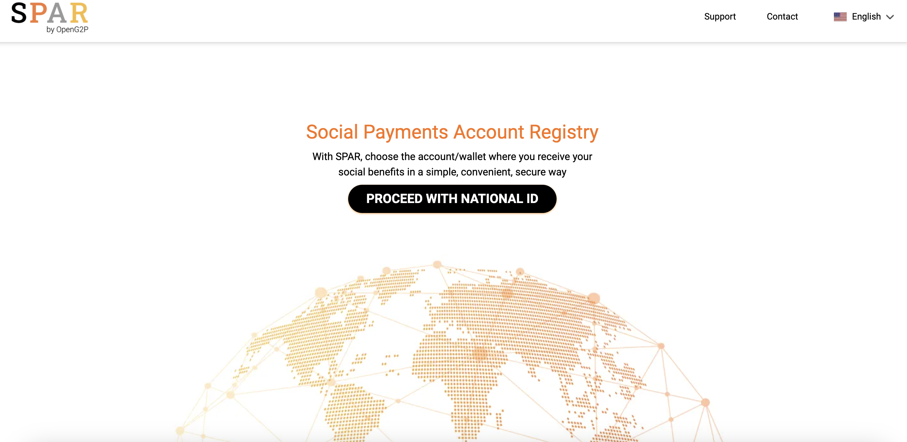
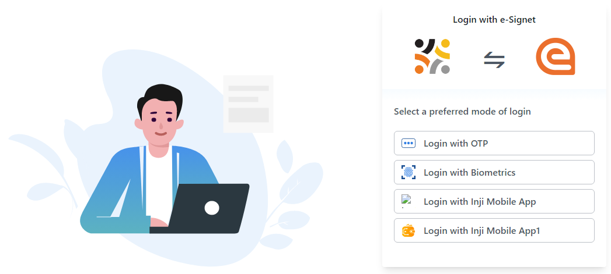
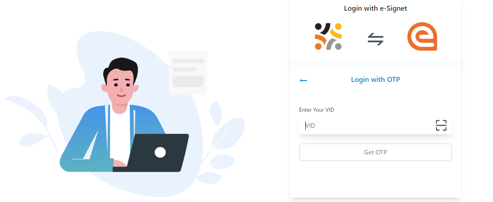
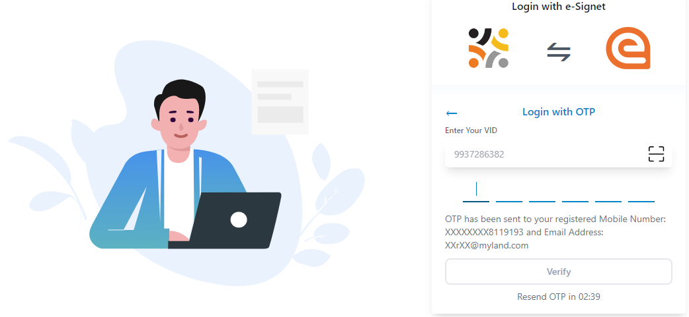
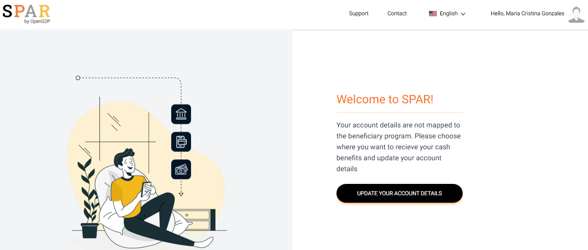
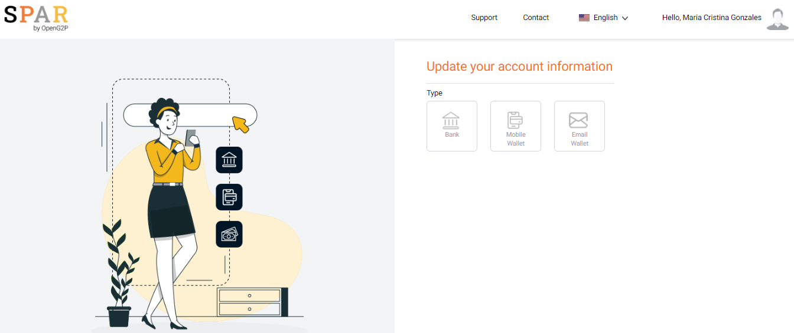
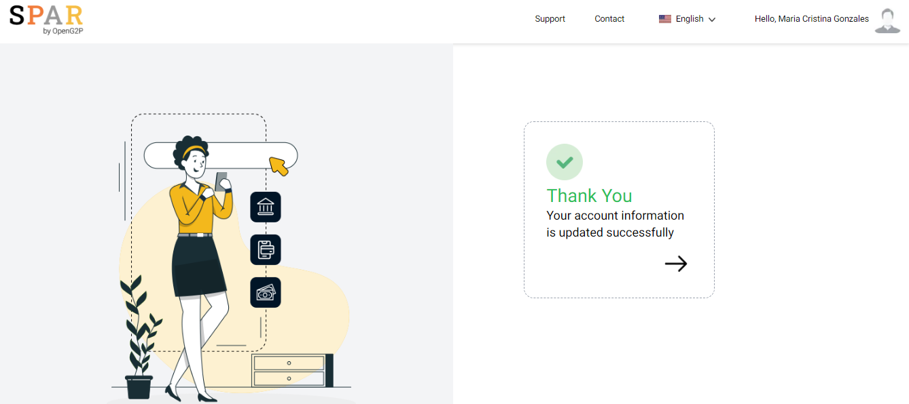
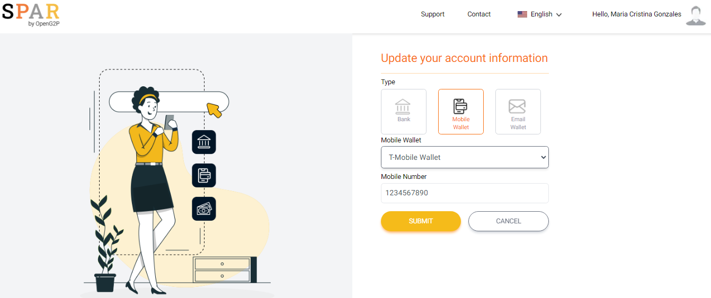
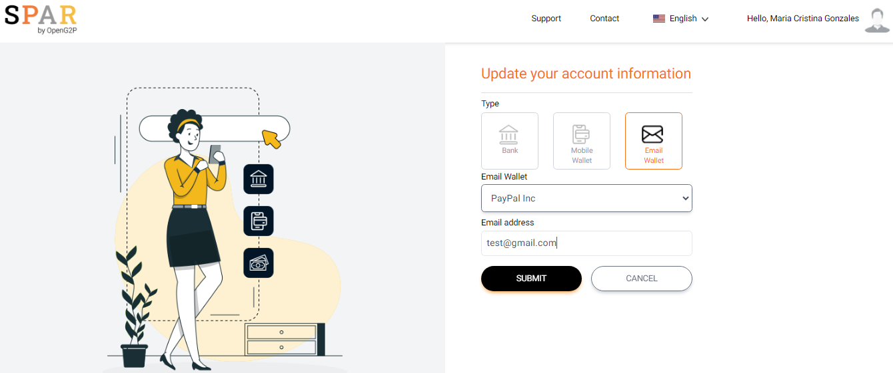

---
layout:
  title:
    visible: true
  description:
    visible: false
  tableOfContents:
    visible: true
  outline:
    visible: true
  pagination:
    visible: true
---

# 📔 Link FA (Self Service)

This document contains step-by-step instructions for the beneficiaries to login self-service portal offered by SPAR (Social Payments Account Registry) and map his/her national ID with their respective bank account, mobile wallet account, and email wallet account.

## Prerequisites

* The user must have access to [SPAR](https://spar.explore.openg2p.net/selfservice/en/login) which is available in public portal via internet
* The user must have his/her National ID,  bank account, mobile wallet, and email ID details.

## Procedure

1. Open the SPAR URL on your browser

_**SPAR**_ self-service portal  screen is displayed.

<figure><figcaption></figcaption></figure>

2. Click the _**Proceed with National ID**_ button.

_**Login with e-Signet**_ screen is displayed.

<figure><figcaption>
eSignet login page.
</figcaption></figure>

You can select your preferred mode of login.

* [Login with OTP](self-update-id-with-financial-address-information.md#login-with-otp)
* Login with Biometrics
* Login with Inji Mobile App
* Login with Inji Mobile App1

### Login with OTP

5. Click the _**Login with OTP**_ button.

_**Login with OTP**_ screen is displayed.

<figure><figcaption>
Login with OTP.
</figcaption></figure>

7. Enter the _**VID**_ number and click the _**Get OTP**_ button.

You receive the OTP number in your registered phone number.

8. Enter the OTP number and click the _**Verify**_ button.

<figure><figcaption>
OTP verification.
</figcaption></figure>

_**SPAR**_ home screen is displayed.

<figure><figcaption></figcaption></figure>

In _**SPAR**_ home screen, the features and their descriptions are given below:

| Feature                                                                         | Description                                                                                                      |
| ------------------------------------------------------------------------------- | ---------------------------------------------------------------------------------------------------------------- |
|  | Displays your name.                                                                                              |
| Language drop-down                                                              | Select your preferred language from the drop-down. Your preferred language gets reflected in the user interface. |
| UPDATE YOUR ACCOUNT DETAILS                                                     | Click to update your account details.                                                                            |

_**Update your account information**_ screen is displayed.

<figure><figcaption></figcaption></figure>

You can find three different modes to update your account details. &#x20;

* Bank
* Mobile Wallet
* Email Wallet



1. Click the _**Bank**_ Type.

You can fill the valid bank details in the respective fields.

| Field         | Description                                        |
| ------------- | -------------------------------------------------- |
| Select Bank   | Select  your bank in the drop-down.                |
| Select Branch | Select your bank's branch in the drop-down.        |
| Type Account  | Enter the 10 digits of your bank's account number. |
| Submit        | Click the _**Submit**_ button                      |

<figure><figcaption></figcaption></figure>

A success message confirms that your account information is updated successfully via bank. Your National ID is successfully mapped to the bank account.



1. Click the _**Mobile Wallet**_ Type.

You can fill the valid mobile wallet information in the respective fields.

<table><thead><tr><th width="334">Field</th><th>Description</th></tr></thead><tbody><tr><td>Select Mobile Wallet</td><td>Select your mobile wallet in the drop-down. </td></tr><tr><td>Type Mobile Number</td><td>Enter the 10 digits of your mobile wallet number.</td></tr><tr><td>Submit</td><td>Click the <em><strong>Submit</strong></em> button</td></tr></tbody></table>

<figure><figcaption></figcaption></figure>

A success message confirms that your account information is updated successfully via mobile wallet. Your National ID is successfully mapped to the bank account.



1. Click the _**Email Wallet**_ Type.

You can fill the valid email wallet information in the respective fields.

| Field               | Description                                 |
| ------------------- | ------------------------------------------- |
| Select Email Wallet | Select your email wallet in the drop-down.  |
| Type Email address  | Enter the valid email address.              |
| Submit              | Click the _**Submit**_ button               |

<figure><figcaption></figcaption></figure>

A success message confirms that your account information is updated successfully via email wallet. Your National ID is successfully mapped to the bank account.


