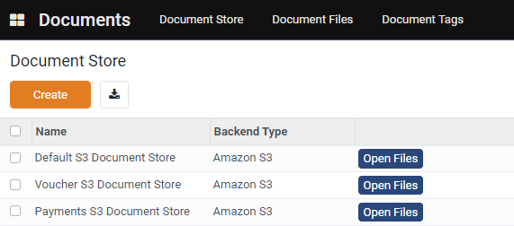
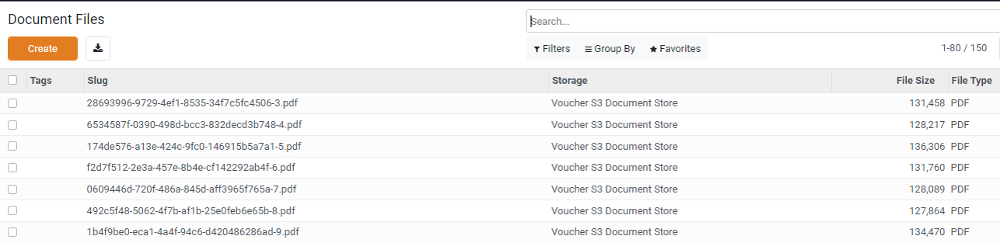
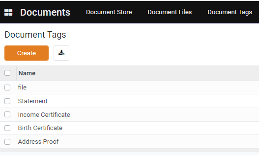

# Document Store

## Introduction

OpenG2P platform allows multiple options for storing registrant documents, evidence documents, entitlement vouchers, accounts payable files, etc. These are the currently supported document store options:

1. AWS S3 object store
2. MinIO object store
3. Private filesystem

Users can configure multiple document stores from a single view. The diagram below shows three document stores using the Amazon S3 object-store.

<figure><figcaption></figcaption></figure>

All the users of the OpenG2P platform such as System Administrators, Program Administrators, Finance Officers, and Social workers can upload/edit/delete these documents based on their [role-based access](role-based-access-control.md#pre-defined-groups).

### Document files

Each document file is assigned a Universally Unique ID (UUID) known as S_lug_ by the system. Information about document store, file UUID, size, and type are available from a single view.

<figure><figcaption></figcaption></figure>

### Document tags

The platform users can define unique tags and associate them with their upload files.&#x20;

<figure><figcaption></figcaption></figure>

&#x20;
