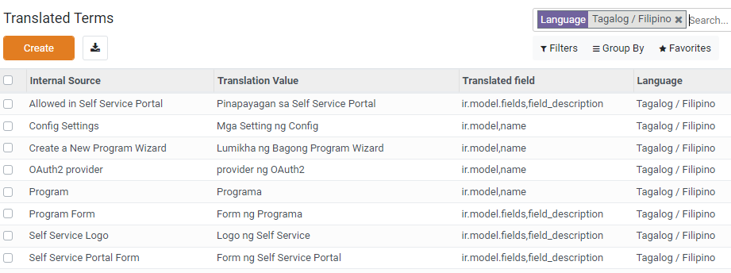
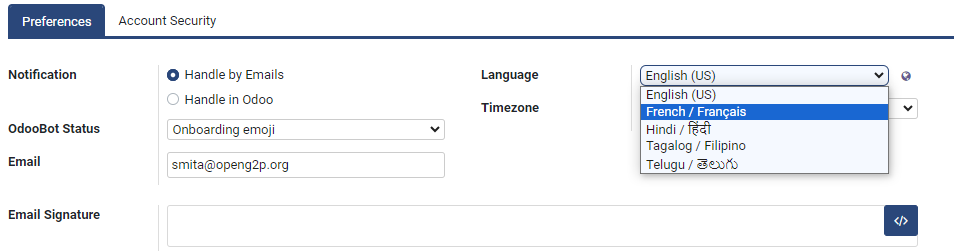
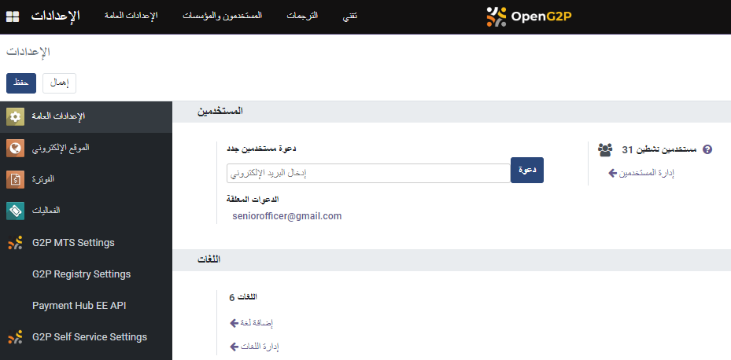
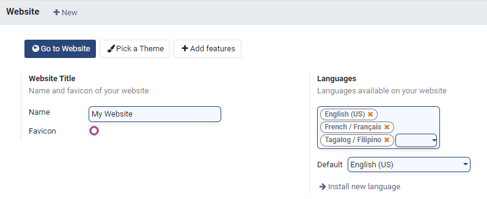
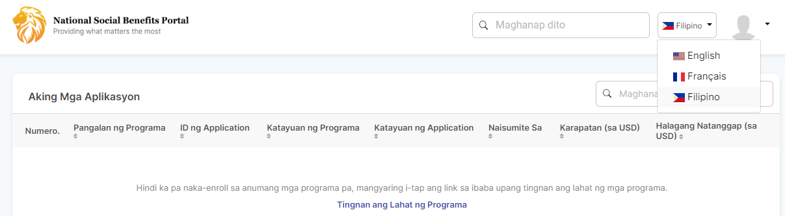

# Internationalization (i18n)

## Introduction

The OpenG2P platform supports internationalization and can localize the platform for a specific region and language. Internationalization converts the text in the menus, labels, and messages into the local language. Users of the OpenG2P platform can configure the local language from preferences.

### Supported languages

OpenG2P platform users can view the language locale codes, ISO codes, URL codes, and activation status for each language from a single view.

<figure><figcaption></figcaption></figure>

### Translation terms

The language-specific translations can be imported from a .csv, .po or .pot file. These translations can also be exported. After importing the translation file, the translated terms for a language can be viewed from a single view. New translation terms can be directly added from this view.

<figure><figcaption></figcaption></figure>

Platform users can also download a .pot file that contains all the missing translations. Once the translation terms are added, the file can be imported into the platform.

### Multiple languages

The platform can support multiple languages at the same time. Users can select the language of choice from their _Preferences_ settings.&#x20;

<figure><figcaption></figcaption></figure>

If the language is active, then the platform shows the translated texts. The image below shows the menu and labels in Arabic. Some of the terms are in English, as the translation terms are not available for these terms.

<figure><figcaption></figcaption></figure>

### Language support for website portals

Platform users can extend the language support to the websites created using the platform. Users can select the languages from all the active languages.

The image below shows that English, French, and Tagalog are selected for the websites.

<figure><figcaption></figcaption></figure>

All the languages selected on this page will be available from the website. The image below shows that Filipino has been selected as the language.

<figure><figcaption></figcaption></figure>
