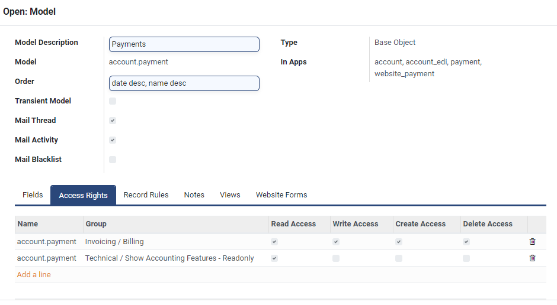

# Role-Based Access Control

## Introduction

OpenG2P platform defines role-based access control (RBAC) to authorize users of the OpenG2P platform to access views and menus according to their roles. RBAC also prevents unauthorized access to the OpenG2P system and safeguards beneficiary data from malicious actors.

### OpenG2P user types

OpenG2P platform has three types of users:

1. **Internal:** These users access the OpenG2P backend application.
2. **Portal:** These users access the portals created using the OpenG2P backend application, i.e. Self-Service Portal and Service-Provider Portal users. Access to these portals is governed by the administrative policies of the program.
3. **Public:** These users do not have any access to the OpenG2P backend application or portals.

### OpenG2P role-based access control

In the OpenG2P platform, a role is implemented by defining a group, and the users playing the role are added to the group. Each user can be added to multiple groups.&#x20;

OpenG2P provides a large variety of pre-defined groups (roles). These are the commonly used roles that are already pre-defined via groups in OpenG2P:

* **Administrator:** The users in this group are system administrators and superusers who assign user access to other users in the OpenG2P platform. These users must install the Odoo platform on their machines, which will be used to provide access.
* **Registrar:** Every user who needs access to the registry views and menus should be assigned to this group.
* **Program Validator:** The users in this group validate the soundness of the program and duplicate registrants. Therefore, these users can access Programs->Programs and Programs->Duplicates view and menus.
* **Program Cycle Approver:** These users in this group approve the program cycles and have access rights to Program -> Cycles views and actions.
* **Program Manager:** The users in this group have access to all the menus, views, and actions related to program management, payments, account journals, and funds.
* **Finance Validator:** These users in this group have access to all the menus, views, and actions related to entitlement/fund/batch finance, program funds, and account journals.
* **Document Write, Document Read, Document Admin:** Registrants' documents, payment files, entitlement vouchers, etc. are stored in the storage configured by the administrators. To preserve privacy and enforce authorized viewing, these documents can only be accessed by authorized users who are part of these groups.
* **Rest API POST, Rest API GET:** The OpenG2P platform provides access to REST APIs for various functionalities. However, access to these APIs is restricted to only authorized users who are part of these groups.

Click [here](https://docs.google.com/spreadsheets/d/1hHhOzriP6-HBcQ9kGUZt7itEzqoHa8Yt/edit?usp=sharing\&ouid=105415667366253313455\&rtpof=true\&sd=true) To get the complete list of OpenG2P pre-configured groups and their access permissions.

### OpenG2P access rights

The administrators can also create custom groups from scratch or inherit from pre-defined groups. Configuring access rights is the most effective way to authorize users to perform the actions for their assigned roles, as the related fields and views are automatically populated.&#x20;

The figure below shows the access rights for a role that requires access to payment accounts.

<figure><figcaption></figcaption></figure>

OpenG2P platform provides granular controls to assign access to each field and view. To learn the steps to create a custom group, click [here](../guides/user-guides/create-entitlement-manager-role.md).&#x20;


The term 'group' here should not be confused with the term for group of registrants. The term 'group' in the current context defines a role for the OpenG2P platform users.


## How-to Guides

[Create a Custom Group](../guides/user-guides/create-entitlement-manager-role.md)
