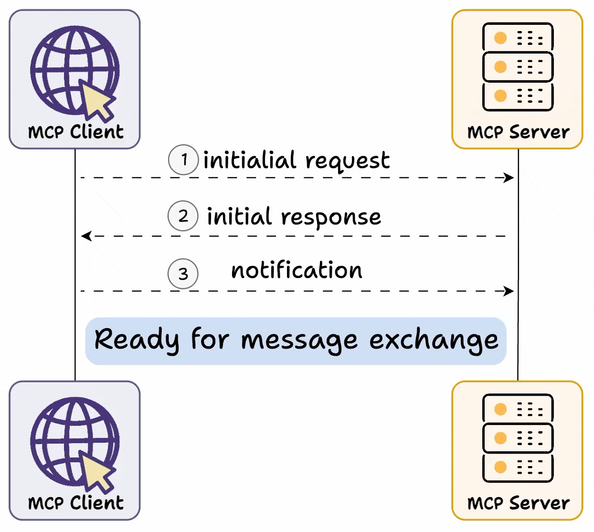

# Modal Context Protocol(MCP)

## Model Context Protocol (MCP): Overview

### 1. Introduction: What is Model Context Protocol?

<figure><figcaption></figcaption></figure>

The Model Context Protocol (MCP) is a standardized architectural framework for AI applications that facilitates communication between AI systems and various data sources, tools, and services. Just as USB-C offers a universal connector for devices to interact with multiple accessories, MCP provides a standardized way for AI applications to connect with different tools, databases, and external services.

At its core, MCP follows a client-server architecture that enables AI applications to discover, access, and utilize various capabilities without requiring hardcoded integration. This design creates a more extensible, maintainable, and robust ecosystem for AI-powered applications.

### 2. MCP Architecture and Components

The MCP architecture consists of three primary components that work together to create a flexible and powerful system:

#### 2.1 MCP Host

The MCP Host represents any AI application that provides an environment for AI interactions. Examples include:

* AI-enhanced IDEs (like those shown in Image 6)
* Claude Desktop (as shown in Image 4)
* AI tools and applications
* Custom AI assistants

The host serves as the environment that runs the MCP Client and provides the interface through which users interact with AI capabilities.

#### 2.2 MCP Client

The MCP Client operates within the host application and facilitates communication with MCP Servers. The client is responsible for:

* Initiating connections with servers
* Requesting capability information
* Sending user queries or commands to appropriate servers
* Receiving and processing responses
* Managing the interaction flow between users and servers

In Image 1, we can see how the MCP Client initiates the communication process with initial requests and processes the subsequent responses.

#### 2.3 MCP Server

The MCP Server exposes specific capabilities and provides access to various data sources and tools. As illustrated in Images 2 and 4, servers can connect to:

* Databases
* Local filesystems
* Web APIs
* External services (Slack, GitHub, Gmail, etc.)

Servers expose three primary types of capabilities:

1. **Tools**: Specific functions that enable LLMs to perform actions (like searching a database or calling an API)
2. **Resources**: Data and content that can be accessed by LLMs (such as documents, user information, or structured data)
3. **Prompts**: Reusable templates and workflows for generating specific types of content

### 3. How MCP Works: The Communication Protocol

The Model Context Protocol defines a standardized process for communication between clients and servers. This process, illustrated clearly in Image 1, involves several key stages:

#### 3.1 Capability Exchange

The first phase of MCP communication is capability exchange:

1. **Initial Request**: The client sends an initial request to the server to learn about its capabilities.
2. **Initial Response**: The server responds with details about its available tools, resources, prompts, and their required parameters.
3. **Notification**: The client acknowledges the successful connection.

This dynamic discovery mechanism is what makes MCP particularly powerful compared to traditional API integrations. Rather than requiring hardcoded knowledge of available functions and parameters, MCP clients can adapt to servers' capabilities at runtime.

#### 3.2 Message Exchange

After the capability exchange is complete, clients and servers can engage in message exchange:

1. The client sends requests to invoke specific capabilities
2. The server processes these requests and returns results
3. The communication continues in this manner as needed

The transport layer, as shown in Image 3, handles the underlying communication infrastructure, ensuring reliable message delivery between clients and servers.

### 4. Key Benefits of MCP

<figure><figcaption></figcaption></figure>

The Model Context Protocol offers several significant advantages over traditional integration approaches:

#### 4.1 Dynamic Capability Discovery

Unlike traditional APIs that require clients to know endpoints and parameters in advance, MCP enables dynamic discovery of capabilities:

* Servers can introduce new tools or modify existing ones
* Clients can adapt to these changes automatically
* This reduces breaking changes and simplifies API evolution

For example, if a weather service initially required "location" and "date" parameters but later added a "unit" parameter, traditional API clients would break. With MCP, clients would discover the new parameter requirement during capability exchange and adapt accordingly.

#### 4.2 Standardized Integration

MCP creates a standardized way for AI applications to connect with diverse services:

* Consistent patterns for discovering and using capabilities
* Uniform error handling and response formatting
* Reduced integration complexity for developers

As Image 5 illustrates, this allows an AI application to connect to many different services (databases, web APIs, local resources) through a single protocol.

#### 4.3 Enhanced Context Management

MCP provides built-in support for managing conversation context:

* Maintaining state across multiple interactions
* Organizing information in structured formats
* Tracking the progression of multi-turn flows
* Facilitating intelligent decision-making about when to use cached information versus calling external services

#### 4.4 Improved Extensibility

Adding new capabilities to an MCP-based system is straightforward:

* Register new servers with existing clients
* Add new capabilities to existing servers
* Develop specialized servers for specific domains
* All without disrupting existing functionality

### 5. MCP Implementation

Building a system based on MCP architecture involves implementing the three core components: hosts, clients, and servers.

#### 5.1 Implementing an MCP Server

An MCP server implementation typically includes:

* Capability registration mechanism
* Request handling logic
* Connection management
* Integration with underlying data sources (databases, APIs, etc.)
* Response formatting according to MCP standards

#### 5.2 Implementing an MCP Client

A client implementation includes:

* Discovery mechanism for finding and connecting to servers
* Capability tracking system
* Request formatting and transmission
* Response handling
* Error management
* User interface integration (for interactive clients)

#### 5.3 Transport Layer

As shown in Image 3, MCP relies on a transport layer to handle communication between clients and servers. This can be implemented using various technologies:

* HTTP/WebSockets for networked communication
* Local IPC (Inter-Process Communication) for components on the same device
* Custom protocols for specialized environments

### 6. MCP in Action: Use Cases

The Model Context Protocol can be applied in various AI-powered scenarios:

#### 6.1 AI-Enhanced Development Environments

As illustrated in Image 6, MCP can connect AI-powered IDEs to various tools and services, including:

* Code repositories (GitHub)
* Documentation resources
* AI code generation services
* Project management tools

#### 6.2 Conversational AI Assistants

For assistants like the one shown in Image 4 (Claude Desktop), MCP enables:

* Accessing diverse knowledge sources
* Performing actions on behalf of users
* Maintaining conversation context
* Integrating with local applications and web services

#### 6.3 Enterprise AI Integration

For organizations, MCP provides a standardized way to connect AI systems with:

* Internal databases and knowledge bases
* Customer management systems
* Communication platforms (Slack, email)
* Document repositories
* Business intelligence tools
*

    <figure><figcaption></figcaption></figure>

### 7. Comparison with Traditional Approaches

Traditional API integrations differ from MCP in several key ways:

#### 7.1 Traditional API Integration

* Static contracts: Endpoints and parameters are defined in advance
* Version management: Changes require explicit versioning or risk breaking clients
* Direct integration: Each client must implement specific code for each API
* Manual discovery: Developers must read documentation to learn capabilities

#### 7.2 MCP Approach

* Dynamic contracts: Capabilities are discovered at runtime
* Graceful evolution: Servers can introduce changes that clients adapt to automatically
* Standardized integration: One client implementation can work with many servers
* Automated discovery: Clients learn about capabilities programmatically

### 8. Conclusion

The Model Context Protocol represents a significant advancement in how AI applications integrate with various data sources and tools. By providing a standardized "USB-C for AI applications," MCP enables more flexible, robust, and maintainable AI systems that can adapt to changing requirements and capabilities.

As AI becomes increasingly integrated into our applications and workflows, architectural frameworks like MCP will play a crucial role in creating an ecosystem where different components can communicate effectively, enabling AI systems to leverage a diverse array of capabilities without requiring extensive custom integration work.

Organizations and developers looking to build scalable AI solutions should consider adopting MCP principles to create more adaptable and future-proof systems that can evolve alongside the rapidly changing AI landscape.

