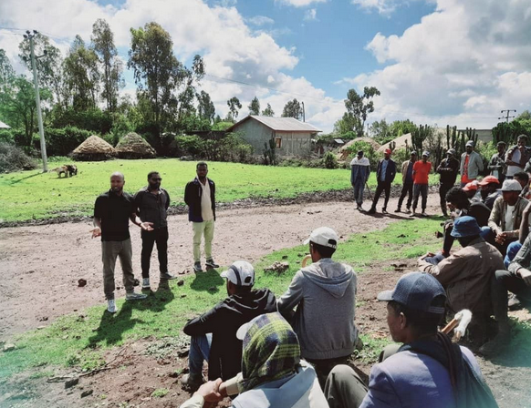

# Farmer Profile

<figure><figcaption>
Farmer Registration in Ethiopia
</figcaption></figure>

## Why Farmer Profile?&#x20;

A Farmer Profile is a foundational block in the digital transformation of the agriculture sector.  It is used by governments to support farmers better and plan agricultural policies and programs. The end objective is to provide the right assistance to farmers and improve their production and productivity, which in turn increases incomes for farmers and food security for everyone. The key requirements to build a Farmer Profile are as follows:

1. Farmer Registration: Capturing and maintaining a centralized database of farmers, including demographics, agricultural activities, and service requirements.
2. Targeted farmer support: Enabling agriculture programs to provide the most relevant support for farmers based on their needs
3. Decision Support: Empowering policymakers with real-time data for better decision-making in agricultural programs and public expenditure.
4. Data exchange: Ensuring seamless integration with other systems and data sources to enhance functionality and scalability

## OpenG2P solution and architecture

OpenG2P’s Registry module, linked with other databases, provides a comprehensive solution for a Farmer Profile. With this module, you can capture, manage, share and analyze farmer data efficiently to provide a digital-first approach to farmer identification and management. It contains:\

* Implementation of an offline ODK-based data collection system integrated with OpenG2P
* Implementation of an online Registration Portal
* Integration with National ID
* Integration with external databases to consolidate farmer and land data

<figure><figcaption>
Farmer Profile Data Flow 
</figcaption></figure>

The Farmer Profile's key functions include **Data Collection, Data Validation and Enrichment, Data Sharing, and Analytics and Reporting**. OpenG2P provides features that include offline assisted registration via the ODK application, online assisted registration, and a dynamic registry that allows data to be updated through multiple channels.

**Data Validation and Enrichment** functions are supported through data validation mechanism, national ID-based validation using the farmer's national ID, integration with external databases to enrich the registry, and integration with land registry databases to streamline the collection of land parcel data.

OpenG2P supports the **Data Sharing** function by sharing data from the registry in a standardized manner. Analytics and Reporting includes reporting and dashboards using Apache Superset and the Reporting Framework, real-time system health monitoring, and revision history to track changes and generate reports.

## Solution approach

Key objectives achieved include:

* **Structured registration**: A comprehensive registration system that captures essential farmer details such as personal information, land ownership, and farming activities.
* **ID authentication**: The system supports biometric or OTP-based authentication to validate farmers.
* **ODK-based data collection**: Offline and online data capture capabilities using ODK (Open Data Kit) for field-level data collection.
* **Configurable deduplication**: Ensures unique farmer records through configurable deduplication based on IDs or biometric data.
* **Registration portal:** An intuitive interface for the enrollment agents to enumerate farmer and their household data.
* **Interoperability**: Designed to integrate with other systems like agricultural finance, subsidy management, and agriculture extension services.

## Key processes and features

Data collection

* _Offline assisted registration_: Offline assisted enumeration enables us to reach remote farmers who may not have internet connectivity. Data is collected by a field enumerator using the ODK application on tablets and stored in ODK Central, and then imported into the farmer registry. The enumerator's login details are also stored within the registry, to monitor the data collection.
* _Online assisted registration_: Enable online assisted enumeration for agents with internet access to facilitate dynamic updates outside of field data collection periods. Farmers can approach agents directly to request registration.&#x20;
* _Dynamic Registry_: A dynamic registry allows registrant data to be received and updated through multiple channels, including APIs, direct entry, ODK, a registration portal, and CSV files.&#x20;
* _Document Storage_: Important documents connected to the land or farm household need to be stored on the registry including but not limited to land title, tenancy agreement, income certificate, loan agreement&#x20;

Data validation and enrichment

* _Farmer ID generation_: Unique Farmer ID is generated to ensure accurate and efficient tracking, as well as to enhance data consistency and integration with other systems. The ID is generated using MOSIP's sophisticated ID generator which applies multiple rules before assigning an ID, and the generation process is managed through a background task system that handles status updates, retries, and eventual confirmation of ID utilisation.
* _Data validation_: Data entered into the registry must be checked and approved by a data validator role to ensure data quality is maintained. The data validator will either confirm the data entered or request corrections to the record.
* _National ID-based validation_: The farmer registry requires a unique identity for each farmer. This unique identity will be the farmer's national ID, fetched from the national ID registry.
* _Data Import from Existing Databases_: The registry can be enriched by importing existing farmer data from external databases. This can be done by identifying common fields between the databases and the registry.  The goal is to increase the registry coverage by using new registrations as well as existing data.
* _Integration with land registry database_: Integrating land parcel data from a verified land registry via API requests will streamline the collection of attributes such as unique parcel ID, area, land use, and soil fertility. Additionally, importing and rendering land parcel geometry on a map within the farmer registry will provide a visual representation of the farmer's land holdings.
* _Draft and Publish_: Data from external databases is imported and stored in a separate database within the registry. These imported records can be further enriched by collecting data on the ground, such as through enumerators or phone calls. This data is used to fill in any missing fields in the records. The records are stored in a draft state until they are complete and approved, at which point they are published.

Data sharing

_Data Sharing_: Data stored in the registry can be easily shared in a standardized manner, making the information reusable by third parties for farmer and agricultural insights.

Analytics and reporting

* _Reporting and Dashboards_: OpenG2P's monitoring and logging tools allow program administrators to track the progress of the registry, and keep an eye on system health. They can do this through:
  1. Visual dashboards for monitoring using Apache Superset
  2. Generating reports using Reporting Framework&#x20;
  3. Real-time system health monitoring&#x20;
* _Revision history_: The system captures any changes or updates to records within the Registry. Administrators have the ability to view information associated with a registry record as it existed on previous dates. Additionally, administrators have the ability to generate reports that aggregate data for a previous period. The Department can use this feature to analyze changes among individual farmers or in a geographic area to understand the impact of natural changes or programmes and policies.&#x20;

## Data model

* Basic details of the farmer and household - name, location, ID, education, etc
* Land area, parcel ID, geo-location, ownership details &#x20;
* Data on crop, livestock, inputs, access to finance&#x20;
* Membership and role in farmer organizations

## Reference design

Reference design for Farmer Profile is available [here](reference-design-farmer-registry.md).

