# Create Eligibility Manager under Program

## Description

This guide provides step-by-step instructions to create and configure the Eligibility Manager under the program.

## Pre-requisites

A user should have a Program Manager role to create a Eligibility Manager under program.

Note:

Refer _**Create User and Assign Role**_ user guide to know how to assign role for a User.

## Procedure

1. In the menu bar, click the icon .png>) and select _**Programs**_.
2. The _**Programs**_ screen is displayed.

<figure><figcaption>
Choose Program module
</figcaption></figure>

2. Click the program name for which configuration to be done.
3. The selected program screen is displayed. For example, here the program selected is Individual Cash Program.

Note:

By default, in the _**Program**_ field, you can find the selected program name.

<figure>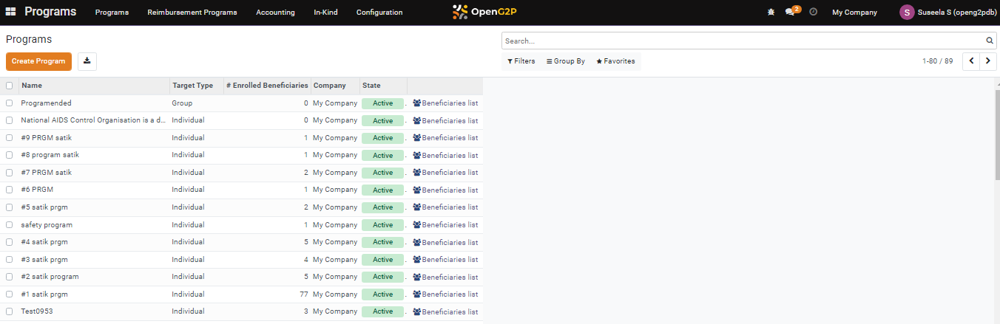<figcaption>
Program list
</figcaption></figure>

<figure>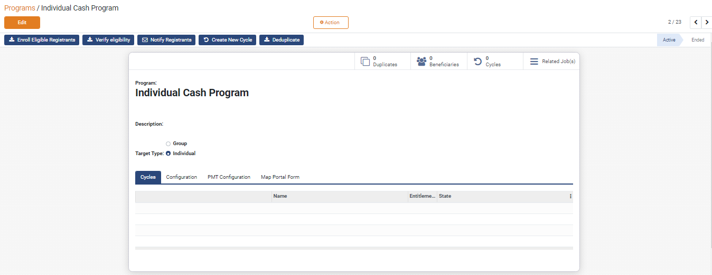<figcaption>
Sample program screen
</figcaption></figure>

4. Enter the _**Description**_ of the program.
5. Choose one of the _**Target Type**_s. The values are

&#x20;       Group

&#x20;       Individual

6. Click the _**Configuration**_ tab.

Note:&#x20;

You can configure the required Managers from the available list.

<figure><figcaption>
List of Configurable Managers
</figcaption></figure>

### Eligibility Manager configuration

1. In the _**Eligibility Managers**_ section, click the link _**Add a line.**_
2. The _**Add: Eligibility Managers**_ screen is displayed.

<figure>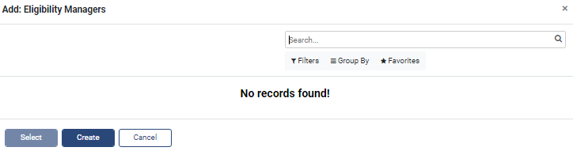<figcaption>
Add: Eligibility Managers
</figcaption></figure>

In _**Add: Eligibility Managers**_ screen, the features and their descriptions are:

<table><thead><tr><th width="130">Feature</th><th>Description</th></tr></thead><tbody><tr><td>Search</td><td>This field is filled when the available option are selected in Filers, Group By, Favorites</td></tr><tr><td>Filters</td><td>
Click the <em><strong>Filters</strong></em> link and then select Add Customer Filter.
<ul><li>Add Customer Filter</li></ul>
The advanced filter option allows you to define conditions and criteria to refine the search results.
<ul><li>Select the <em><strong>Add Customer filter</strong></em> and then select the appropriate option in the first drop-down to display the specific data based on the option selected.</li><li>Select the criteria in second and third drop-down to refine the search results. </li><li>Click the <em><strong>Apply</strong></em> button to display the data based on the search.</li></ul>
<em>Note: To enhance the search, click the <strong>Add a condition</strong> button and follows the steps given in <strong>Add Customer Filter</strong> option.</em>
</td></tr><tr><td>Group by</td><td><ul><li>Click the <em><strong>Group By</strong></em> link, select <strong>Add Custom Group</strong> and then select the appropriate options in the drop-down to display the specific data based on the option selected.</li><li>Click the <em><strong>Apply</strong></em> button to display the data based on the search.</li></ul></td></tr><tr><td>Favorites</td><td><ul><li>
Click the <em><strong>Favorites</strong></em> link, select <strong>Save current search</strong> and then check the appropriate options. The valid values are: 
<ul><li>Use by default</li><li>Share with all users</li></ul></li></ul><ul><li>Click the <em><strong>Save</strong></em> button to display the data based on the search.</li></ul></td></tr><tr><td>&#x3C;</td><td>Click the <em><strong>Left</strong></em> arrow to go the previous screen</td></tr><tr><td>></td><td>Click the <em><strong>Right</strong></em> arrow to go the next screen</td></tr><tr><td>Create</td><td>Click the <em><strong>Create</strong></em> button to Eligibility Managers</td></tr></tbody></table>

3. Click the _**Create**_ button.&#x20;
4. The below screen _**Add: Eligibility Managers**_ screen is displayed.

<figure>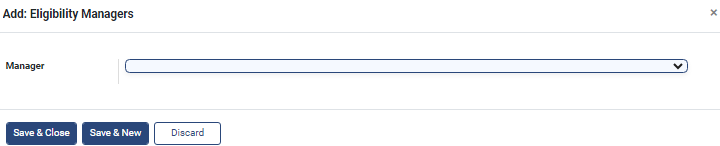<figcaption>
Add: Eligibility Managers
</figcaption></figure>

The feature and their description is:

<table><thead><tr><th width="211">Feature</th><th>Description</th></tr></thead><tbody><tr><td>Manager</td><td>
Select the Manager from the drop-down. The three available managers are:
<ul><li>Default Eligibility</li><li>ID Document Eligibility</li><li>Phone Number Eligibility</li></ul></td></tr></tbody></table>

Note:&#x20;

Once the Manager is selected, an additional field is displayed.

<figure>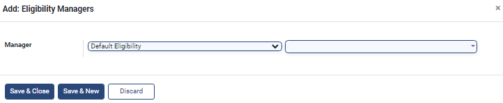<figcaption>
Choose Eligibility Manager 
</figcaption></figure>

5. Enter the Eligibility Manager's name in the second field.

Note:

In the drop-down, choose the Eligibility Manager's name, if already available or click the option _**Start typing**_ to enter the new Eligibility Manager's name.

6. While entering the new Eligibility Manager's name, a button _**Create and Edit**_ pops up.
7. Click the _**Create and Edit**_ button.
8. _**Create: Manager screen**_ is displayed.

<figure>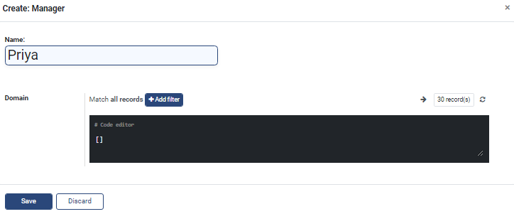<figcaption>
Create Manger screen
</figcaption></figure>

In the Create: Manager screen, the features and their descriptions are:

<table><thead><tr><th width="185">Feature</th><th>Description</th></tr></thead><tbody><tr><td>Name</td><td>Enter the name of the Eligibility manager</td></tr><tr><td>Domain</td><td>Set the eligibility criteria's using <em><strong>Add Filter</strong></em> button on the creation page.</td></tr><tr><td>Match all records</td><td>Retrieves the data which matches all records</td></tr><tr><td></td><td>
Click the <em><strong>Records</strong></em> button. The <em><strong>Selected records</strong></em> screen is displayed. 

<em>Note:</em> 
<ul><li><em>By default the list of three records are listed in the <strong>Selected records</strong> screen.</em></li><li><em>Click the <strong>Cancel</strong> button to close the <strong>Selected records</strong> screen.</em></li></ul></td></tr><tr><td></td><td>Click the <em><strong>Refresh</strong></em> button to refresh the screen</td></tr><tr><td>Add filter</td><td>
Click the <em><strong>Add filter</strong></em> button to set eligibility criteria using <a href="https://github.com/OpenG2P/openg2p-documentation/blob/1.2.1/beneficiary-management/eligibility.md#domain-filters">Domain Filters</a>. You may set multiple eligibility criteria. 
<ol><li>Click the <em><strong>Add filters</strong></em> button. The multiple criteria fields are displayed.</li><li>Select the multiple criteria such as ID, condition and count.</li><li>Click the <strong>x</strong> button to remove the entry in the criteria fields.</li><li>Click the <strong>+</strong> button to add new multiple criteria field.</li><li>Click the <strong>...</strong> option to display fields in <em><strong>Any of</strong></em> section. The multiple criteria fields are displayed.</li></ol>
<em>Note: You can click the <strong>...</strong> option to add n number of <strong>Any of</strong> section</em>
<ol start="6"><li>The value chosen in the multiple criteria fields are displayed in the <em><strong>Code editor</strong></em>.</li><li>In the Match records chose one of the followings:</li></ol><ul><li>Select <em><strong>All</strong></em> to display the data belongs to <em><strong>All</strong></em> section </li><li>Select <em><strong>Any</strong></em> to display the data belongs to <em><strong>Any</strong></em> <em><strong>of</strong></em> section</li></ul></td></tr></tbody></table>

9. Click the _**Save**_ button to save the data.
10. Click the _**Discard**_ button to exit the screen.
11. The added new Eligibility Manager is listed in the Configuration tab list.

<figure>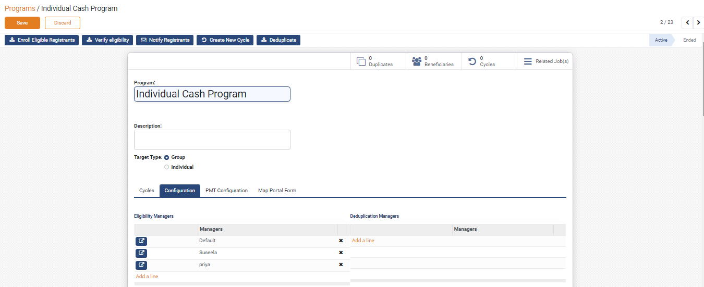<figcaption>
List of Eligibility Managers
</figcaption></figure>

12. Click the _**Save**_ button which will save the eligibility manager to that program under configuration.

### Configuration tab - List Eligibility Manager

In the Add Eligibility Manager screen, you can find the list of Eligibility Manager.

<figure>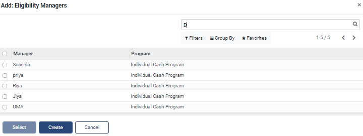<figcaption>
Eligibility Manager list
</figcaption></figure>

1. Check the required Manager in the list, it enables the _**Select, Action**_ button. It  also shows the number of entries selected.

<figure><figcaption>
Selected Eligibility Manager list
</figcaption></figure>

2. Click the _**Select**_ button.
3. The selected Manager will be listed in the Eligibility Manager section below the _**Configuration**_ tab.

<figure><figcaption>
New list of Eligibility Manager
</figcaption></figure>

### Delete - Eligibility Manager

In the Add Eligibility Manager, you can find the list of Eligibility Manager.

1. Check the required Manager in the list, it enables the _**Select, Action**_ button. It   also shows the number of entries selected.

<figure>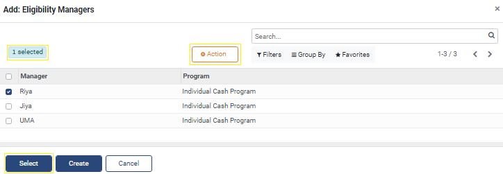<figcaption>
Search, Action button enabled
</figcaption></figure>

2. Click the _**Action**_ button and then click _**delete**_.&#x20;

<figure>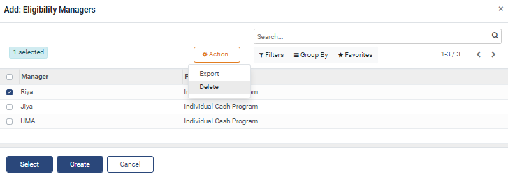<figcaption>
Action button
</figcaption></figure>

3. The _**Confirmation**_ dialog box pops up.
4. Click the _**OK**_ button to delete the entry.  The selected entry will be deleted
5. Click the _**Cancel**_ button to retain the entry.

<figure>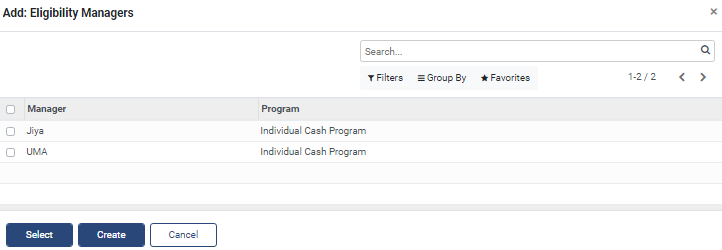<figcaption>
Deleted entry screen
</figcaption></figure>

