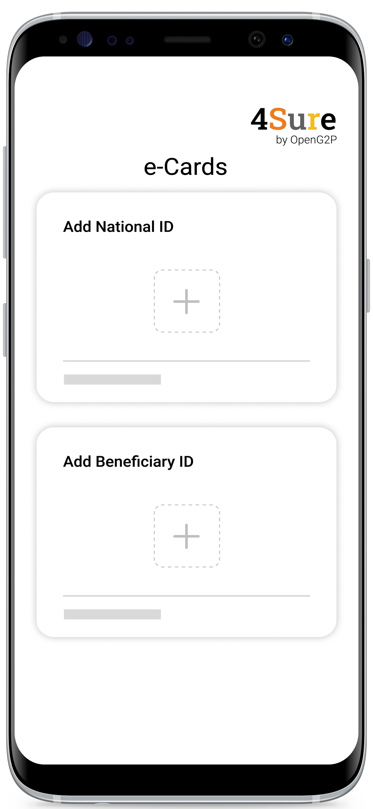

# Verify Digital Credentials using 4Sure

## Description

This document provides step-by-step instructions to verify digital credentials using 4Sure app installed in a mobile device.&#x20;

## Prerequisites

* A user must have installed _**4Sure**_ app in his/her mobile device
* A user must have installed _**Inji**_ in another mobile device. The Inji wallet must have the user's national ID and the beneficiary ID
* A user must have enabled _**Bluetooth**_ in both the mobile devices

## Procedure

1. Tap the _**4Sure**_ app icon in your mobile device.

The 4Sure app screen is displayed.&#x20;

<figure><figcaption>
4Sure 
</figcaption></figure>

In the e-Cards screen, you can find options to add National ID card and Beneficiary ID card.

<figure><figcaption>
e-Cards
</figcaption></figure>

2. Tap the **+** icon in the _**Add National ID**_ tab.

The Scan QR code screen is displayed.

<figure><figcaption>
QR code screen
</figcaption></figure>

The below screen waits for the beneficiary to share his/her e-Card (national ID) stored in Inji wallet.

<figure><figcaption>
Screen to capture the details of beneficiary national ID
</figcaption></figure>

3. Click the _**Disconnect**_ button to go previous screen.

Once the national ID is shared, the details of the national ID are auto-populated in the e-Cards screen.

<figure><figcaption></figcaption></figure>

4. Click the _**Authenticate**_ button to capture the present picture of the beneficiary.

The beneficiary must position his face within the frame as shown in the below image to capture the his/her picture.

<figure><figcaption>
Position the face in the frame
</figcaption></figure>

5. Click the _**Capture**_ button.

In the Preview dialog box,

6. Click the _**Authenticate**_ button to re-confirm the captured picture.
7. Click the _**Re-take**_ button to recapture the picture.

<figure><figcaption>
Preview screen
</figcaption></figure>

The captured picture is recorded in the e-Cards screen and it shows _**Authenticated**_.

<figure><figcaption>
Authenticated screen
</figcaption></figure>

8. Click the **+** button in the _**Add Beneficiary ID**_ tab.

Follow the same procedure from 2 to 7 mentioned above to populate details of Beneficiary ID in the e-Cards screen. The details of National ID and Beneficiary ID are populated in e-Cards.

<figure><figcaption>
National and Beneficiary ID details
</figcaption></figure>

9. Click the _**Match**_ button.

If the UIN of the national ID and beneficiary ID are matched, then a message on successful verification of digital credentials is displayed.

<figure><figcaption>
Verification of digital credentials completed
</figcaption></figure>

10. Click the _**BACK TO HOME**_ button.

The e-Cards screen is displayed to verify another beneficiaries' digital credentials.

<figure><figcaption>
e-Cards screen
</figcaption></figure>

If the UIN of the national ID and the beneficiary ID do not match, then an error message is displayed.

<figure><figcaption>
UIN of national ID and the beneficiary ID do not match
</figcaption></figure>

> 4Sure App does not store the details of the beneficiary in the back-end. It is an app used only to verify the digital credentials of the beneficiary.&#x20;
